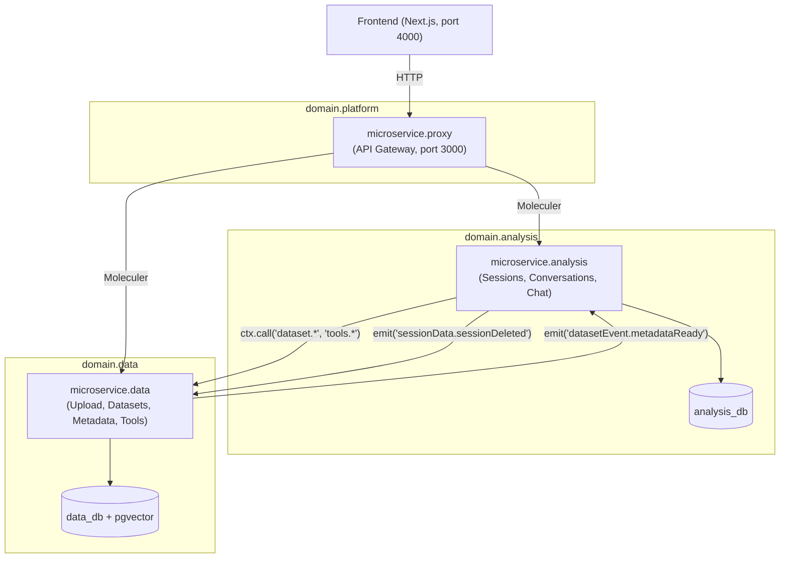
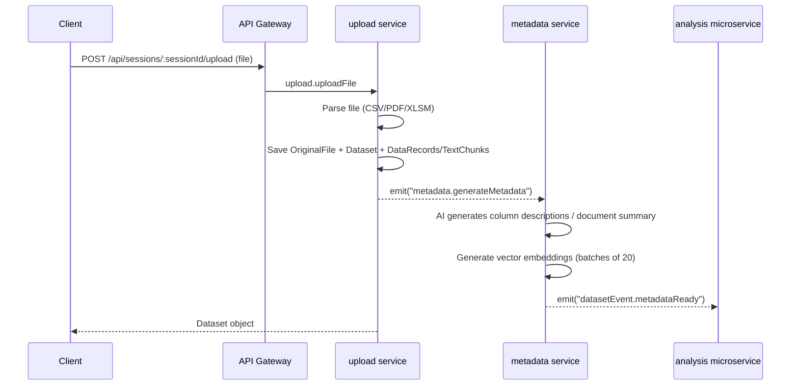
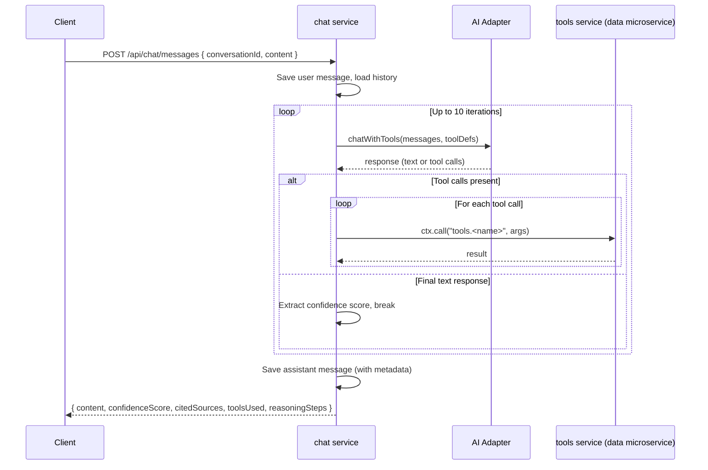

# Data Analysis Platform

A microservice-based **agentic data analysis** platform built with [Moleculer](https://moleculer.services/) and TypeScript. Upload datasets (CSV, PDF, XLSM), manage analysis sessions and conversations, and interact with your data through an AI-powered chat interface that orchestrates 16 analysis tools automatically.

## Architecture



| Component | Description |
|-----------|-------------|
| **Frontend** | Next.js 16 app with React Query and Markdown rendering |
| **microservice.proxy** | API gateway (moleculer-web) — routes HTTP to internal services, file upload (100 MB), CORS, rate limiting |
| **microservice.analysis** | Session & conversation management, AI chat orchestration with tool-calling loop (max 10 iterations) |
| **microservice.data** | File upload & parsing, dataset CRUD, AI metadata generation, 16 data analysis tool actions |
| **core.lib** | Shared library — broker, config, AI adapters, file-parser adapters, codegen, database |

## Tech Stack

- **Runtime:** Node.js + TypeScript
- **Microservices:** Moleculer with auto-generated type-safe service calls
- **Frontend:** Next.js 16 / React 19 / React Query
- **Database:** PostgreSQL 16+ with pgvector for vector similarity search
- **ORM:** TypeORM with automatic migrations
- **AI:** Ollama (local) / Google Gemini adapters with retry & fallback
- **File Parsing:** CSV (PapaParse), PDF (pdf-parse), XLSM/XLSX (SheetJS)
- **Text Chunking:** LangChain RecursiveCharacterTextSplitter (800 char chunks, 200 overlap)
- **Embeddings:** nomic-embed-text (768-dim vectors via Ollama) or text-embedding-004 (Gemini)
- **Linting:** Biome

## Prerequisites

- **Node.js** >= 18
- **PostgreSQL 16+** with pgvector extension
- **Ollama** (for local AI) or a **Gemini API key**
- **NATS** (optional — for multi-process transporter)

```bash
# Quick PostgreSQL setup with Docker
docker run -d \
  --name pgvector \
  -e POSTGRES_PASSWORD=postgres \
  -p 5432:5432 \
  pgvector/pgvector:pg16
```

## Getting Started

```bash
# 1. Install dependencies
npm install

# 2. Configure environment
#    Copy .env.example to .env in each microservice and set:
#    - Database credentials (POSTGRES_HOST, POSTGRES_DB, etc.)
#    - AI provider (AI_PROVIDER=ollama or AI_PROVIDER=gemini + GEMINI_API_KEY)
#    - Transporter (TRANSPORTER=nats://localhost:4222 for multi-service)

# 3. Generate type-safe service call types
npm run generate:types:all

# 4. Start microservices (each in its own terminal)
npm run dev -w microservice.proxy
npm run dev -w microservice.analysis
npm run dev -w microservice.data

# 5. Start the frontend
npm run dev -w frontend
```

- **API Gateway:** http://localhost:3000/api
- **Frontend:** http://localhost:4000
- **Health check:** `GET /api/health`

## Microservices

### microservice.proxy (API Gateway)

HTTP entry point. Routes `/api/*` requests to internal services via auto-aliases. Handles file upload at `POST /api/sessions/:sessionId/upload` (100 MB limit), CORS, and rate limiting (100 req/min).

### microservice.analysis

Manages AI analysis sessions, conversations, and the chat orchestration loop.

| Service | Key Actions | Description |
|---------|-------------|-------------|
| **session** | `create`, `list`, `getSession`, `renameSession`, `deleteSession` | Session CRUD and lifecycle (`empty` → `has-data` → `active` → `archived`) |
| **conversation** | `createConversation`, `listConversations`, `getConversation`, `deleteConversation`, `renameConversation` | Conversation threads with auto-generated system prompts from dataset metadata |
| **chat** | `sendMessage`, `getHistory` | AI tool-calling orchestration loop (up to 10 iterations per request) |
| **datasetEvent** | *(event listener)* | Receives `datasetEvent.metadataReady` from data microservice |

**Database:** `analysis_db` — entities: Session, Conversation, ChatMessage, AILog

### microservice.data

Handles file upload, parsing, AI metadata generation, and 16 data analysis tools.

| Service | Key Actions | Description |
|---------|-------------|-------------|
| **upload** | `uploadFile`, `importFromUrl`, `searchWebsites` | File upload with hash dedup, parsing (CSV/PDF/XLSM), URL import via web fetch, website discovery via Brave Search |
| **dataset** | `listDatasets`, `getDataset`, `previewDataset`, `renameDataset`, `deleteDataset` | Dataset CRUD and preview |
| **metadata** | `retryGeneration` | Triggers AI metadata regeneration; `generateMetadata` event handler produces column descriptions, summaries, embeddings |
| **sessionData** | *(event listener)* | Receives `sessionData.sessionDeleted` — cascade-deletes datasets, files, chunks |
| **tools** | 11 structured + 2 unstructured + 2 web + 1 meta | Data analysis tools callable by the AI chat loop |

**Database:** `data_db` (PostgreSQL + pgvector) — entities: OriginalFile, Dataset, DataRecord, TextChunk, AILog

#### Structured Data Tools (for `structured-table` datasets)

| Tool | Description |
|------|-------------|
| `aggregate` | Multi-field aggregation pipeline (limit/orderBy, max 200 rows) |
| `correlateFields` | Pearson correlation between two numeric fields |
| `countDistinctValues` | Count distinct values for a field |
| `detectOutliers` | Records beyond 2 standard deviations |
| `filterByCondition` | Filter by conditions (eq, gt, contains, in, etc.) |
| `getDistinctValues` | Distinct values with counts |
| `getPercentile` | Percentile values (P25, P50, P75, P99) |
| `joinDatasets` | Join two datasets on a shared field |
| `pivotTable` | Cross-tabulation by two categorical fields |
| `sampleData` | Random sample of records from a dataset |
| `sortByField` | Sort records by field(s) with limit |

#### Unstructured Text Tools (for `unstructured-text` datasets)

| Tool | Description |
|------|-------------|
| `getChunks` | Retrieve text chunks from a document |
| `semanticSearch` | Vector similarity search across text chunks |

#### Web Tools

| Tool | Description |
|------|-------------|
| `webFetch` | Fetch and extract content from a web URL |
| `webSearch` | Search the web using Brave Search API |

#### Meta Tools

| Tool | Description |
|------|-------------|
| `createSubAgent` | Spawn a sub-agent for delegated analysis tasks |

### microservice.example

Demo/scaffold microservice showing patterns (user CRUD, event-driven notifications).

## Project Structure

```
├── lib/                        # Shared core library (core.lib)
│   ├── broker/                 #   createApp, defineAction, defineEvent, run
│   ├── config/                 #   Configuration system & env presets
│   ├── adapters/               #   AI (Ollama/Gemini) & file-parser adapters
│   ├── database/               #   TypeORM DataSource factory & shared entities
│   ├── codegen/                #   Type generation for typed ctx.call()
│   └── __generated__/          #   Global action/event registry (all microservices)
├── apps/
│   ├── domain.analysis/
│   │   └── microservice.analysis/   # Sessions, conversations, AI chat
│   ├── domain.data/
│   │   └── microservice.data/       # Upload, datasets, metadata, 16 tools
│   ├── domain.example/
│   │   └── microservice.example/    # Reference / starter microservice
│   └── domain.platform/
│       └── microservice.proxy/      # API gateway
├── frontend/                   # Next.js frontend
├── docs/                       # Documentation
│   ├── api/api.yaml            # OpenAPI 3.0 specification
│   └── domain-knowledge/       # Feature-specific docs with diagrams
└── scripts/                    # Build, codegen, and utility scripts
```

Each microservice follows the convention:

```
microservice.{name}/
├── app.ts                  # Entry point (sets TZ=UTC)
├── moleculer.config.ts     # Service config
├── .env                    # Environment variables
├── db/                     # TypeORM entities & query objects
├── services/
│   └── {serviceName}/
│       ├── {name}.action.ts    # → serviceName.name
│       └── {name}.event.ts     # → serviceName.name
└── __generated__/          # Auto-generated types (git-ignored)
```

## Key Workflows

### File Upload & Metadata Generation



### AI Chat with Tool Calling



## Scripts

| Script | Description |
|--------|-------------|
| `npm install` | Install all workspace dependencies |
| `npm run generate:types:all` | Generate types for all microservices |
| `npm run generate:types` | Generate types for a single microservice |
| `npm run init:microservice -- <domain> <name> [services]` | Scaffold a new microservice |
| `npm run lint` | Check code with Biome |
| `npm run lint:fix` | Auto-fix lint issues |
| `npm run format` | Format code with Biome |
| `npm run db:clear` | Clear the database |

## Creating a New Microservice

```bash
# Scaffold with init script
npm run init:microservice -- payment payment transaction,refund

# Install & generate types
npm install
npm run generate:types:all

# Start development
npm run dev -w microservice.payment
```

See [docs/creating-services.md](docs/creating-services.md) for the full guide.

## Configuration

Configuration is merged in order: **defaults → environment presets → service config → env variables**.

Key environment variables:

| Variable | Default | Description |
|----------|---------|-------------|
| `NODE_ENV` | — | `development` / `staging` / `production` |
| `TRANSPORTER` | `null` | Moleculer transporter URL (e.g. `nats://localhost:4222`) |
| `LOG_LEVEL` | `info` | `trace` / `debug` / `info` / `warn` / `error` / `fatal` |
| `AI_PROVIDER` | `ollama` | AI backend: `ollama` or `gemini` |
| `GEMINI_API_KEY` | — | Google Generative AI API key (required when `AI_PROVIDER=gemini`) |
| `GEMINI_MODEL` | `gemini-2.0-flash` | Gemini model name |
| `POSTGRES_HOST` | `localhost` | PostgreSQL host |
| `POSTGRES_PORT` | `5432` | PostgreSQL port |
| `POSTGRES_USER` | `postgres` | Database user |
| `POSTGRES_PASSWORD` | `postgres` | Database password |
| `POSTGRES_DB` | — | Database name per microservice (`analysis_db`, `data_db`) |

See [docs/configuration.md](docs/configuration.md) for the full reference.

## Documentation

### Core

| Document | Description |
|----------|-------------|
| [Project Structure](docs/project-structure.md) | Codebase overview and conventions |
| [Core Library](docs/core-library.md) | `core.lib` API reference |
| [Creating Services](docs/creating-services.md) | Guide to adding microservices and actions |
| [Configuration](docs/configuration.md) | Config system and environment variables |
| [Type Generation](docs/type-generation.md) | How typed `ctx.call()` works |
| [Database](docs/database.md) | PostgreSQL / TypeORM setup and patterns |
| [API Spec](docs/api/api.yaml) | OpenAPI 3.0 REST API specification |

### Domain Knowledge

| Document | Description |
|----------|-------------|
| [Architecture Overview](docs/domain-knowledge/architecture-overview.md) | Microservice topology, service registry, database schema |
| [Session Management](docs/domain-knowledge/session-management.md) | Session lifecycle and status transitions |
| [Conversation Management](docs/domain-knowledge/conversation-management.md) | Conversation CRUD and system prompt construction |
| [Chat System](docs/domain-knowledge/chat-system.md) | AI tool-calling orchestration, message protocol |
| [Chat Streaming](docs/domain-knowledge/chat-streaming.md) | Real-time chat streaming implementation |
| [Dataset Events](docs/domain-knowledge/dataset-events.md) | Cross-service event flow for uploads and metadata |
| [Tool Configuration](docs/domain-knowledge/tool-configuration.md) | Centralized tool registry, enabling/disabling tools |
| [Document Summarization](docs/domain-knowledge/document-summarization.md) | Map-reduce summarization for large documents |
| [Text Chunking](docs/domain-knowledge/text-chunking.md) | LangChain text splitting with word-boundary awareness |
| [Hybrid Semantic Search](docs/domain-knowledge/hybrid-semantic-search.md) | Vector similarity search with pgvector |
| [Gemini Adapter](docs/domain-knowledge/gemini-adapter.md) | Google Gemini AI integration and tool-calling flow |
| [AI Logging](docs/domain-knowledge/ai-logging.md) | Audit trail for all AI interactions |
| [AI Naming](docs/domain-knowledge/ai-naming.md) | AI-generated naming conventions |
| [Agent Self-Reflection](docs/domain-knowledge/agent-self-reflection.md) | Agent self-reflection patterns |
| [Sub-Agent Delegation](docs/domain-knowledge/sub-agent-delegation.md) | Sub-agent delegation patterns |
| [URL & Web Search Import](docs/domain-knowledge/url-and-web-search-import.md) | URL import and web search features |
| [XLSM Parsing](docs/domain-knowledge/xlsm-parsing.md) | Excel parsing with merged cells and multi-row headers |
| [Numeric Comma Handling](docs/domain-knowledge/numeric-comma-handling.md) | European/Vietnamese comma-decimal format support |
| [Timezone Handling](docs/domain-knowledge/timezone-handling.md) | UTC enforcement to prevent double-offset bugs |
| [Query Param Validation](docs/domain-knowledge/query-param-validation.md) | Type coercion for HTTP query parameters |
| [Jaeger Tracing](docs/domain-knowledge/jaeger-tracing.md) | Distributed tracing setup and integration |

## License

Private — all rights reserved.
