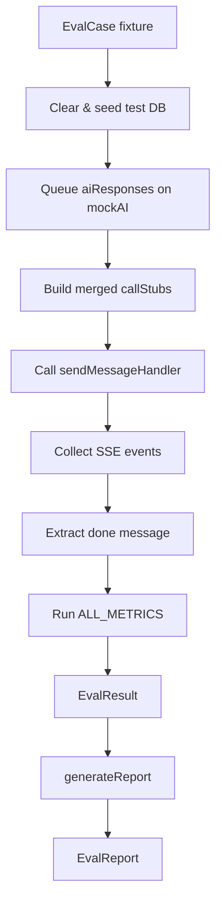

# Agent Evaluation Framework

Local automatic evaluation and scoring framework for the `sendMessage` chat agent in `microservice.analysis`. Runs entirely within Jest — no external services required.

## Overview

The evaluation framework provides deterministic, regression-safe quality measurement for the AI agent by:

1. **Replaying recorded scenarios** (fixtures) with a mocked AI adapter
2. **Scoring outputs** with five metrics covering faithfulness, relevance, tool accuracy, efficiency, and confidence calibration
3. **Generating structured reports** that can be viewed in CI logs or saved as artefacts

## Architecture

```
evaluation/
├── types.ts                          ← Core interfaces (EvalCase, EvalResult, EvalReport…)
├── runner.ts                         ← runEvaluation() — orchestrates the full pipeline
├── report.ts                         ← generateReport() — aggregates results into EvalReport
├── metrics/
│   ├── index.ts                      ← ALL_METRICS array + MetricRunner type
│   ├── faithfulness.metric.ts        ← Is the answer grounded in tool data?
│   ├── relevance.metric.ts           ← Does the answer address the question?
│   ├── tool-accuracy.metric.ts       ← Were the right tools called?
│   ├── efficiency.metric.ts          ← Did the agent finish within iteration budget?
│   └── confidence-calibration.metric.ts ← Did confidence meet the threshold?
├── fixtures/
│   ├── index.ts                      ← ALL_FIXTURES array
│   ├── case-structured-basic.ts      ← Simple aggregate query
│   ├── case-structured-filter.ts     ← Filtered aggregate (top-N with conditions)
│   ├── case-unstructured-rag.ts      ← Semantic search on unstructured dataset
│   ├── case-multi-iteration.ts       ← Two aggregate calls before final answer
│   ├── case-sub-agent.ts             ← createSubAgent delegation flow
│   ├── case-wrong-tool-type.ts       ← Self-correction after wrong-category tool call
│   └── case-confidence.ts            ← Explicit confidence score calibration
└── __tests__/
    └── runner.test.ts                ← Jest test (integration + unit metric tests)
```

## Running the Evaluation

```bash
# Run the full evaluation suite
npm run eval:agent

# Run a single fixture during development
npx jest --testPathPattern=evaluation/runner --verbose -t "structured-basic"
```

## How It Works

### Flow Diagram



### Mock AI Adapter

The `aiResponses` array in each `EvalCase` drives the mock AI adapter via `jest.fn().mockResolvedValueOnce(...)`. Each entry in the array corresponds to one call to `chatWithTools` — in the exact order they occur across the main orchestration loop and any sub-agent loops.

```typescript
// Example: two-step flow (tool call → final answer)
aiResponses: [
  {
    content: "",
    toolCalls: [{ function: { name: "aggregate", arguments: { ... } } }],
    // ...token fields
  },
  {
    content: "The total revenue is $500K. Confidence: 0.9",
    toolCalls: [],
    // ...token fields
  },
]
```

### Call Stubs

`callStubs` in each fixture override `ctx.call()` for inter-service calls. The runner provides default stubs for common calls:

| Action | Default stub |
|--------|--------------|
| `chat.buildDynamicSystemPrompt` | `{ systemPrompt: "You are a data analysis assistant." }` |
| `chat.generateName` | `{ name: fixture.description }` |
| `conversation.renameConversation` | `{ success: true }` |
| `dataset.listDatasets` | Array from fixture.datasets |

Fixture-specific stubs (e.g. `tools.aggregate`, `dataset.getDataset`) are merged on top with fixture values taking priority.

## Metrics Reference

### Faithfulness

**Goal:** Verify the answer is grounded in retrieved data rather than hallucinated.

**Heuristic:** `toolsUsed.length > 0 → score 1.0` | `empty → score 0.5`

**Threshold:** passes if score ≥ 0.5

**Future enhancement:** LLM-as-judge overlay to verify each claim maps to a specific tool result.

---

### Relevance

**Goal:** Verify the answer addresses the user's question.

**Heuristic:** Extract keywords from `userMessage` (words > 3 chars, excluding stop words), count matches in `doneMessage.content` (case-insensitive).

`score = matchedKeywords / totalKeywords` (capped at 1.0)

**Threshold:** passes if score ≥ 0.5

---

### Tool Accuracy

**Goal:** Verify the agent called the expected tools the required number of times.

**Formula:** `score = matched expectations / total expectations`

**Threshold:** passes if score ≥ 0.8

Only tools in `toolsUsed` (i.e. successfully executed) count. Tools rejected by dataset-type validation do not appear in `toolsUsed`.

---

### Efficiency

**Goal:** Verify the agent resolved the query without excessive back-and-forth.

**Method:** Count SSE events with `type: "reasoning"` and `step: "Cooking..."` (exactly, 3 ASCII periods). This equals the number of main-loop iterations. Sub-agent loops emit `[Sub-agent] Cooking…` (Unicode ellipsis) and are not counted.

**Formula:** `score = min(1, maxIterations / actualIterations)`

**Threshold:** passes if `actualIterations <= maxIterations`

---

### Confidence Calibration

**Goal:** Verify the agent's self-reported confidence meets the expected threshold.

The `extractConfidenceScore` function in the action parses `confidence: N` patterns (0–1 or 1–100 normalised) from the final answer.

**When `minConfidence` is set:** `score = confidenceScore ?? 0`, passes if `score >= minConfidence`

**When `minConfidence` is not set:** always passes, records `confidenceScore ?? 0.5`

## Adding a New Fixture

1. Create `evaluation/fixtures/case-<name>.ts` exporting a single `EvalCase` object.
2. Add it to `evaluation/fixtures/index.ts` and `ALL_FIXTURES`.
3. If needed, add a corresponding test in `__tests__/runner.test.ts`.

```typescript
// case-my-scenario.ts
import type { ChatWithToolsResponse } from "core.lib/adapters/ai";
import type { EvalCase } from "../types";

const DATASET_ID = "xxxxxxxx-xxxx-4xxx-8xxx-xxxxxxxxxxxx";

const BASE_RESPONSE: Omit<ChatWithToolsResponse, "content" | "toolCalls"> = {
  completionTokens: 20,
  durationMs: 100,
  model: "mock-model",
  promptTokens: 100,
  reasoning: null,
  totalTokens: 120,
};

export const caseMyScenario: EvalCase = {
  id: "my-scenario",
  description: "Human-readable description",
  userMessage: "User question here",
  datasets: [{ id: DATASET_ID, name: "My Dataset", datasetType: "structured-table" }],
  aiResponses: [
    { ...BASE_RESPONSE, content: "", toolCalls: [/* tool call */] },
    { ...BASE_RESPONSE, content: "Final answer. Confidence: 0.9", toolCalls: [] },
  ],
  callStubs: {
    "dataset.getDataset": { datasetType: "structured-table", name: "My Dataset" },
    "tools.aggregate": { results: [], totalGroups: 0, truncated: false },
  },
  expectedToolCalls: [{ toolName: "aggregate", minCalls: 1 }],
  maxIterations: 5,
  minConfidence: 0.8,
};
```

## Adding a New Metric

1. Create `evaluation/metrics/<name>.metric.ts` exporting a `MetricRunner` function.
2. Add it to `evaluation/metrics/index.ts` and `ALL_METRICS`.

```typescript
// evaluation/metrics/my-metric.metric.ts
import type { EvalCase, EvalResult, ScoreResult } from "../types";

export function myMetric(evalCase: EvalCase, result: EvalResult): ScoreResult {
  const score = /* compute 0–1 score */;
  return {
    metricName: "my_metric",
    passed: score >= 0.7,
    reason: `Explanation of the score`,
    score,
  };
}
```

## Fixture Catalogue

| ID | Description | Tools Expected | maxIterations |
|----|-------------|---------------|---------------|
| `structured-basic` | Simple aggregate — revenue by country | `aggregate` | 5 |
| `structured-filter` | Filtered aggregate — top 5 products in Germany | `aggregate` | 5 |
| `unstructured-rag` | Semantic search — key findings in report | `semanticSearch` | 5 |
| `multi-iteration` | Two aggregates — compare Q1 vs Q2 revenue | `aggregate` ×2 | 7 |
| `sub-agent` | Sub-agent delegation — sales performance by region | `createSubAgent` | 10 |
| `wrong-tool-type` | Self-correction after wrong-category tool call | `semanticSearch` | 7 |
| `confidence` | Explicit confidence calibration check | `aggregate` | 5 |

## Future Enhancements

- **LLM-as-judge:** Use a lightweight judge model to verify faithfulness claim-by-claim.
- **Reference-answer similarity:** Add a `referenceSimilarity` metric using embedding cosine distance.
- **Latency percentiles:** Track p50/p99 `durationMs` across fixture runs.
- **Historical trending:** Persist `EvalReport` as JSON artefacts and plot metric trends over commits.
- **TSX CLI runner:** Create a standalone `runner.ts` entry point that patches the module cache for AI mocking and runs outside Jest.
