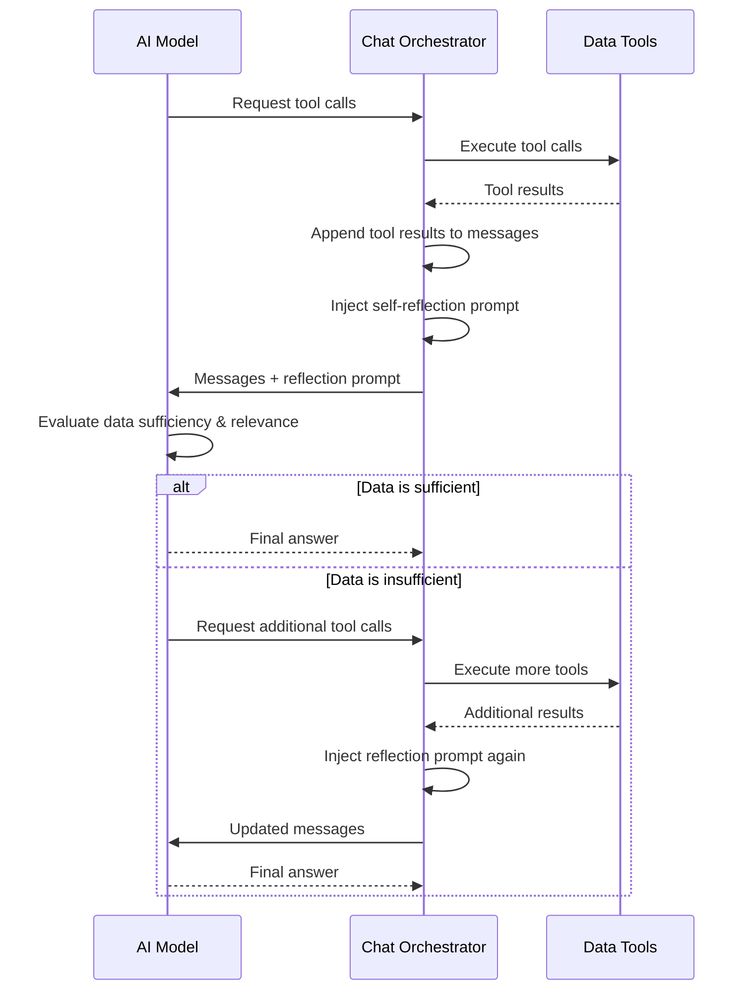
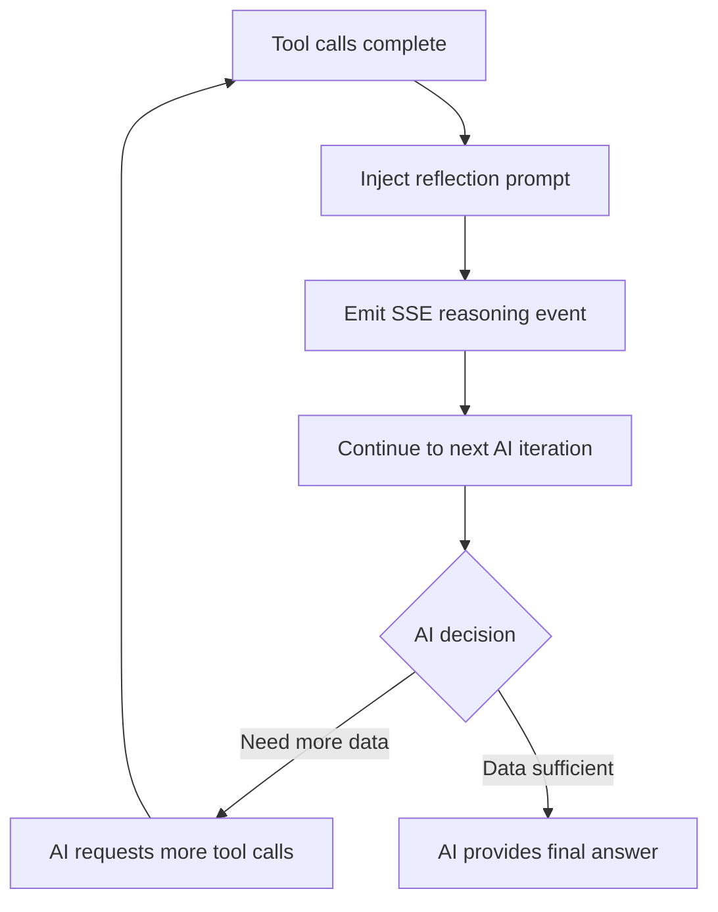

# Agent Self-Reflection

## Overview

The agent self-reflection feature ensures that the AI verifies retrieved data is sufficient and relevant before generating its final response. This is implemented through two complementary mechanisms:

1. **System prompt guidance** — instructs the AI on self-reflection best practices
2. **Runtime reflection injection** — injects a reflection prompt after tool results are collected

## Architecture



## System Prompt: Self-Reflection Section

The `buildDynamicSystemPrompt` action includes a "Self-Reflection & Data Verification" section in the system prompt. This section instructs the AI to:

1. **Assess Data Sufficiency** — evaluate whether retrieved information fully answers the user's question
2. **Verify Data Relevance** — check that retrieved data is on-topic and not incomplete
3. **Cross-Reference** — verify key facts by checking multiple sources or using different tools
4. **Acknowledge Limitations** — explicitly state missing or uncertain information rather than guessing
5. **Confidence Assessment** — rate confidence in the answer, especially when using unstructured text tools

### Unstructured Document Guidance

Special guidance is provided for unstructured documents:

- After `semanticSearch` or `getChunks`, review whether retrieved content actually answers the question
- If chunks are not relevant enough, try different search queries or browse different document index sections
- Use AI-generated chunk summaries to quickly assess relevance before reading full content

## Runtime Reflection Injection

After each round of tool calls in the `sendMessage` orchestration loop, a reflection prompt is injected into the conversation:

```
Before responding, reflect on the data you just retrieved:
1. Is this data sufficient to answer the user's question?
2. Is the retrieved information relevant and accurate?
3. Do you need to fetch additional data from other sections or datasets?
If the data is insufficient or irrelevant, use more tools to gather better information.
If the data is sufficient, provide your final answer.
```

This prompt is added as a `role: "user"` message, which triggers the AI to:

- Evaluate the quality of the data just retrieved
- Decide whether to fetch more data or provide a final answer
- Use additional tools if the data is insufficient

A corresponding `reasoning` SSE event is emitted so the client can display the reflection step in real time.



## DocumentIndexEntry Enhancement

The `DocumentIndexEntry` interface now includes a `chunkIds` field:

```typescript
interface DocumentIndexEntry {
  chunkEnd: number;
  chunkIds: string[];
  chunkStart: number;
  indexLabel: string;
  level: number;
  summary: string;
  title: string;
}
```

The `chunkIds` array provides direct references to specific chunk identifiers within a document index entry, supporting more precise chunk retrieval during self-reflection.

## Impact on Tool-Calling Loop

The self-reflection step is integrated into the existing tool-calling loop (max 20 iterations). The reflection prompt consumes one additional iteration per tool-call round, but this is offset by:

- Reduced false starts (AI is less likely to respond with irrelevant data)
- Better data coverage (AI proactively fetches missing information)
- Higher answer quality (AI acknowledges limitations instead of guessing)

## Files Modified

| File | Change |
|------|--------|
| `services/chat/buildDynamicSystemPrompt.action.ts` | Added Self-Reflection section to system prompt; added `chunkIds` to `DocumentIndexEntry` |
| `services/chat/sendMessage.action.ts` | Injected reflection prompt after tool results; emits reasoning SSE event |
