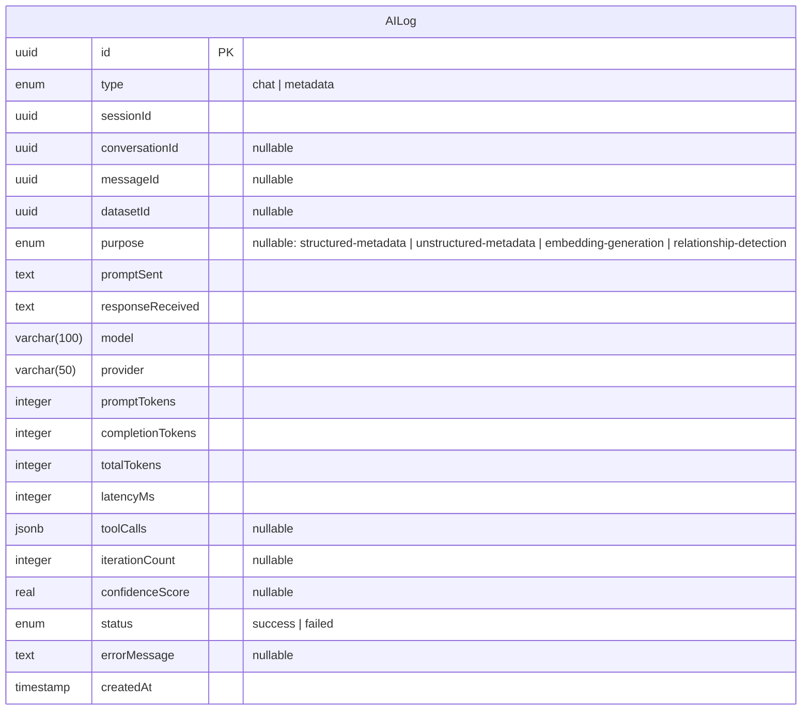

# AI Logging

## Overview

Every AI interaction across the system is recorded in the `AILog` entity for auditability and debugging. The entity is shared across microservices via `core.lib/database`.

## Data Model



## Log Types

| Type       | Used By              | Description                                     |
|------------|----------------------|-------------------------------------------------|
| `chat`     | Analysis microservice | Logged for each `chat.sendMessage` invocation   |
| `metadata` | Data microservice     | Logged when AI generates dataset metadata        |

## Log Purpose (Metadata Only)

| Purpose                    | Description                                    |
|----------------------------|------------------------------------------------|
| `embedding-generation`     | Vector embedding creation for text chunks      |
| `relationship-detection`   | AI-based relationship discovery between datasets |
| `structured-metadata`      | AI-generated descriptions for tabular datasets |
| `unstructured-metadata`    | AI-generated summaries/topics for text datasets |

## Tool Call Log Entry

The `toolCalls` JSONB column stores an array of:

```typescript
interface ToolCallLog {
  durationMs: number;
  iterationIndex: number;
  parameters: Record<string, unknown>;
  resultSummary: string;
  toolName: string;
}
```

## Indexes

| Index                                          | Columns                              |
|------------------------------------------------|--------------------------------------|
| `idx_aiLogs_type_sessionId_createdAt`          | `type`, `sessionId`, `createdAt`     |
| `idx_aiLogs_conversationId_createdAt`          | `conversationId`, `createdAt`        |
| `idx_aiLogs_datasetId_createdAt`               | `datasetId`, `createdAt`             |
