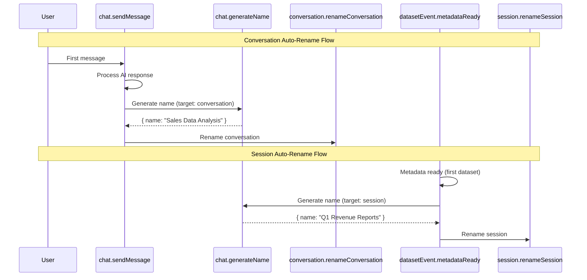

# AI-Powered Naming

Automatic AI-generated names for sessions and conversations, replacing the default timestamp-based names.

## Overview

Sessions and conversations start with default names like "Session — Mar 16, 2026, 05:53" and "Conversation — Mar 16, 06:49". The system automatically generates descriptive names using AI when:

1. **Session**: After the first dataset's metadata generation completes
2. **Conversation**: After the user sends their first chat message

## Architecture

## Action: `chat.generateName`

Internal action (no REST endpoint) that generates names via AI.

| Parameter | Type | Description |
|-----------|------|-------------|
| `target` | `"session" \| "conversation"` | What entity to name |
| `context` | `string` | Context for name generation (dataset names or user question) |

Returns `{ name: string }`.

## Trigger Conditions

### Session Rename
- Triggered by `datasetEvent.metadataReady` event
- Only renames if session name starts with "Session —" (default pattern)
- Context includes all dataset names and types in the session

### Conversation Rename
- Triggered inside `chat.sendMessage` after saving the assistant response
- Only renames when `conversation.messageCount === 0` (first message exchange)
- Context is the user's first message content

## Naming Rules (AI Prompt)
- Maximum 60 characters
- No quotes or special formatting
- Natural, readable language
- Specific to the topic/domain

## AI Logging
All name generation calls are logged to `AILog` with purpose `NAME_GENERATION`.
