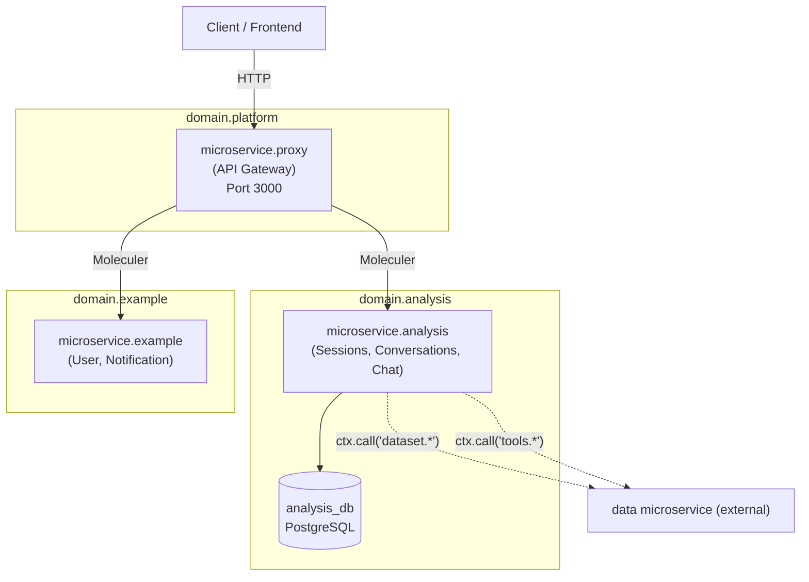
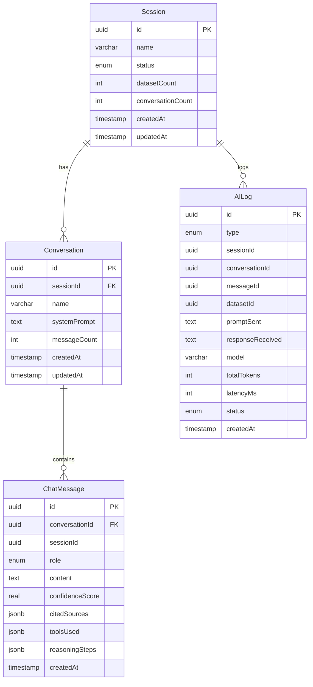

# Architecture Overview

## Microservices

The backend consists of three microservices communicating via the Moleculer service broker (NATS transporter):

## Microservice Responsibilities

### microservice.proxy (API Gateway)

- HTTP entry point on port 3000
- Routes all `/api/*` requests to internal services via auto-aliases
- Dedicated file upload route at `POST /api/sessions/:sessionId/upload` (100MB limit)
- URL import at `POST /api/sessions/:sessionId/import-url`
- Web search at `POST /api/sessions/:sessionId/search-websites`
- CORS, rate limiting (100 req/min), request body parsing
- Health check at `GET /api/health`

### microservice.analysis

- **Session service** — CRUD for analysis workspaces, lifecycle status management
- **Conversation service** — CRUD for chat threads within sessions, system prompt construction
- **Chat service** — AI-powered message handling with tool-calling orchestration loop
- **datasetEvent service** — Event listener for `datasetEvent.metadataReady` from data microservice
- Database: `analysis_db` (PostgreSQL) with entities: `Session`, `Conversation`, `ChatMessage`, `AILog`

### microservice.example

- Demo/scaffold microservice showing patterns
- **User service** — create/list users, emits `user.created` event
- **Notification service** — listens for `user.created` event, simulates welcome email

## Service Registry

### Analysis Microservice Actions

| Service        | Action                              | REST Endpoint                        | Visibility |
|----------------|-------------------------------------|--------------------------------------|------------|
| `session`      | `session.create`                    | `POST /api/sessions`                 | External   |
| `session`      | `session.list`                      | `GET /api/sessions`                  | External   |
| `session`      | `session.getSession`                | `GET /api/sessions/:id`              | External   |
| `session`      | `session.deleteSession`             | `DELETE /api/sessions/:id`           | External   |
| `session`      | `session.renameSession`             | `PATCH /api/sessions/:id/rename`     | External   |
| `session`      | `session.updateSessionStatus`       | —                                    | Protected  |
| `conversation` | `conversation.createConversation`   | `POST /api/conversations`            | External   |
| `conversation` | `conversation.listConversations`    | `GET /api/conversations`             | External   |
| `conversation` | `conversation.getConversation`      | `GET /api/conversations/:id`         | External   |
| `conversation` | `conversation.deleteConversation`   | `DELETE /api/conversations/:id`      | External   |
| `conversation` | `conversation.renameConversation`   | `PATCH /api/conversations/:id/rename`| External   |
| `chat`         | `chat.getHistory`                   | `GET /api/chat/messages`             | External   |
| `chat`         | `chat.sendMessage`                  | `POST /api/chat/messages`            | External   |

### Analysis Microservice Events

| Event                    | Emitted By       | Handled By       | Description                          |
|--------------------------|------------------|------------------|--------------------------------------|
| `sessionData.sessionDeleted`  | `session`       | `sessionData`    | Cross-service cascade cleanup        |
| `datasetEvent.metadataReady`  | (data svc)  | `datasetEvent`   | Dataset metadata processing complete |

### Example Microservice Actions

| Service        | Action                  | REST Endpoint | Visibility |
|----------------|-------------------------|---------------|------------|
| `user`         | `user.create`           | —             | Internal   |
| `user`         | `user.list`             | —             | Internal   |
| `notification` | `notification.create`   | —             | Internal   |
| `notification` | `notification.list`     | —             | Internal   |

### Example Microservice Events

| Event           | Emitted By | Handled By                     | Description              |
|-----------------|------------|--------------------------------|--------------------------|
| `user.created`  | `user`     | `user`, `notification`         | New user was created     |

## Database Schema

