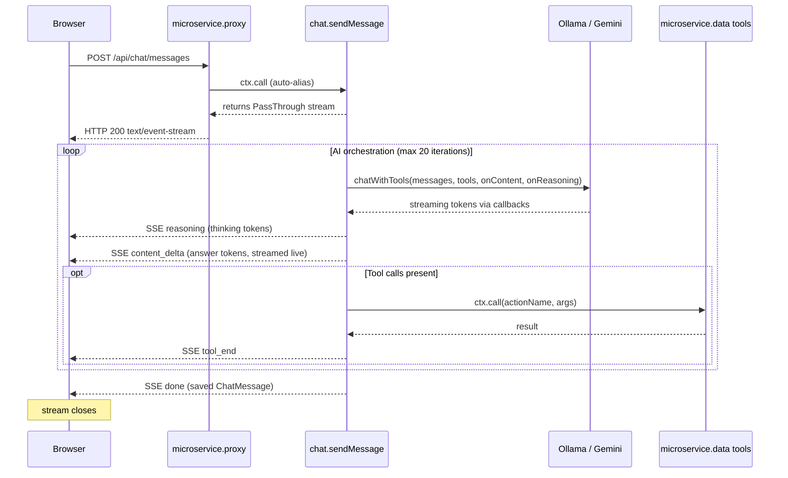

# Chat Streaming (SSE)

Real-time AI reasoning progress delivered to the frontend via Server-Sent Events.

## Overview

When a user sends a chat message, the backend runs an AI tool-calling
orchestration loop (up to 20 iterations). Previously the UI waited for the
entire loop to finish before displaying a response. With streaming, each
intermediate step is pushed to the client as it happens — including the final
answer which is streamed token-by-token via incremental `content_delta` events.

## Architecture



## SSE Event Types

| Event           | Payload                                   | Description                          |
|-----------------|-------------------------------------------|--------------------------------------|
| `status`        | `{ type, message }`                       | Progress label ("Building context…") |
| `reasoning`     | `{ type, step }`                          | Single reasoning step string         |
| `tool_start`    | `{ type, toolName, parameters }`          | Tool call initiated                  |
| `tool_end`      | `{ type, toolName, durationMs, success, resultPreview }` | Tool call completed/failed |
| `content_delta` | `{ type, delta }`                         | Streamed assistant text chunk (token-by-token) |
| `done`          | `{ type, message: ChatMessage }`          | Final saved message; stream ends     |
| `error`         | `{ type, message }`                       | Unrecoverable error; stream ends     |

## Wire Format

Each SSE frame follows the standard format:

```
event: <type>\n
data: <JSON object>\n
\n
```

Example:

```
event: tool_start
data: {"type":"tool_start","toolName":"queryData","parameters":{"datasetId":"abc"}}

event: tool_end
data: {"type":"tool_end","toolName":"queryData","durationMs":142,"success":true,"resultPreview":"[5 rows]"}

event: content_delta
data: {"type":"content_delta","delta":"Based on the analysis of your dataset…"}

event: done
data: {"type":"done","message":{"id":"msg-123","content":"Based on…","role":"assistant",…}}
```

## Backend Implementation

### Action

`services/chat/sendMessage.action.ts` — REST: `POST /messages`

1. Sets `ctx.meta.$responseType = "text/event-stream"` and SSE-related headers.
2. Creates a `PassThrough` stream and returns it immediately.
3. Runs the orchestration loop asynchronously, writing SSE events via
   `writeSSE(stream, event)`.
4. Passes `onContent` and `onReasoning` callbacks to `ai.chatWithTools()` so
   that both reasoning steps and final answer content are streamed
   token-by-token as `content_delta` SSE events to the client.
5. On completion, writes a `done` event with the persisted `ChatMessage` and
   calls `stream.end()`.

### How moleculer-web Streams

When an action returns a Node.js `Stream`, moleculer-web automatically pipes it
to the HTTP response. Combined with `$responseType` and `$responseHeaders`, the
gateway serves it as a proper SSE endpoint with no custom alias required.

## Frontend Implementation

### Hook: `useStreamMessage`

Located in `hooks/useStreamChat.ts`. Uses `fetch()` with
`response.body.getReader()` to consume the SSE stream (native `EventSource`
only supports GET).

**State exposed:**

```typescript
interface StreamingState {
  content: string;           // accumulated text from content_delta
  error: string | null;
  finalMessage: ChatMessage | null;
  isStreaming: boolean;
  pendingUserMessage: string | null;  // optimistic user bubble
  reasoningSteps: string[];
  statusMessage: string;
  tools: ActiveTool[];       // running / success / error
}
```

When the `done` event arrives, `react-query` cache is invalidated so the
history query picks up both user and assistant messages from the server.

### Component: `StreamingThinkingIndicator`

Replaces the old static `ThinkingIndicator` during streaming. Shows:

- Animated spinner + status label
- Collapsible activity log (reasoning steps + tool call cards)
- Streamed markdown content as it arrives
- Error banner if something fails

## Endpoint Reference

| Method | Path                       | Content-Type         |
|--------|----------------------------|----------------------|
| POST   | `/api/chat/messages`       | `text/event-stream`  |
