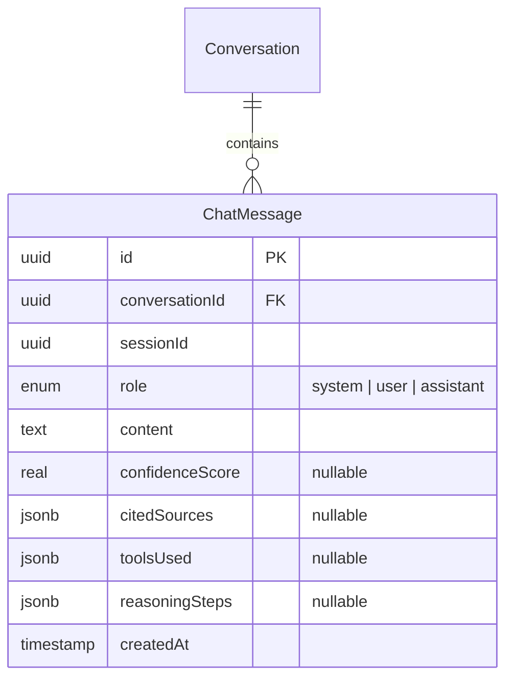
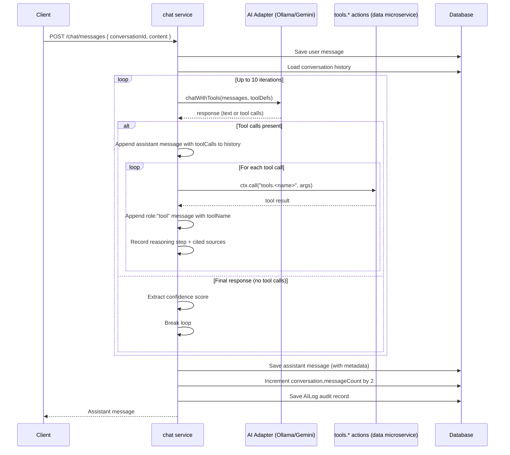

# Chat System

## Overview

The chat system powers AI-driven data analysis conversations. It provides message history retrieval and an AI-orchestrated send-message flow with tool calling capabilities.

## Data Model



### Message Roles

| Role        | Description                                                    |
|-------------|----------------------------------------------------------------|
| `system`    | System prompt, created when conversation is initialized        |
| `user`      | User's question or instruction                                 |
| `assistant` | AI response with optional confidence, citations, tools, reasoning |

### Assistant Message Metadata

- **`confidenceScore`** — float 0–1, extracted from AI response text
- **`citedSources`** — `Array<{ datasetId, datasetName, columnName? }>`, datasets referenced during tool calls
- **`toolsUsed`** — `Array<{ toolName, parameters, resultSummary }>`, tool invocations and their results
- **`reasoningSteps`** — `string[]`, step-by-step record of AI reasoning and tool calls

## REST Endpoints

All chat endpoints are under the `/api/chat` base path.

| Operation        | Method | URL                  | Action                |
|------------------|--------|----------------------|-----------------------|
| Get history      | `GET`  | `/api/chat/messages` | `chat.getHistory`     |
| Send message     | `POST` | `/api/chat/messages` | `chat.sendMessage`    |

### Get History

Paginated message history in chronological order (ASC by `createdAt`).

**Query params:**
- `conversationId` (uuid, required)
- `page` (number, optional, default: 1) — uses `convert: true`
- `limit` (number, optional, default: 50, max: 100) — uses `convert: true`
- `excludeSystem` (boolean, optional, default: false) — uses `convert: true`

**Returns:** `{ messages[], total, page, limit, hasMore }`

### Send Message

Core chat action that orchestrates AI tool-calling in a loop.

**Params:**
- `conversationId` (uuid, required)
- `content` (string, required, 1–10,000 chars)

**Returns:** Full assistant message: `{ id, conversationId, role, content, confidenceScore, citedSources, toolsUsed, reasoningSteps, createdAt }`

## AI Tool-Calling Orchestration



### Available Tools

Tools are mapped to Moleculer service actions via `TOOL_TO_ACTION`. Max 10 tool-calling iterations per request.

#### Structured Data Tools

| Tool                | Action                     | Description                                        |
|---------------------|----------------------------|----------------------------------------------------|
| `aggregate`         | `tools.aggregate`          | Multi-field aggregation pipeline                   |
| `avgField`          | `tools.avgField`           | Average a numeric field with optional groupBy      |
| `correlateFields`   | `tools.correlateFields`    | Pearson correlation between two numeric fields     |
| `count`             | `tools.count`              | Count records with optional filters                |
| `countAndGroup`     | `tools.countAndGroup`      | Count records grouped by field(s)                  |
| `detectOutliers`    | `tools.detectOutliers`     | Identify records beyond 2 standard deviations      |
| `filterByCondition` | `tools.filterByCondition`  | Filter by conditions (equals, range, contains, in) |
| `getDistinctValues` | `tools.getDistinctValues`  | Get distinct values with counts                    |
| `getMinMax`         | `tools.getMinMax`          | Get min/max values for a field                     |
| `getPercentile`     | `tools.getPercentile`      | Get percentile values (P25, P50, P75, P99)         |
| `getTopByField`     | `tools.getTopByField`      | Get top N records sorted by a field                |
| `joinDatasets`      | `tools.joinDatasets`       | Join two datasets on a shared field                |
| `pivotTable`        | `tools.pivotTable`         | Cross-tabulation by two categorical fields         |
| `sortByField`       | `tools.sortByField`        | Sort records by field(s) with limit                |
| `sumField`          | `tools.sumField`           | Sum a numeric field with optional groupBy          |

#### Unstructured Text Tools

| Tool                 | Action                       | Description                                         |
|----------------------|------------------------------|-----------------------------------------------------|
| `answerFromContext`  | `tools.answerFromContext`    | Answer questions using retrieved text context (RAG)  |
| `compareDocuments`   | `tools.compareDocuments`     | Compare content/themes across text datasets          |
| `extractEntities`    | `tools.extractEntities`      | Extract people, orgs, dates, locations, monetary     |
| `extractKeyTopics`   | `tools.extractKeyTopics`     | Identify main topics and themes                      |
| `findSimilarChunks`  | `tools.findSimilarChunks`    | Find semantically similar text passages              |
| `semanticSearch`     | `tools.semanticSearch`       | Vector similarity search across text chunks          |
| `sentimentAnalysis`  | `tools.sentimentAnalysis`    | Determine sentiment of text passages                 |
| `summarizeDocument`  | `tools.summarizeDocument`    | Generate a summary of a text dataset                 |
| `timelineExtraction` | `tools.timelineExtraction`   | Extract and order date-referenced events             |

## AI Logging

Every AI interaction is recorded in the `AILog` table for auditability:

- `type: "chat"` — distinguishes from metadata-generation logs
- Tracks: `promptSent`, `responseReceived`, `model`, `provider`, `promptTokens`, `completionTokens`, `totalTokens`, `latencyMs`
- Records `toolCalls` array with per-tool parameters and result summaries
- Stores `iterationCount`, `confidenceScore`, and `status` (success/failed)

## Response Post-Processing

### Tool Message Protocol

The AI tool-calling loop follows the Ollama/OpenAI message protocol. Correct message ordering is critical for the model to process tool results:

1. **Assistant message with `toolCalls`** — when the AI requests tool calls, the full assistant response (including the `toolCalls` array) is appended to the message history. This lets the model see its own tool requests on the next iteration.
2. **Tool result messages with `role: "tool"`** — each tool execution result is added as a separate message with `role: "tool"` and `toolName` set to the function name. The Ollama adapter maps `toolName` to Ollama's `tool_name` field.

```typescript
// After AI responds with tool calls:
messages.push({
  role: "assistant",
  content: response.content || "",
  toolCalls: response.toolCalls,   // preserved for model context
});

// After each tool executes:
messages.push({
  role: "tool",
  content: resultStr,              // tool output as text
  toolName: fnName,                // maps to Ollama's tool_name
});
```

**Why this matters:** If tool results are sent as `role: "assistant"` without the original tool-call request, the model loses context about what it asked for and returns empty responses.

### Think Tag Stripping

Reasoning models like Qwen3 wrap internal chain-of-thought in `<think>...</think>` tags. The Ollama adapter (`lib/adapters/ai/ollama.adapter.ts`) automatically strips these tags from all responses (`chatWithTools`, `generateText`) using `stripThinkTags()` so they never leak into user-facing content.

The function handles three edge cases:
1. **Standard paired tags**: `<think>reasoning</think>response` — strips the matched block
2. **Orphaned closing tag**: `reasoning</think>response` — Ollama may place thinking in a separate field while leaving `</think>` in content; strips everything up to and including `</think>`
3. **Unclosed opening tag**: `response<think>reasoning...` — strips from `<think>` to end

### Tool Definition Best Practices

Tool definitions passed to the AI must include detailed `items` schemas for array parameters. Without explicit item schemas (including property names, types, enums, and descriptions), the AI model may:

- Generate invalid parameter structures (e.g., sending a string instead of an array of objects)
- Use incorrect enum values (e.g., `"equals"` instead of the expected `"eq"`)
- Omit required fields

Example of a well-defined array parameter:

```json
{
  "conditions": {
    "type": "array",
    "description": "Array of condition objects.",
    "items": {
      "type": "object",
      "properties": {
        "field": { "type": "string", "description": "Column key" },
        "operator": {
          "type": "string",
          "enum": ["eq", "neq", "gt", "gte", "lt", "lte", "contains", "in"],
          "description": "Comparison operator"
        },
        "value": { "type": "string", "description": "Value to compare" }
      },
      "required": ["field", "operator", "value"]
    }
  }
}
```
