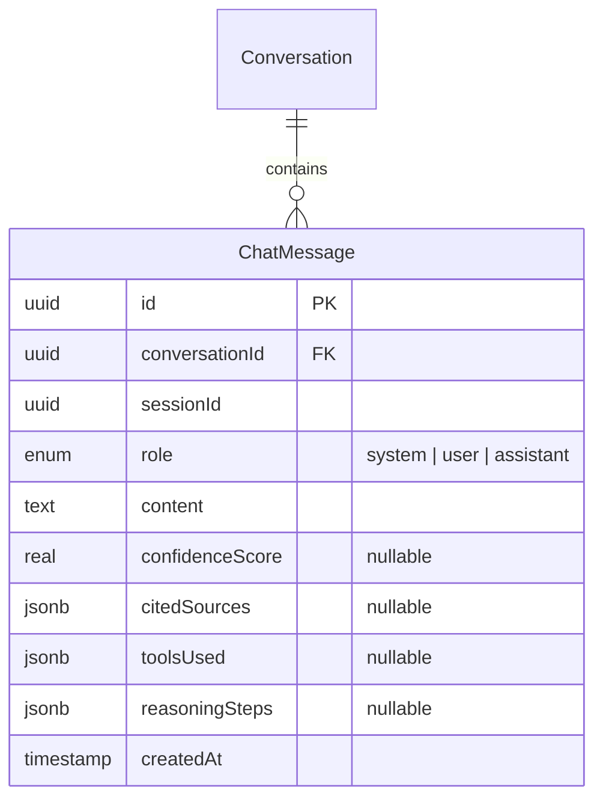
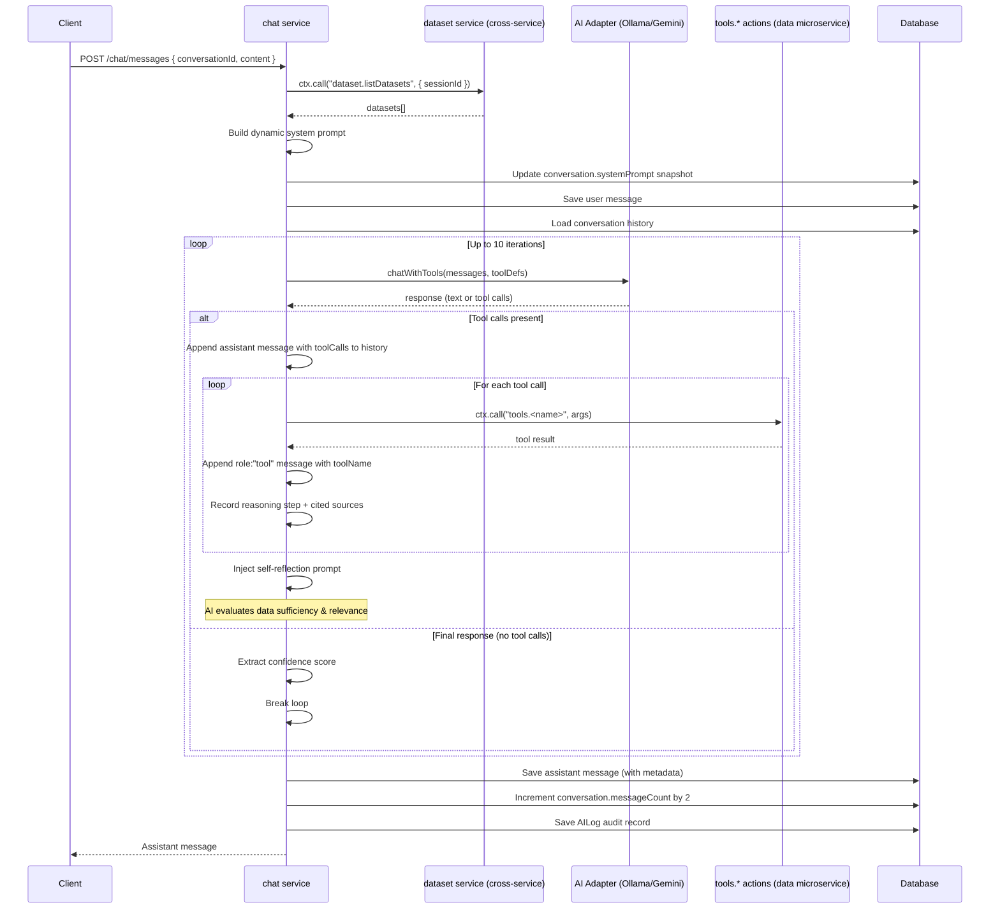
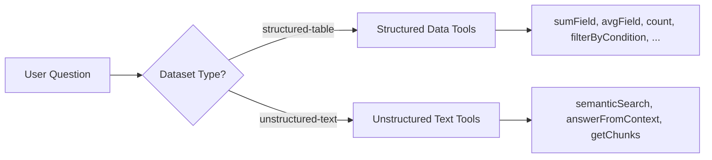
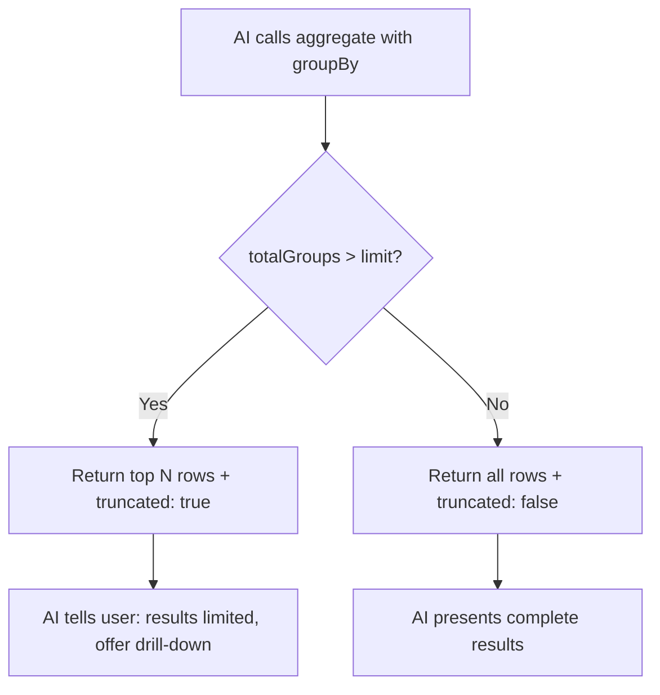
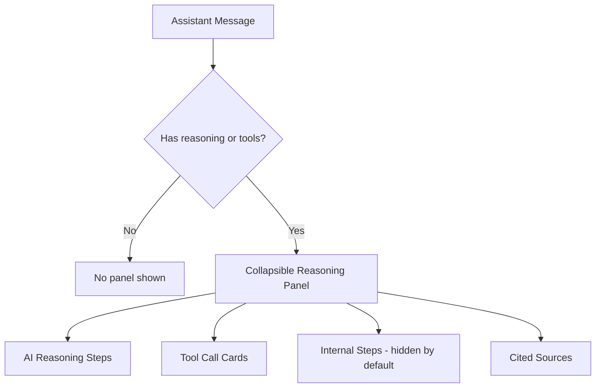

# Chat System

## Overview

The chat system powers AI-driven data analysis conversations. It provides message history retrieval and an AI-orchestrated send-message flow with tool calling capabilities.

## Data Model



### Message Roles

| Role        | Description                                                    |
|-------------|----------------------------------------------------------------|
| `system`    | Runtime system prompt injected in memory before each AI call   |
| `user`      | User's question or instruction                                 |
| `assistant` | AI response with optional confidence, citations, tools, reasoning |

### Assistant Message Metadata

- **`confidenceScore`** — float 0–1, extracted from AI response text
- **`citedSources`** — `Array<{ datasetId, datasetName, columnName? }>`, datasets referenced during tool calls
- **`toolsUsed`** — `Array<{ toolName, parameters, resultSummary }>`, tool invocations and their results
- **`reasoningSteps`** — `string[]`, step-by-step record of AI reasoning and tool calls

## REST Endpoints

All chat endpoints are under the `/api/chat` base path.

| Operation        | Method | URL                  | Action                |
|------------------|--------|----------------------|-----------------------|
| Get history      | `GET`  | `/api/chat/messages` | `chat.getHistory`     |
| Send message     | `POST` | `/api/chat/messages` | `chat.sendMessage`    |

### Get History

Paginated message history in chronological order (ASC by `createdAt`).

**Query params:**
- `conversationId` (uuid, required)
- `page` (number, optional, default: 1) — uses `convert: true`
- `limit` (number, optional, default: 50, max: 100) — uses `convert: true`
- `excludeSystem` (boolean, optional, default: false) — uses `convert: true`

**Returns:** `{ messages[], total, page, limit, hasMore }`

### Send Message (SSE Streaming)

Core chat action that orchestrates AI tool-calling in a loop, returning results as a **Server-Sent Events (SSE)** stream.

**Params:**
- `conversationId` (uuid, required)
- `content` (string, required, 1–10,000 chars)

**Response:** `Content-Type: text/event-stream` with the following event types:

| Event          | Data Fields                                      | Description                          |
|----------------|--------------------------------------------------|--------------------------------------|
| `status`       | `{ message }`                                    | High-level status updates            |
| `reasoning`    | `{ step }`                                       | AI chain-of-thought reasoning lines  |
| `tool_start`   | `{ toolName, parameters }`                       | Tool invocation started              |
| `tool_end`     | `{ toolName, success, durationMs, resultPreview }`| Tool invocation completed           |
| `content_delta`| `{ delta }`                                      | Streamed final content chunks        |
| `done`         | Full assistant message object                    | Stream complete                      |
| `error`        | `{ message }`                                    | Error during processing              |

### Internal Action: buildDynamicSystemPrompt

`chat.buildDynamicSystemPrompt` is an internal action (no REST endpoint) that builds the latest system prompt from session datasets.

**Params:**
- `sessionId` (uuid, required)

**Returns:** `{ systemPrompt: string }`

## AI Tool-Calling Orchestration



### Available Tools

Tools are mapped to Moleculer service actions via `TOOL_TO_ACTION`. Max 10 tool-calling iterations per request.

**Tool selection is driven by dataset type.** Each tool definition includes a `[STRUCTURED DATA ONLY]` or `[UNSTRUCTURED TEXT ONLY]` prefix in its description so the AI model knows which tools apply to which datasets.

#### Tool-to-Dataset-Type Mapping



The system prompt explicitly groups datasets by type and tells the AI:
- **`structured-table`** datasets → use ONLY structured data tools (tabular row/column operations)
- **`unstructured-text`** datasets → use ONLY unstructured text tools (vector search, RAG, chunk reading)
- NEVER mix tool categories across dataset types

#### Structured Data Tools (for `structured-table` datasets only)

| Tool                | Action                     | Description                                        |
|---------------------|----------------------------|----------------------------------------------------|
| `aggregate`         | `tools.aggregate`          | Multi-field aggregation pipeline (limit/orderBy support, max 200 rows) |
| `avgField`          | `tools.avgField`           | Average a numeric field with optional groupBy (max 200 grouped rows) |
| `correlateFields`   | `tools.correlateFields`    | Pearson correlation between two numeric fields     |
| `count`             | `tools.count`              | Count records with optional filters                |
| `countAndGroup`     | `tools.countAndGroup`      | Count records grouped by field(s) (max 200 groups) |
| `countDistinctValues` | `tools.countDistinctValues` | Count how many distinct values exist for a field |
| `detectOutliers`    | `tools.detectOutliers`     | Identify records beyond 2 standard deviations      |
| `filterByCondition` | `tools.filterByCondition`  | Filter by conditions (equals, range, contains, in) |
| `getDistinctValues` | `tools.getDistinctValues`  | Get distinct values with counts                    |
| `getMinMax`         | `tools.getMinMax`          | Get min/max values for a field                     |
| `getPercentile`     | `tools.getPercentile`      | Get percentile values (P25, P50, P75, P99)         |
| `getTopByField`     | `tools.getTopByField`      | Get top N records sorted by a field                |
| `joinDatasets`      | `tools.joinDatasets`       | Join two datasets on a shared field                |
| `pivotTable`        | `tools.pivotTable`         | Cross-tabulation by two categorical fields         |
| `sortByField`       | `tools.sortByField`        | Sort records by field(s) with limit                |
| `sumField`          | `tools.sumField`           | Sum a numeric field with optional groupBy (max 200 grouped rows) |

### Result Size Limits for Grouping Tools

Aggregation tools that produce grouped results enforce a **hard cap of 200 rows** to prevent overwhelming the AI context window. This applies to:

- **`aggregate`** — supports `limit` (default 200) and `orderBy: { field, direction }` for sorting
- **`sumField`** — supports `limit` (default 200) when `groupBy` is used; sorted by total DESC
- **`avgField`** — supports `limit` (default 200) when `groupBy` is used; sorted by average DESC
- **`countAndGroup`** — supports `limit` (default 200); sorted by count DESC

All return `{ results, totalGroups, truncated }` metadata so the AI can inform the user when results are partial.



#### Unstructured Text Tools (for `unstructured-text` datasets only)

| Tool                 | Action                       | Description                                         |
|----------------------|------------------------------|-----------------------------------------------------|
| `answerFromContext`  | `tools.answerFromContext`    | Answer questions using retrieved text context (RAG)  |
| `getChunks`          | `tools.getChunks`            | Retrieve text chunks by order index range from document index |
| `semanticSearch`     | `tools.semanticSearch`       | Hybrid search: vector similarity + keyword matching across text chunks |

## AI Logging

Every AI interaction is recorded in the `AILog` table for auditability:

- `type: "chat"` — distinguishes from metadata-generation logs
- Tracks: `promptSent`, `responseReceived`, `model`, `provider`, `promptTokens`, `completionTokens`, `totalTokens`, `latencyMs`
- Records `toolCalls` array with per-tool parameters and result summaries
- Stores `iterationCount`, `confidenceScore`, and `status` (success/failed)

## Reasoning History & Display

### Saved Reasoning Data

Every assistant message persists its full reasoning trail in the `reasoningSteps` jsonb column. This includes:

1. **AI model reasoning** — chain-of-thought lines streamed via the `onReasoning` callback (e.g., thinking output from models like Qwen3)
2. **Internal orchestration steps** — iteration markers, tool call logs, timing, and error messages

Both categories are saved together in the `reasoningSteps` array. The `toolsUsed` jsonb column separately stores structured tool call data (name, parameters, result summary).

### Frontend Reasoning Panel

The `ReasoningPanel` component (`frontend/src/components/chat/ReasoningPanel.tsx`) renders saved reasoning on historical assistant messages. It provides a collapsible "Thought process" section with three sub-areas:



- **AI Reasoning** — model thinking steps, separated from internal logs via pattern matching (e.g., lines starting with `Iteration`, `Calling tool:`, `Tool ... returned` are classified as internal)
- **Tool Call Cards** — each tool shows name, parameters, and an expandable result preview
- **Internal Steps** — debug/orchestration lines, collapsed by default for advanced users
- **Cited Sources** — dataset badges from the `citedSources` column

### Live vs Historical Reasoning

| Phase | Component | Data Source |
|-------|-----------|-------------|
| During streaming | `StreamingThinkingIndicator` | SSE events (`reasoning`, `tool_start`, `tool_end`, `status`) |
| After completion | `ReasoningPanel` (in `ChatMessageBubble`) | `ChatMessage.reasoningSteps` + `ChatMessage.toolsUsed` from DB |

## Response Post-Processing

### Tool Message Protocol

The AI tool-calling loop follows the Ollama/OpenAI message protocol. Correct message ordering is critical for the model to process tool results:

1. **Assistant message with `toolCalls`** — when the AI requests tool calls, the full assistant response (including the `toolCalls` array) is appended to the message history. This lets the model see its own tool requests on the next iteration.
2. **Tool result messages with `role: "tool"`** — each tool execution result is added as a separate message with `role: "tool"` and `toolName` set to the function name. The Ollama adapter maps `toolName` to Ollama's `tool_name` field.

```typescript
// After AI responds with tool calls:
messages.push({
  role: "assistant",
  content: response.content || "",
  toolCalls: response.toolCalls,   // preserved for model context
});

// After each tool executes:
messages.push({
  role: "tool",
  content: resultStr,              // tool output as text
  toolName: fnName,                // maps to Ollama's tool_name
});
```

**Why this matters:** If tool results are sent as `role: "assistant"` without the original tool-call request, the model loses context about what it asked for and returns empty responses.

### Empty Content Retry

Reasoning models (e.g., Qwen3) may occasionally spend all completion tokens on `<think>` reasoning without producing any visible content. After `stripThinkTags()` removes the reasoning block, the response content is empty — even though the model consumed tokens.

When the orchestration loop receives a response with **no tool calls and no content**, it retries once by appending a nudge message:

```typescript
if (!finalContent && iteration < MAX_TOOL_ITERATIONS) {
  messages.push({ role: "user", content: "Please provide your final analysis." });
  continue;
}
```

This gives the model a second chance to produce a user-facing answer. If the retry also returns empty, the fallback message fires:
> "I was unable to generate a response. Please try rephrasing your question."

### Think Tag Stripping

Reasoning models like Qwen3 wrap internal chain-of-thought reasoning. The Ollama SDK (>=0.5) separates thinking into a dedicated `message.thinking` field on both streaming and non-streaming responses. The adapter reads this field directly:

- **Streaming mode**: Each chunk's `message.thinking` tokens are buffered and flushed line-by-line via the `onReasoning` callback in real-time
- **Non-streaming mode**: The full `message.thinking` string is returned as the `reasoning` field

As a fallback for older SDK versions, `extractThinkContent()` still parses `<think>...</think>` tags from `message.content`:
1. **Standard paired tags**: `<think>reasoning</think>response` — strips the matched block
2. **Orphaned closing tag**: `reasoning</think>response` — strips everything up to and including `</think>`
3. **Unclosed opening tag**: `response<think>reasoning...` — strips from `<think>` to end

All user-facing content has thinking removed via `stripThinkTags()` in the Ollama adapter (`lib/adapters/ai/ollama.adapter.ts`).

### Tool Definition Best Practices

Tool definitions passed to the AI must include detailed `items` schemas for array parameters. Without explicit item schemas (including property names, types, enums, and descriptions), the AI model may:

- Generate invalid parameter structures (e.g., sending a string instead of an array of objects)
- Use incorrect enum values (e.g., `"equals"` instead of the expected `"eq"`)
- Omit required fields

Example of a well-defined array parameter:

```json
{
  "conditions": {
    "type": "array",
    "description": "Array of condition objects.",
    "items": {
      "type": "object",
      "properties": {
        "field": { "type": "string", "description": "Column key" },
        "operator": {
          "type": "string",
          "enum": ["eq", "neq", "gt", "gte", "lt", "lte", "contains", "in"],
          "description": "Comparison operator"
        },
        "value": { "type": "string", "description": "Value to compare" }
      },
      "required": ["field", "operator", "value"]
    }
  }
}
```
