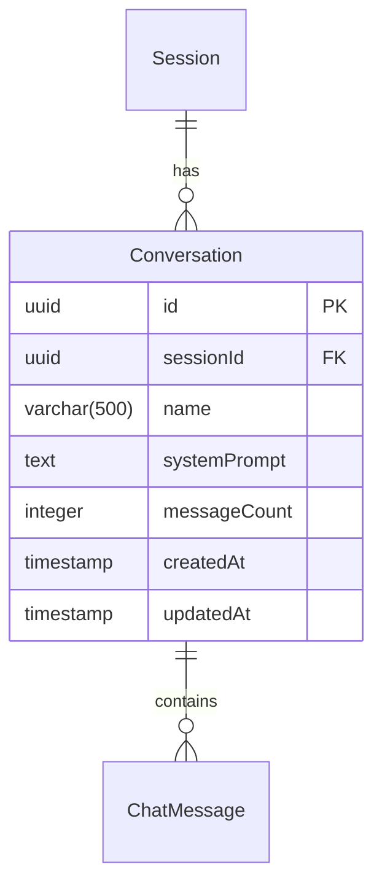
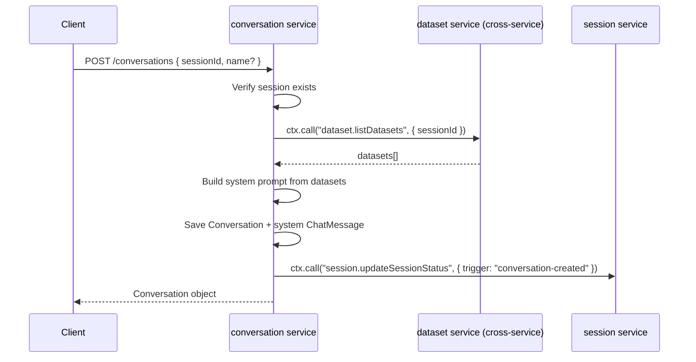

# Conversation Management

## Overview

A **Conversation** is a single chat thread within a session. When created, a system prompt is automatically constructed from the session's datasets (schemas, column mappings, AI metadata, tool definitions) and stored as the first `ChatMessage`.

## Data Model

- `sessionId` — foreign key to `Session`, cascades on delete
- `systemPrompt` — constructed at creation time from session state, never updated
- `messageCount` — denormalized counter, incremented when messages are added

## REST Endpoints

All conversation endpoints are under the `/api/conversations` base path.

| Operation             | Method   | URL                                  | Action                                |
|-----------------------|----------|--------------------------------------|---------------------------------------|
| Create conversation   | `POST`   | `/api/conversations`                 | `conversation.createConversation`     |
| List conversations    | `GET`    | `/api/conversations`                 | `conversation.listConversations`      |
| Get conversation      | `GET`    | `/api/conversations/:id`             | `conversation.getConversation`        |
| Delete conversation   | `DELETE` | `/api/conversations/:id`             | `conversation.deleteConversation`     |
| Rename conversation   | `PATCH`  | `/api/conversations/:id/rename`      | `conversation.renameConversation`     |

### Create Conversation

Auto-generates a name like `Conversation — Feb 28, 14:30` when no name is provided.

**Flow:**

**Params:**
- `sessionId` (uuid, required)
- `name` (string, optional, 1–500 chars)

**Returns:** `{ id, sessionId, name, systemPrompt, messageCount, createdAt }`

### System Prompt Construction

The system prompt includes:
1. **Mission statement** — defines the AI's role as a data analysis assistant
2. **Response format rules** — cite datasets/columns, include confidence scores, show reasoning
3. **Dataset context** — for each dataset: name, type, format, row count, column mappings (camelCase, original name, detected type), AI metadata (description, summary, topics)
4. **Available tools** — structured data tools (aggregate, sum, avg, count, etc.) and unstructured text tools (semantic search, summarize, extract entities, etc.)

Prompt is truncated to ~15,000 characters if too long.

### List Conversations

Returns conversations for a given session, sorted by `createdAt DESC`.

**Query params:**
- `sessionId` (uuid, required)

**Returns:** Array of `{ id, sessionId, name, messageCount, createdAt, updatedAt }` (excludes `systemPrompt` for efficiency).

### Get Conversation

**Params:**
- `id` (uuid, required)

**Returns:** Full conversation including `systemPrompt`. Throws `404 CONVERSATION_NOT_FOUND` if not found.

### Delete Conversation

Cascade-deletes all `ChatMessage` and `AILog` records for the conversation, then decrements the session's `conversationCount`.

**Params:**
- `id` (uuid, required)

**Returns:** `{ success: true, id }`

### Rename Conversation

**Params:**
- `id` (uuid, required)
- `name` (string, required, 1–500 chars)

**Returns:** Updated conversation object.
