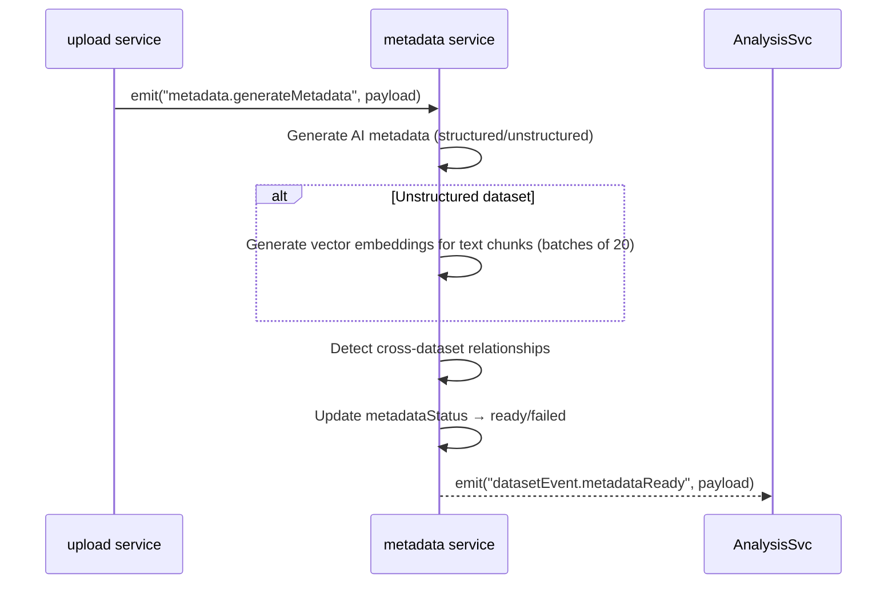
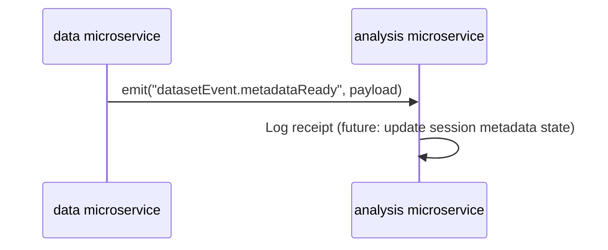

# Dataset Events

## Overview

Dataset-related events enable cross-service communication without tight coupling. The data microservice uses internal events for metadata generation and emits cross-service events to notify the analysis microservice.

## Event: `metadata.generateMetadata`

Internal event within the data microservice. Emitted by the `upload.uploadFile` action (and `metadata.retryGeneration`) after a dataset is created. Triggers background AI metadata generation and embedding computation.

### Metadata Generation Details

**Structured datasets:** AI generates column descriptions, summary statistics, and a dataset description from sample rows.

**Unstructured datasets:**
1. AI generates document summary, key topics, content domain, entities, and word count.
2. **Embedding generation:** All text chunks are sent through `ai.generateEmbeddings()` in batches of 20. The resulting 768-dimensional vectors (nomic-embed-text) are stored in the `TextChunk.embedding` column for semantic search via pgvector.

### Text Chunking

Text from PDFs is split into chunks using a recursive character splitter with **word-boundary awareness**:
- **Separator priority:** paragraph (`\n\n`) → newline (`\n`) → sentence (`. `) → word (` `)
- **Target size:** ~800 characters per chunk with 200-character overlap
- **Word safety:** Hard splits snap to the nearest word boundary (space) to avoid splitting words mid-token
- Overlap regions also snap to word boundaries for clean context windows

**Payload:**

| Field         | Type   | Description                              |
|---------------|--------|------------------------------------------|
| `datasetId`   | string | UUID of the dataset                      |
| `datasetType` | string | `structured-table` or `unstructured-text`|
| `name`        | string | Human-readable dataset name              |
| `sessionId`   | string | UUID of the owning session               |

**Handler group:** `metadata-workers` (load-balanced — only one data instance processes each event).

**Handler location:** `services/metadata/generateMetadata.event.ts`

## Event: `datasetEvent.metadataReady`

Fired by the data microservice when a dataset's metadata (column mappings, AI-generated descriptions, etc.) has been fully processed.

**Payload:**

| Field       | Type   | Description                    |
|-------------|--------|--------------------------------|
| `datasetId` | string | UUID of the dataset            |
| `sessionId` | string | UUID of the owning session     |
| `name`      | string | Human-readable dataset name    |

**Handler group:** `analysis-workers` (load-balanced — only one analysis instance processes each event).

**Current behavior:** Logs the event. Placeholder for future session-level aggregated metadata state updates.

## Event: `sessionData.sessionDeleted`

Emitted by the session service (in microservice.analysis) when a session is deleted. The `sessionData` service (in microservice.data) listens for this event to cascade-delete datasets, uploaded files, text chunks, and embeddings.

**Payload:**

| Field       | Type   | Description                    |
|-------------|--------|--------------------------------|
| `sessionId` | string | UUID of the deleted session    |

## Cross-Service Dataset Access

The analysis microservice calls `dataset.listDatasets` (on the data microservice) when creating conversations to build the system prompt with dataset context. This is a synchronous cross-service call via `ctx.call()`.
