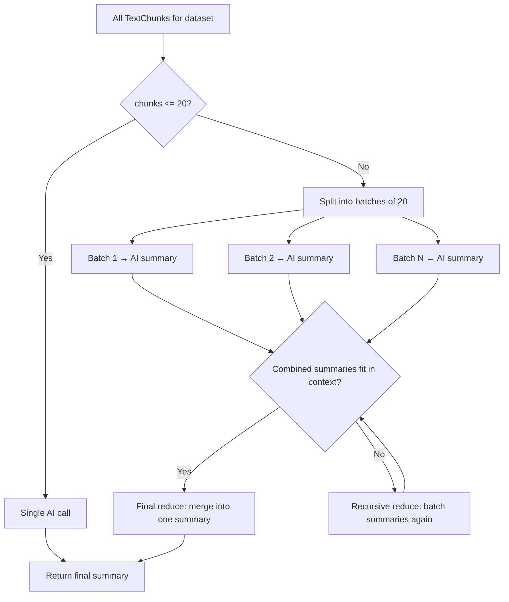

# Document Summarization (Map-Reduce)

## Overview

The `tools.summarizeDocument` action generates an AI summary of a text dataset. It uses a **map-reduce** strategy to handle documents of any size, removing the previous 20-chunk limitation.

## Architecture



## Parameters

| Parameter | Type | Default | Range | Description |
|-----------|------|---------|-------|-------------|
| `datasetId` | uuid | required | — | The text dataset to summarize |
| `concurrency` | number | 1 | 1–10 | How many AI calls run in parallel |

### Concurrency

The `concurrency` parameter controls how many AI calls execute simultaneously during the map and reduce phases:

- **`concurrency: 1`** (default) — Sequential processing. Safest option, lowest resource usage. Suitable for low-powered AI backends or rate-limited APIs.
- **`concurrency: 3–5`** — Balanced parallelism. Good for local Ollama or moderate API rate limits.
- **`concurrency: 10`** — Maximum parallelism. Use when the AI backend can handle many concurrent requests (e.g., cloud APIs with high rate limits).

## Algorithm

### Map Phase
1. Fetch **all** `TextChunk` records for the dataset (no limit), ordered by `orderIndex`
2. Split chunks into batches of 20
3. For each batch, concatenate chunk content and send to `ai.generateText()` (capped at 12,000 characters per batch)
4. Run batches respecting the `concurrency` limit

### Reduce Phase
1. Collect all batch summaries
2. If combined summaries fit within 12,000 characters, make a single final AI call to merge them
3. If not, recursively batch the summaries and reduce again until a single summary remains

### Fast Path
If the document has ≤ 20 chunks, a single AI call is made directly — no map-reduce overhead.

## Response

```typescript
{
  batchesUsed: number;   // How many map batches were processed
  chunksUsed: number;    // Total chunks in the dataset
  summary: string;       // The final merged summary
  totalLength: number;   // Total character count of all chunks
}
```

## Constants

| Constant | Value | Purpose |
|----------|-------|---------|
| `BATCH_SIZE` | 20 | Chunks per map batch |
| `MAX_CHARS_PER_BATCH` | 12000 | Character limit sent to AI per call |
