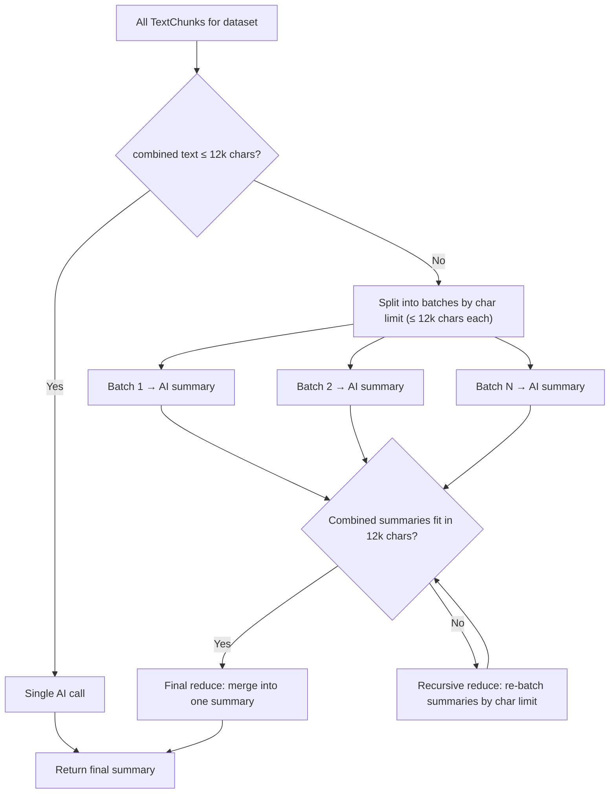
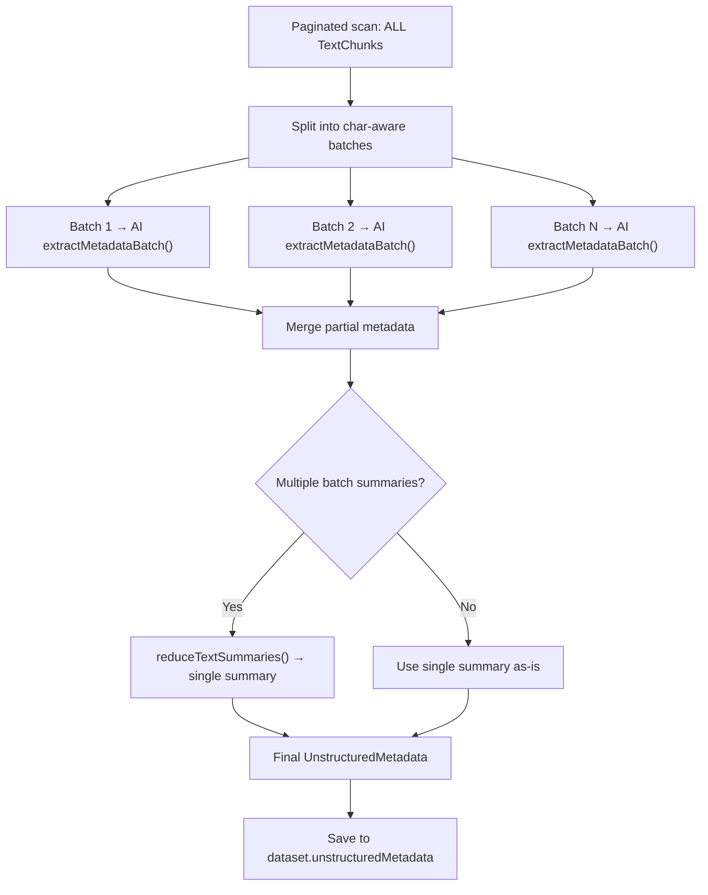

# Document Summarization & Map-Reduce Utilities

## Overview

The project uses a **map-reduce** strategy to process documents of any size. The shared utilities in `lib/map-reduce.ts` provide character-aware batching, concurrency control, and both text summarization and metadata extraction pipelines.

These utilities are consumed by:
- **`tools.summarizeDocument`** — generates AI text summaries
- **`metadata.generateMetadata`** — extracts unstructured metadata (topics, entities, domain, summary)

## Shared Utilities (`lib/map-reduce.ts`)

| Export | Description |
|--------|-------------|
| `MAX_CHARS_PER_BATCH` | Character limit per batch (12,000) |
| `splitIntoBatchesByChars` | Split items into batches by cumulative character length |
| `runWithConcurrency` | Execute async tasks with a concurrency limit |
| `summarizeTextBatch` | Summarize a single batch of text via `ai.generateText()` |
| `reduceTextSummaries` | Recursively merge multiple summaries into one |
| `extractMetadataBatch` | Extract partial metadata (topics, entities, domain, summary) from a text batch via `ai.generateJSON()` |
| `mergePartialMetadata` | Merge multiple partial metadata results (dedup topics, sum entity counts, pick most common domain) |

## Document Summarization (`tools.summarizeDocument`)



### Parameters

| Parameter | Type | Default | Range | Description |
|-----------|------|---------|-------|-------------|
| `datasetId` | uuid | required | — | The text dataset to summarize |
| `concurrency` | number | 1 | 1–10 | How many AI calls run in parallel |

### Concurrency

The `concurrency` parameter controls how many AI calls execute simultaneously during the map and reduce phases:

- **`concurrency: 1`** (default) — Sequential processing. Safest option, lowest resource usage. Suitable for low-powered AI backends or rate-limited APIs.
- **`concurrency: 3–5`** — Balanced parallelism. Good for local Ollama or moderate API rate limits.
- **`concurrency: 10`** — Maximum parallelism. Use when the AI backend can handle many concurrent requests (e.g., cloud APIs with high rate limits).

### Algorithm

#### Character-Aware Batching

Both the map and reduce phases use `splitIntoBatchesByChars` instead of a fixed count. The function accumulates items into a batch until adding the next item would exceed `MAX_CHARS_PER_BATCH`. This guarantees each batch stays within the AI context limit and eliminates content truncation.

#### Map Phase
1. Fetch **all** `TextChunk` records for the dataset (no limit), ordered by `orderIndex`
2. Split chunks into batches by character length (each batch ≤ 12,000 chars of content)
3. For each batch, concatenate chunk content and send to `ai.generateText()`
4. Run batches respecting the `concurrency` limit

#### Reduce Phase
1. Collect all batch summaries
2. If combined summaries fit within 12,000 characters, make a single final AI call to merge them
3. If not, split summaries into character-aware sub-batches and recursively reduce until a single summary remains

#### Fast Path
If the total combined text of all chunks is ≤ 12,000 characters, a single AI call is made directly — no map-reduce overhead.

### Response

```typescript
{
  batchesUsed: number;   // How many map batches were processed
  chunksUsed: number;    // Total chunks in the dataset
  summary: string;       // The final merged summary
  totalLength: number;   // Total character count of all chunks
}
```

## Unstructured Metadata Generation (`metadata.generateMetadata`)

Previously limited to the first 50 chunks (3,000 chars excerpt), now uses the same map-reduce approach to cover the **entire** document.



### Per-Batch Extraction

Each batch produces a `PartialUnstructuredMetadata` with:
- `documentSummary` — summary of that section
- `keyTopics` — topics found in that section
- `contentDomain` — domain classification
- `entities` — named entities with counts

### Merge Strategy (`mergePartialMetadata`)

| Field | Merge Strategy |
|-------|---------------|
| `documentSummary` | Joined, then reduced via `reduceTextSummaries()` into one cohesive summary |
| `keyTopics` | Deduplicated (case-insensitive), sorted alphabetically |
| `entities` | Merged by name+type key, counts summed |
| `contentDomain` | Most frequently reported domain wins |
| `wordCount` | Computed from full paginated scan |
| `chunkCount` | Total from DB count query |

## Constants

| Constant | Value | Purpose |
|----------|-------|---------|
| `MAX_CHARS_PER_BATCH` | 12,000 | Character limit per batch (map and reduce) |
| `PAGE_SIZE` (metadata) | 100 | DB pagination size for chunk loading |
