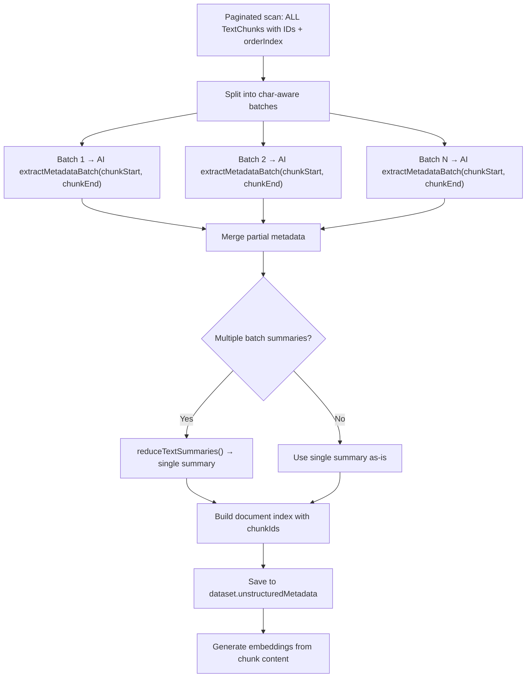

# Map-Reduce Utilities & Metadata Generation

## Overview

The project uses a **map-reduce** strategy to process documents of any size. The shared utilities in `lib/map-reduce.ts` provide character-aware batching, concurrency control, and metadata extraction pipelines.

These utilities are consumed by:
- **`metadata.generateMetadata`** — extracts unstructured metadata (topics, entities, domain, summary, document index)

## Shared Utilities (`lib/map-reduce.ts`)

| Export | Description |
|--------|-------------|
| `MAX_CHARS_PER_BATCH` | Character limit per batch (12,000) |
| `splitIntoBatchesByChars` | Split items into batches by cumulative character length |
| `runWithConcurrency` | Execute async tasks with a concurrency limit |
| `summarizeTextBatch` | Summarize a single batch of text via `ai.generateText()` |
| `reduceTextSummaries` | Recursively merge multiple summaries into one |
| `extractMetadataBatch` | Extract partial metadata (topics, entities, domain, summary, sections) from a text batch via `ai.generateJSON()` |
| `mergePartialMetadata` | Merge multiple partial metadata results (dedup topics, sum entity counts, pick most common domain, concatenate sections) |

## Unstructured Metadata Generation (`metadata.generateMetadata`)

Uses a map-reduce approach to cover the **entire** document and build comprehensive metadata including a document index.



### Per-Batch Extraction

Each batch produces a `PartialUnstructuredMetadata` with:
- `documentSummary` — summary of that section
- `keyTopics` — topics found in that section
- `contentDomain` — domain classification
- `entities` — named entities with counts (unrestricted types)
- `sections` — logical sections identified within the batch, linked to chunk order index ranges

### Entity Types

Entity types are **not restricted** to predefined categories. The AI is free to use whatever entity type best describes each entity found in the text (e.g. person, organisation, location, date, monetary, product, event, regulation, technology, concept, metric, etc.).

### Document Index

The metadata includes a `documentIndex` — an array of section entries that map logical document sections to chunk order index ranges, supporting multiple levels like a book's table of contents. Each entry has:
- `indexLabel` — hierarchical label (e.g. "1", "2", "2a", "2b", "2a-i")
- `level` — nesting depth (0 = main section, 1 = sub-section, 2 = sub-sub-section, etc.)
- `title` — section or topic title
- `summary` — brief description of what the section covers
- `chunkStart` — starting chunk orderIndex
- `chunkEnd` — ending chunk orderIndex
- `chunkIds` — array of TextChunk UUIDs that belong to this section

Index labels are assigned automatically based on level:
- Level 0: numeric (1, 2, 3, ...)
- Level 1: parent number + lowercase letter (1a, 1b, 2a, ...)
- Level 2: parent label + roman numeral (1a-i, 1a-ii, ...)
- Level 3+: parent label + sequential number (1a-i-1, 1a-i-2, ...)

The `chunkIds` field enables direct lookup of TextChunk records for each document section without needing orderIndex range queries.

This index enables the AI to navigate documents using the `getChunks` tool to read specific sections.

### Merge Strategy (`mergePartialMetadata`)

| Field | Merge Strategy |
|-------|---------------|
| `documentSummary` | Joined, then reduced via `reduceTextSummaries()` into one cohesive summary |
| `keyTopics` | Deduplicated (case-insensitive), sorted alphabetically |
| `entities` | Merged by name+type key, counts summed |
| `contentDomain` | Most frequently reported domain wins |
| `sections` | Concatenated in order (carry chunk index ranges from batches) |
| `wordCount` | Computed from full paginated scan |
| `chunkCount` | Total from DB count query |

### Embedding Generation

The embedding pipeline uses **raw chunk content** as the text for vector embedding generation:

```typescript
// In generateTextChunkEmbeddings:
const texts = batch.map((c) => c.content);
```

## Constants

| Constant | Value | Purpose |
|----------|-------|---------|
| `MAX_CHARS_PER_BATCH` | 12,000 | Character limit per batch (map and reduce) |
| `PAGE_SIZE` (metadata) | 100 | DB pagination size for chunk loading |
