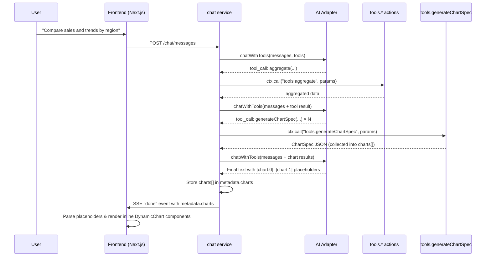

# Dynamic Data Visualization

## Overview

The Dynamic Data Visualization feature allows the AI chat assistant to generate interactive charts that can be placed **anywhere within a message**. The AI can call `generateChartSpec` multiple times to produce multiple charts, and use `[chart:N]` placeholders in its text response to position each chart inline. Each chart can reference its data source via the optional `datasetName` field.

## Architecture



## ChartSpec Type

```typescript
type ChartType = "bar" | "line" | "pie";

interface ChartDataPoint {
  label: string;
  value: number;
}

interface ChartSpec {
  chartType: ChartType;
  data: ChartDataPoint[];
  datasetNames?: string[]; // Data source attribution (supports multiple sources)
  title: string;
  xAxisLabel?: string;
  yAxisLabel?: string;
}
```

## Backend Components

### 1. Tool Action (`tools.generateChartSpec`)

- **Location**: `apps/domain.data/microservice.data/services/tools/generateChartSpec.action.ts`
- **Category**: `visualization`
- **Purpose**: Validates and returns a strictly typed `ChartSpec` JSON
- **Parameters**: `chartType`, `title`, `data[]`, optional `datasetNames`, `xAxisLabel`, `yAxisLabel`
- **No database access**: Pure transformation/validation tool

### 2. Tool Configuration

- **Location**: `apps/domain.analysis/microservice.analysis/toolConfig.ts`
- `"generateChartSpec"` in `ToolName` union type
- `"visualization"` in `ToolCategory` union type
- Tool is registered with OpenAI-compatible function definition including `datasetNames` parameter
- `getEnabledToolNamesByCategory` returns visualization tools separately

### 3. System Prompt

- **Location**: `apps/domain.analysis/microservice.analysis/services/chat/buildDynamicSystemPrompt.action.ts`
- "Visualization Tools" section instructs the AI:
  - Be **proactive**: generate charts whenever numerical results would be clearer as a visualization
  - First gather data using aggregation tools, then call `generateChartSpec`
  - Choose appropriate chart type (bar, line, pie)
  - Always provide the `datasetNames` parameter to reference the data source(s)
  - Do NOT print raw chart JSON in text
  - **Multiple charts**: call `generateChartSpec` multiple times; each call gets an index (0-based)
  - **Inline placement**: use `[chart:N]` placeholders in text to position charts
  - If no placeholders are used, charts appear at the end of the message
- "Data source referencing" section instructs the AI:
  - Always mention the dataset name when reporting data
  - Always pass `datasetNames` to `generateChartSpec`

### 4. Orchestration Loop

- **Location**: `apps/domain.analysis/microservice.analysis/services/chat/sendMessage.action.ts`
- `handleNormalToolInLoop` returns `ChartSpec` when `generateChartSpec` is called
- `runOrchestrationLoop` collects all chart specs into a `charts: ChartSpec[]` array
- `saveAndFinalize` stores `charts` in `metadata.charts` JSONB field
- SSE "done" event includes `metadata` with `charts` array
- Visualization tools skip dataset type validation

### 5. ChatMessage Entity

- **Location**: `apps/domain.analysis/microservice.analysis/db/chat-message.entity.ts`
- `metadata` JSONB column (`MessageMetadata | null`)
- `MessageMetadata` contains:
  - `charts?: ChartSpec[]` — array of chart specs

## Frontend Components

### 1. DynamicChart Component

- **Location**: `frontend/src/components/chat/DynamicChart.tsx`
- Uses [Recharts](https://recharts.org/) library for rendering
- Supports three chart types:
  - **Bar chart**: `BarChartRenderer` — for categorical comparisons
  - **Line chart**: `LineChartRenderer` — for trends over time
  - **Pie chart**: `PieChartRenderer` — for proportional distributions
- Validates ChartSpec before rendering (fallback warning shown for invalid specs)
- Shows data source label(s) when `spec.datasetNames` is provided
- Responsive container adapts to parent width

### 2. ChatMessageBubble Integration

- **Location**: `frontend/src/components/chat/ChatMessageBubble.tsx`
- **`resolveCharts()`**: reads charts from `metadata.charts`
- **`buildContentSegments()`**: parses `[chart:N]` placeholders in message content and interleaves text segments with chart segments
  - If placeholders are found, charts are rendered at the placeholder positions
  - If no placeholders exist, charts are appended after the message text
  - Unreferenced charts (index not in any placeholder) are appended at the end
- Charts only rendered for assistant messages

### 3. ChatMessage Type

- **Location**: `frontend/src/hooks/useChat.ts`
- `metadata: MessageMetadata | null` on `ChatMessage` interface
- `MessageMetadata` contains `charts?: ChartSpec[]`
- Exported `ChartSpec`, `ChartDataPoint`, `ChartType`, `MessageMetadata` types
