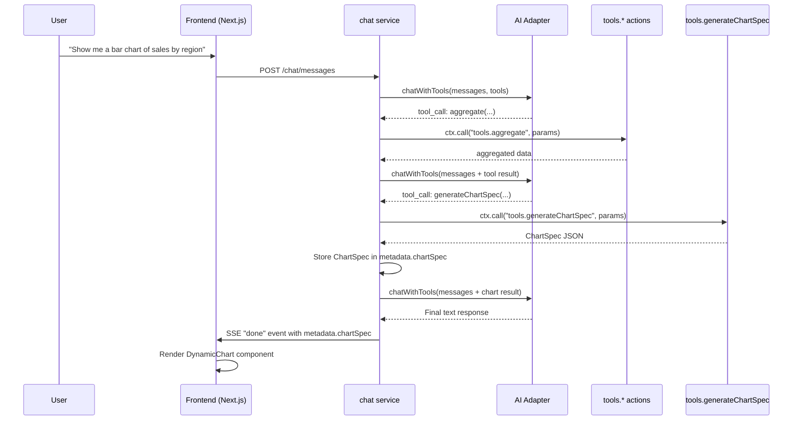

# Dynamic Data Visualization

## Overview

The Dynamic Data Visualization feature allows the AI chat assistant to generate interactive charts in response to user requests for visualizations. When a user asks for a chart, graph, or plot, the AI orchestrator gathers data using aggregation/retrieval tools and then calls the `generateChartSpec` tool to produce a structured `ChartSpec` JSON. This spec is stored in the assistant message's `metadata.chartSpec` field and rendered as an interactive chart on the frontend.

## Architecture



## ChartSpec Type

```typescript
type ChartType = "bar" | "line" | "pie";

interface ChartDataPoint {
  label: string;
  value: number;
}

interface ChartSpec {
  chartType: ChartType;
  data: ChartDataPoint[];
  title: string;
  xAxisLabel?: string;
  yAxisLabel?: string;
}
```

## Backend Components

### 1. Tool Action (`tools.generateChartSpec`)

- **Location**: `apps/domain.data/microservice.data/services/tools/generateChartSpec.action.ts`
- **Category**: `visualization` (new tool category)
- **Purpose**: Validates and returns a strictly typed `ChartSpec` JSON
- **Parameters**: `chartType`, `title`, `data[]`, optional `xAxisLabel`, `yAxisLabel`
- **No database access**: Pure transformation/validation tool

### 2. Tool Configuration

- **Location**: `apps/domain.analysis/microservice.analysis/toolConfig.ts`
- Added `"generateChartSpec"` to `ToolName` union type
- Added `"visualization"` to `ToolCategory` union type
- Tool is registered with OpenAI-compatible function definition
- `getEnabledToolNamesByCategory` returns visualization tools separately

### 3. System Prompt

- **Location**: `apps/domain.analysis/microservice.analysis/services/chat/buildDynamicSystemPrompt.action.ts`
- Added "Visualization Tools" section with instructions:
  - The AI is **proactive**: it generates charts whenever its analysis produces numerical results that would be clearer as a visualization, even without an explicit user request
  - First gather data using aggregation tools, then call `generateChartSpec`
  - Choose appropriate chart type (bar, line, pie)
  - Do NOT print raw chart JSON in text

### 4. Orchestration Loop

- **Location**: `apps/domain.analysis/microservice.analysis/services/chat/sendMessage.action.ts`
- `handleNormalToolInLoop` captures and returns `ChartSpec` when `generateChartSpec` is called
- `runOrchestrationLoop` tracks `chartSpec` in `OrchestrationResult`
- `saveAndFinalize` stores `chartSpec` in `metadata` JSONB column
- SSE "done" event includes `metadata` with `chartSpec`
- Visualization tools skip dataset type validation

### 5. ChatMessage Entity

- **Location**: `apps/domain.analysis/microservice.analysis/db/chat-message.entity.ts`
- Added `metadata` JSONB column (`MessageMetadata | null`)
- `MessageMetadata` contains optional `chartSpec: ChartSpec`

## Frontend Components

### 1. DynamicChart Component

- **Location**: `frontend/src/components/chat/DynamicChart.tsx`
- Uses [Recharts](https://recharts.org/) library for rendering
- Supports three chart types:
  - **Bar chart**: `BarChartRenderer` — for categorical comparisons
  - **Line chart**: `LineChartRenderer` — for trends over time
  - **Pie chart**: `PieChartRenderer` — for proportional distributions
- Validates ChartSpec before rendering (fallback warning shown for invalid specs)
- Responsive container adapts to parent width

### 2. ChatMessageBubble Integration

- **Location**: `frontend/src/components/chat/ChatMessageBubble.tsx`
- Conditionally renders `DynamicChart` below message text when `message.metadata?.chartSpec` is present
- Chart only rendered for assistant messages

### 3. ChatMessage Type

- **Location**: `frontend/src/hooks/useChat.ts`
- Added `metadata: MessageMetadata | null` to `ChatMessage` interface
- Exported `ChartSpec`, `ChartDataPoint`, `ChartType`, `MessageMetadata` types
