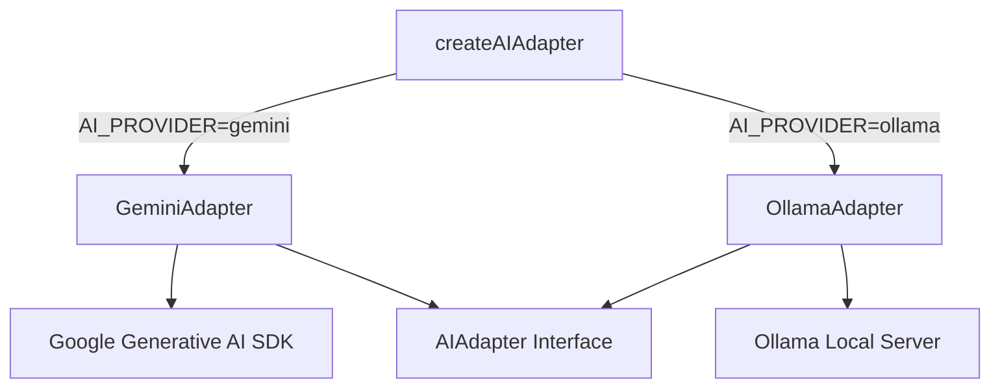
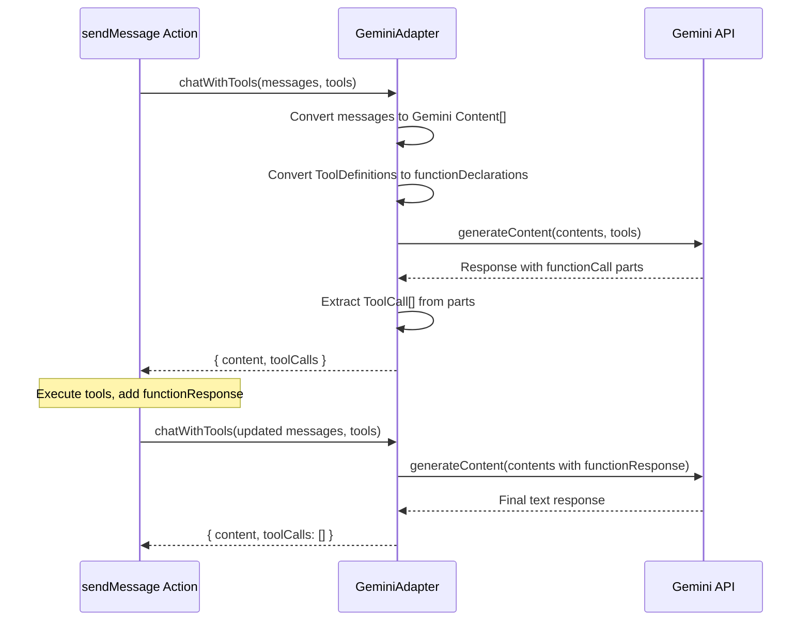

# Gemini AI Adapter

## Overview

The Gemini adapter integrates the Google Generative AI API as an alternative AI provider alongside Ollama. It implements the full `AIAdapter` interface: text generation, JSON generation, chat with tool-calling, and embeddings.

## Configuration

| Environment Variable | Description | Default |
|---|---|---|
| `AI_PROVIDER` | Set to `"gemini"` to use Gemini | `"ollama"` |
| `GEMINI_API_KEY` | Google Generative AI API key (required) | — |
| `GEMINI_MODEL` | Default model | `gemini-2.0-flash` |

## Architecture



## Method Mapping

| AIAdapter Method | Gemini SDK Call | Notes |
|---|---|---|
| `generateText` | `model.generateContent()` | System prompt via `systemInstruction` |
| `generateJSON` | `model.generateContent()` | Uses `responseMimeType: "application/json"` |
| `chatWithTools` | `model.generateContent()` | Tools as `functionDeclarations`; tool results as `functionResponse` parts |
| `generateEmbeddings` | `model.embedContent()` | Default model: `text-embedding-004` |
| `isAvailable` | Sends a ping prompt | Returns `false` on failure |

## Tool-Calling Flow



## Message Role Mapping

| Internal Role | Gemini Role | Notes |
|---|---|---|
| `system` | `systemInstruction` | Not a content entry; passed as model config |
| `user` | `user` | Direct mapping |
| `assistant` | `model` | May include `functionCall` parts |
| `tool` | `function` (user role) | Contains `functionResponse` parts |

## Retry & Resilience

- Max **3 retries** with exponential backoff (1s, 2s, 4s) — same as Ollama adapter.
- `createAIAdapterWithFallback()` tries Gemini first and falls back to Ollama if unavailable.

## Usage

```typescript
// Via factory (recommended)
const ai = createAIAdapter({ provider: "gemini" });

// Or set AI_PROVIDER=gemini in .env and use default
const ai = createAIAdapter();
```
