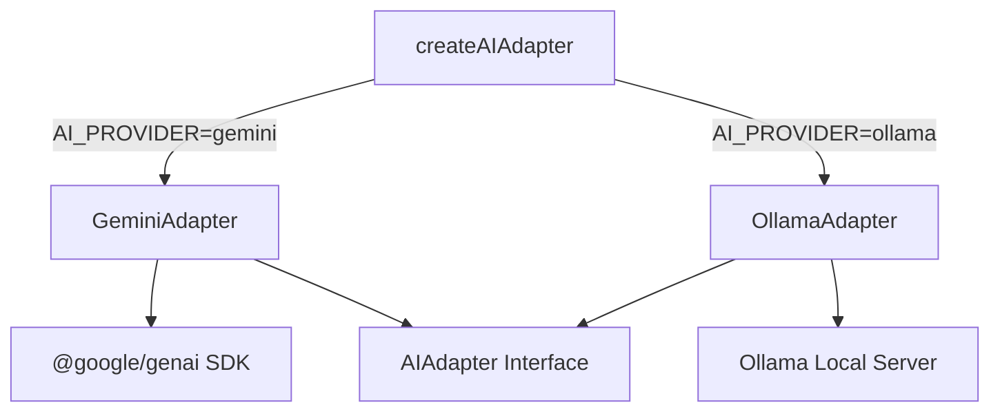
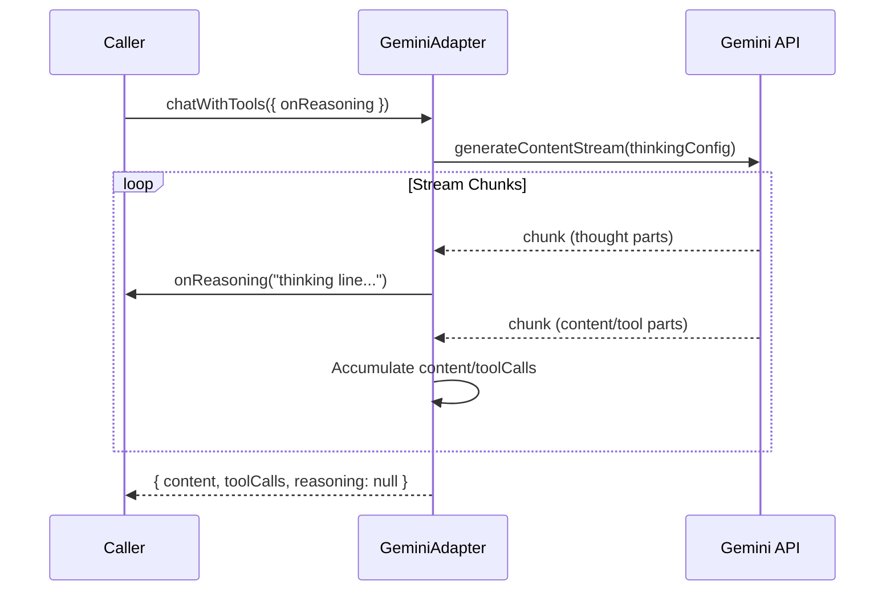
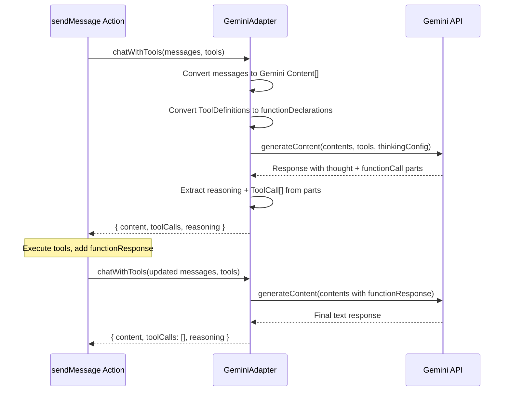

# Gemini AI Adapter

## Overview

The Gemini adapter integrates the Google Gemini API as an alternative AI provider alongside Ollama. It implements the full `AIAdapter` interface: text generation, JSON generation, chat with tool-calling (including reasoning/thinking support), and embeddings.

Uses the `@google/genai` SDK (v1.x).

## Configuration

| Environment Variable | Description | Default |
|---|---|---|
| `AI_PROVIDER` | Set to `"gemini"` to use Gemini | `"ollama"` |
| `GEMINI_API_KEY` | Google Gemini API key (required) | — |
| `GEMINI_MODEL` | Default model | `gemini-2.5-flash` |

## Architecture



## Method Mapping

| AIAdapter Method | Gemini SDK Call | Notes |
|---|---|---|
| `generateText` | `ai.models.generateContent()` | System prompt via `config.systemInstruction` |
| `generateJSON` | `ai.models.generateContent()` | Uses `config.responseMimeType: "application/json"` |
| `chatWithTools` | `ai.models.generateContent()` | Tools as `functionDeclarations`; tool results as `functionResponse` parts |
| `chatWithTools` (streaming) | `ai.models.generateContentStream()` | When `onReasoning` callback provided |
| `generateEmbeddings` | `ai.models.embedContent()` | Default model: `text-embedding-004`; batch support via `contents` array |
| `isAvailable` | Sends a ping prompt | Returns `false` on failure |

## Reasoning / Thinking Support

Gemini 2.5+ models support chain-of-thought reasoning via `thinkingConfig`. The adapter enables this automatically in `chatWithTools`.

### Non-Streaming Mode

When `onReasoning` is not provided, the adapter:
1. Passes `thinkingConfig: { includeThoughts: true }` in the config
2. Iterates response parts and separates `part.thought === true` parts as reasoning
3. Returns reasoning in the `ChatWithToolsResponse.reasoning` field

### Streaming Mode

When `onReasoning` callback is provided, the adapter:
1. Uses `ai.models.generateContentStream()` instead of `generateContent()`
2. Streams chunks and buffers reasoning text (parts with `thought: true`)
3. Flushes complete lines to the `onReasoning` callback in real-time
4. Returns `reasoning: null` since reasoning was already forwarded via callback



### Parity with Ollama

| Feature | Ollama | Gemini |
|---|---|---|
| `reasoning` in response | `message.thinking` + `<think>` tag fallback | `part.thought === true` |
| `onReasoning` streaming | SDK `thinking` field per chunk | `part.thought` per streamed chunk |
| Line-by-line buffering | Yes | Yes |
| Thinking budget control | Model-level (`/no_think`) | `thinkingConfig.thinkingBudget` |

## Tool-Calling Flow



## Message Role Mapping

| Internal Role | Gemini Role | Notes |
|---|---|---|
| `system` | `systemInstruction` | Not a content entry; passed as config |
| `user` | `user` | Direct mapping |
| `assistant` | `model` | May include `functionCall` parts |
| `tool` | `user` | Contains `functionResponse` parts |

## Retry & Resilience

- Max **3 retries** with exponential backoff (1s, 2s, 4s) — same as Ollama adapter.
- `createAIAdapterWithFallback()` tries Gemini first and falls back to Ollama if unavailable.

## Usage

```typescript
// Via factory (recommended)
const ai = createAIAdapter({ provider: "gemini" });

// Or set AI_PROVIDER=gemini in .env and use default
const ai = createAIAdapter();

// With reasoning streaming
const response = await ai.chatWithTools({
  messages,
  tools,
  onReasoning: (chunk) => console.log("[thinking]", chunk),
});
```
