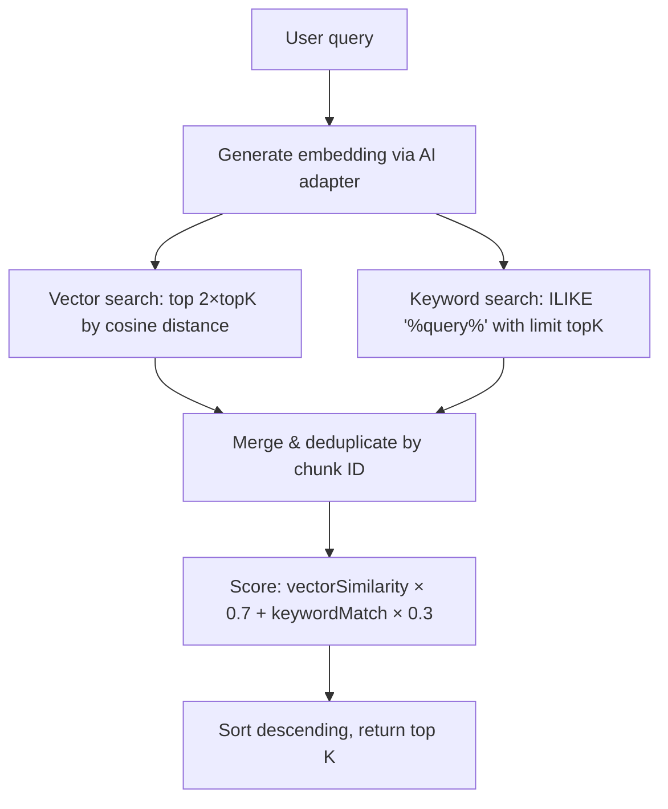

# Hybrid Semantic Search

## Problem

Pure vector-based semantic search (pgvector cosine distance) can miss text chunks that contain an **exact keyword match** when the embedding similarity score is low. This is common for:

- **Proper nouns / names** (e.g. searching for "Loan" in Vietnamese text)
- **Short queries** where the embedding carries little semantic signal
- **Domain-specific terms** the embedding model hasn't been well-trained on

## Solution

The `tools.semanticSearch` action uses a **hybrid search** strategy that combines two retrieval signals:

| Signal | Weight | Method | Strength |
|--------|--------|--------|----------|
| Vector similarity | 0.7 | pgvector cosine distance (`<=>`) | Captures semantic meaning, synonyms, paraphrases |
| Keyword match | 0.3 | PostgreSQL `ILIKE` substring match | Catches exact term occurrences the vector model misses |

## How It Works



### Scoring Formula

For each chunk in the merged result set:

- **Vector-only hit:** `similarity = vectorScore × 0.7`
- **Keyword-only hit:** `similarity = vectorScore × 0.7 + 0.3`
- **Both (vector + keyword):** `similarity = vectorScore × 0.7 + 0.3`

Chunks that match the query as a substring always receive a `0.3` boost, which typically promotes them above vector-only results.

### ILIKE Safety

The query string is escaped before use in `ILIKE` to prevent the characters `%`, `_`, and `\` from being interpreted as pattern wildcards.

## Parameters

| Parameter | Type | Required | Description |
|-----------|------|----------|-------------|
| `query` | string | Yes | Search query (used for both embedding and keyword match) |
| `datasetId` | uuid | At least one | Filter to a specific dataset |
| `sessionId` | uuid | At least one | Filter to a specific session |
| `topK` | number (1–20) | No (default 5) | Number of results to return |

## Response Shape

Each result contains:

```typescript
{
  chunkId: string;
  datasetId: string;
  datasetName: string;
  content: string;
  sourcePage: number | null;
  sourceSection: string | null;
  similarity: number;      // Combined score (0–1)
  keywordMatch: boolean;   // True if the chunk matched via ILIKE
}
```

## Trade-offs

- The keyword search adds one extra SQL query per call, but both queries run in **parallel** (`Promise.all`), so latency impact is minimal.
- The vector query fetches `2 × topK` rows to leave room for keyword-only results in the final merged set.
- The `ILIKE` query does a sequential scan on the `content` column. For very large datasets, a GIN trigram index (`pg_trgm`) could be added in the future.
