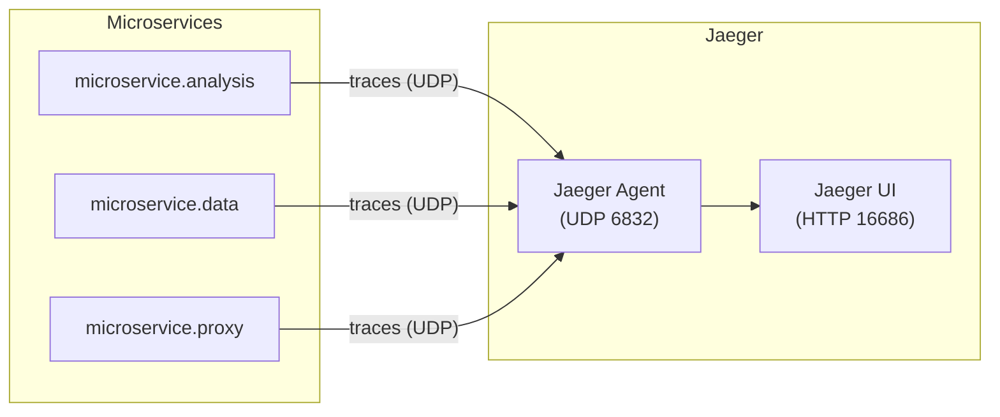

# Jaeger Distributed Tracing

All Moleculer microservices ship with **Jaeger tracing enabled by default**. Every action call, event emission, and inter-service request is automatically traced and sent to a local Jaeger agent.

## Architecture



## Quick Start

### 1. Start Jaeger (Docker)

```bash
npm run jaeger:start
```

This runs `docker compose up -d jaeger`, which starts the Jaeger all-in-one container exposing:

| Port | Protocol | Purpose |
|------|----------|---------|
| **16686** | HTTP | Jaeger UI |
| **6831** | UDP | Thrift compact protocol |
| **6832** | UDP | Thrift binary protocol (used by default) |
| **14268** | HTTP | Thrift HTTP collector |
| **4317** | gRPC | OTLP gRPC receiver |
| **4318** | HTTP | OTLP HTTP receiver |

### 2. Start Microservices

```bash
npm run dev -w microservice.analysis
npm run dev -w microservice.data
npm run dev -w microservice.proxy
```

Traces are reported automatically — no extra flags needed.

### 3. View Traces

Open the Jaeger UI at **http://localhost:16686**.

- Select a service from the **Service** dropdown (e.g., `analysis`, `data`, `proxy`)
- Click **Find Traces** to see recent spans
- Click any trace to view the full call graph, timings, and metadata

### 4. Stop Jaeger

```bash
npm run jaeger:stop
```

## Configuration

Tracing is configured in [lib/config/default.ts](../../lib/config/default.ts). The Jaeger exporter is enabled for all environments (development, staging, production).

### Environment Variables

| Variable | Default | Description |
|----------|---------|-------------|
| `JAEGER_ENDPOINT` | `http://localhost:14268/api/traces` | Jaeger HTTP collector endpoint (recommended, especially on Windows) |
| `JAEGER_HOST` | `127.0.0.1` | Jaeger agent hostname (UDP fallback, used when `JAEGER_ENDPOINT` is not set) |
| `JAEGER_PORT` | `6832` | Jaeger agent UDP port (UDP fallback) |

Override these in your `.env` file to point at a remote Jaeger instance:

```dotenv
JAEGER_ENDPOINT=http://jaeger.internal.example.com:14268/api/traces
```

### Default Config (all environments)

```typescript
tracing: {
  enabled: true,
  exporter: {
    type: "Jaeger",
    options: {
      endpoint: process.env.JAEGER_ENDPOINT || "http://localhost:14268/api/traces",
      host: process.env.JAEGER_HOST || "127.0.0.1",
      port: Number(process.env.JAEGER_PORT) || 6832,
      sampler: { type: "Const", options: {} },
      tracerOptions: {},
      defaultTags: null,
    },
  },
  events: true,
  stackTrace: true,
},
```

### What Gets Traced

| Item | Traced? |
|------|---------|
| Action calls (`ctx.call`) | Yes |
| Events (`ctx.emit` / `ctx.broadcast`) | Yes (`events: true`) |
| Stack traces on errors | Yes (`stackTrace: true`) |

## Disable Tracing

To fully disable tracing for a specific microservice, override the config in its `moleculer.config.ts`:

```typescript
import * as path from "node:path";
import { createNodeConfig } from "core.lib/config";

export default () =>
  createNodeConfig("analysis", {
    servicesPath: path.join(__dirname, "services"),
    tracing: { enabled: false },
  });
```

## References

- [Moleculer Tracing — Jaeger Exporter](https://moleculer.services/docs/0.14/tracing#Jaeger)
- [Jaeger Documentation](https://www.jaegertracing.io/docs/)
- [Docker Compose file](../../docker-compose.yaml)
