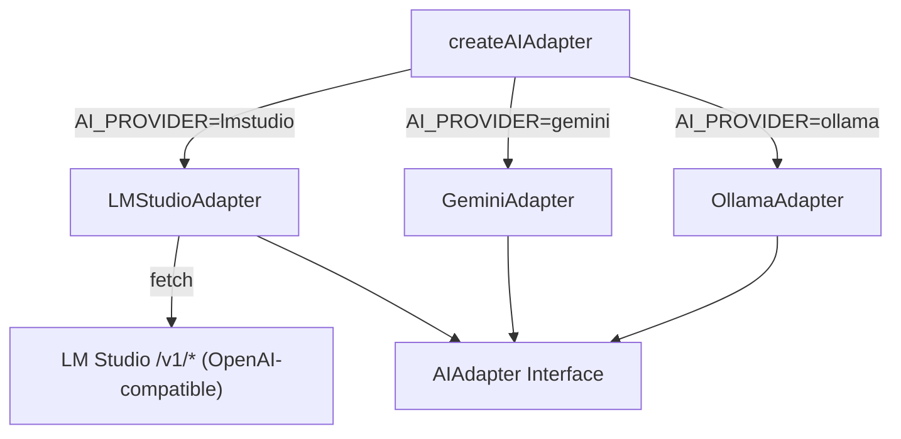
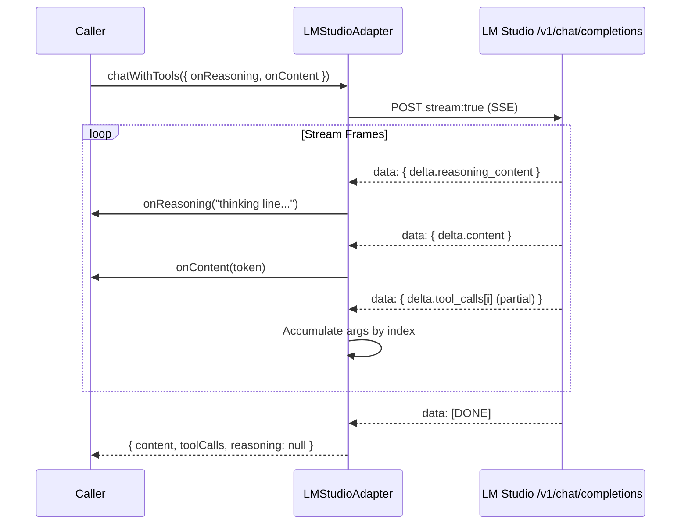
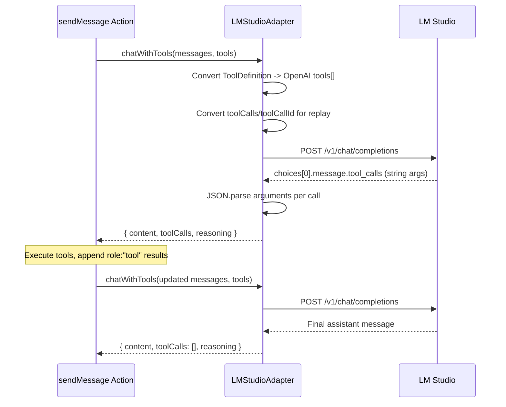

# LM Studio AI Adapter

## Overview

The LM Studio adapter integrates [LM Studio](https://lmstudio.ai/) as a third local AI provider alongside Ollama and Gemini. It implements the full `AIAdapter` interface: text generation, JSON generation, chat with tool-calling (including reasoning/thinking support and streaming), and embeddings.

LM Studio exposes an **OpenAI-compatible REST API** (`/v1/chat/completions`, `/v1/embeddings`, `/v1/models`), so the adapter is implemented with the built-in `fetch` client — no SDK dependency required.

## Configuration

| Environment Variable | Description | Default |
|---|---|---|
| `AI_PROVIDER` | Set to `"lmstudio"` to use LM Studio | `"ollama"` |
| `LM_STUDIO_HOST` | Base URL of the LM Studio local server | `http://localhost:1234` |
| `LM_STUDIO_MODEL` | Default model identifier as registered in LM Studio | `lmstudio-community/qwen2.5-7b-instruct` |
| `LM_STUDIO_API_KEY` | API key sent in the `Authorization` header. LM Studio ignores the value but requires a non-empty token. | `lm-studio` |
| `EMBEDDING_MODEL` | Embedding model name (overrides default for `generateEmbeddings`) | `nomic-ai/nomic-embed-text-v1.5` |

Start the LM Studio server from the **Developer** tab inside the desktop application before pointing the adapter at it.

## Architecture



## Method Mapping

| AIAdapter Method | LM Studio Endpoint | Notes |
|---|---|---|
| `generateText` | `POST /v1/chat/completions` | System prompt is sent as a `system` message |
| `generateJSON` | `POST /v1/chat/completions` | Uses `response_format: { type: "json_object" }` |
| `chatWithTools` | `POST /v1/chat/completions` | Tools as OpenAI `tools[].function`; tool results as `role: "tool"` messages keyed by `tool_call_id` |
| `chatWithTools` (streaming) | `POST /v1/chat/completions` (SSE) | Triggered when `onReasoning` or `onContent` callback is provided |
| `generateEmbeddings` | `POST /v1/embeddings` | Batch input via `input: string[]`; embeddings are sorted by `index` to preserve input order |
| `isAvailable` | `GET /v1/models` | Returns `false` on any non-OK response |

## Reasoning / Thinking Support

LM Studio reasoning models (e.g. DeepSeek-R1, Qwen3 thinking variants) emit a `reasoning_content` field on assistant messages and on streamed deltas. The adapter forwards this in the same way as Ollama and Gemini.

### Non-Streaming Mode

When `onReasoning` is not provided, the adapter:
1. Reads `choices[0].message.reasoning_content` from the response.
2. Returns it in the `ChatWithToolsResponse.reasoning` field (or `null` if absent / empty).

### Streaming Mode

When `onReasoning` (or `onContent`) is provided, the adapter:
1. Sets `stream: true` and consumes the SSE response with the built-in `fetch` reader.
2. Buffers `delta.reasoning_content` chunks and flushes complete lines to `onReasoning` in real time.
3. Forwards `delta.content` chunks to `onContent` immediately as they arrive.
4. Accumulates incremental tool calls per `delta.tool_calls[].index`, parsing the assembled JSON arguments once at the end.
5. Returns `reasoning: null` since reasoning was already forwarded via callback.



### Parity with Ollama and Gemini

| Feature | Ollama | Gemini | LM Studio |
|---|---|---|---|
| `reasoning` in response | `message.thinking` + `<think>` fallback | `part.thought === true` | `message.reasoning_content` |
| `onReasoning` streaming | SDK `thinking` per chunk | `part.thought` per chunk | `delta.reasoning_content` per SSE frame |
| Line-by-line buffering | Yes | Yes | Yes |
| Thinking budget control | Model-level (`/no_think`) | `thinkingConfig.thinkingBudget` | Model-level (depends on the loaded model) |

## Tool-Calling Flow



## Message Role Mapping

| Internal Role | LM Studio Role | Notes |
|---|---|---|
| `system` | `system` | Plain content message |
| `user` | `user` | Direct mapping |
| `assistant` | `assistant` | May include `tool_calls[]` with stringified `arguments` |
| `tool` | `tool` | Requires `tool_call_id`; the adapter falls back to `toolName` if `toolCallId` is missing |

## Retry & Resilience

- Max **3 retries** with exponential backoff (1s, 2s, 4s) — same as the Ollama and Gemini adapters.
- `createAIAdapterWithFallback()` falls back to Ollama if LM Studio is unavailable on startup.

## Usage

```typescript
// Via factory (recommended)
const ai = createAIAdapter({ provider: "lmstudio" });

// Or set AI_PROVIDER=lmstudio in .env and use the default
const ai = createAIAdapter();

// With reasoning streaming
const response = await ai.chatWithTools({
  messages,
  tools,
  onReasoning: (chunk) => console.log("[thinking]", chunk),
  onContent: (chunk) => process.stdout.write(chunk),
});
```
