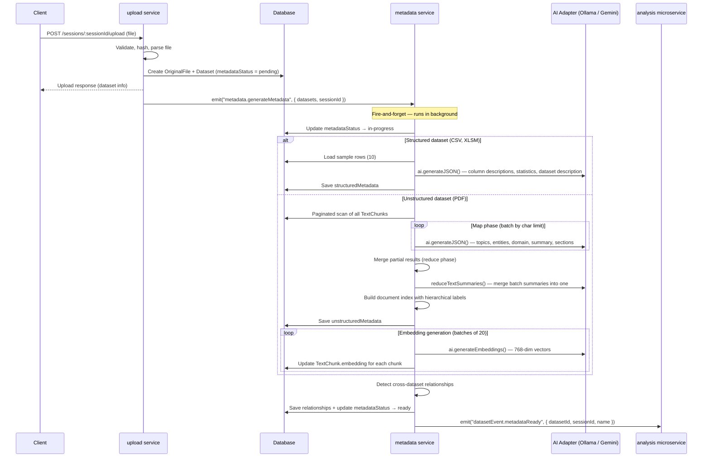
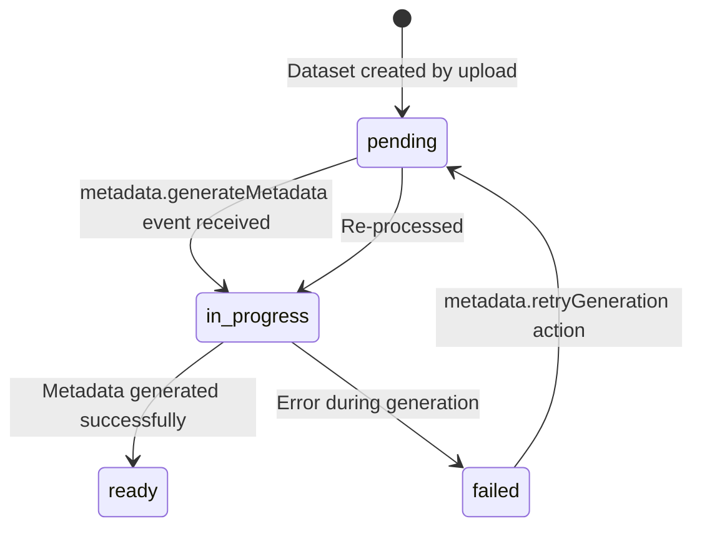
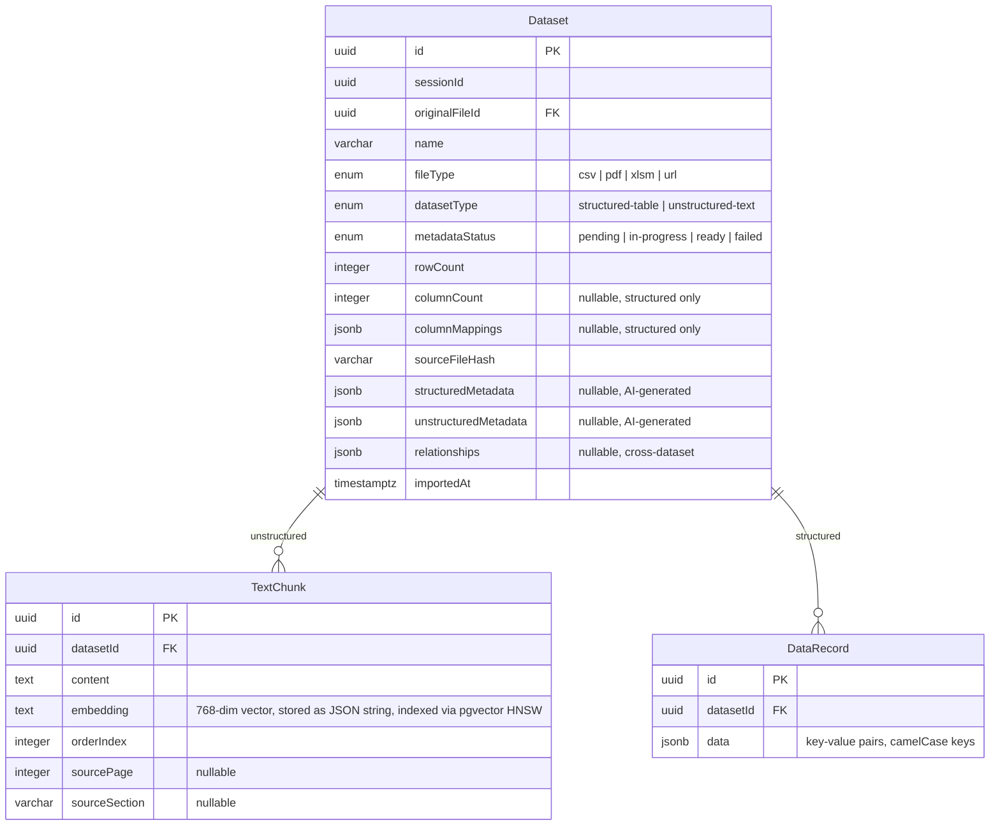
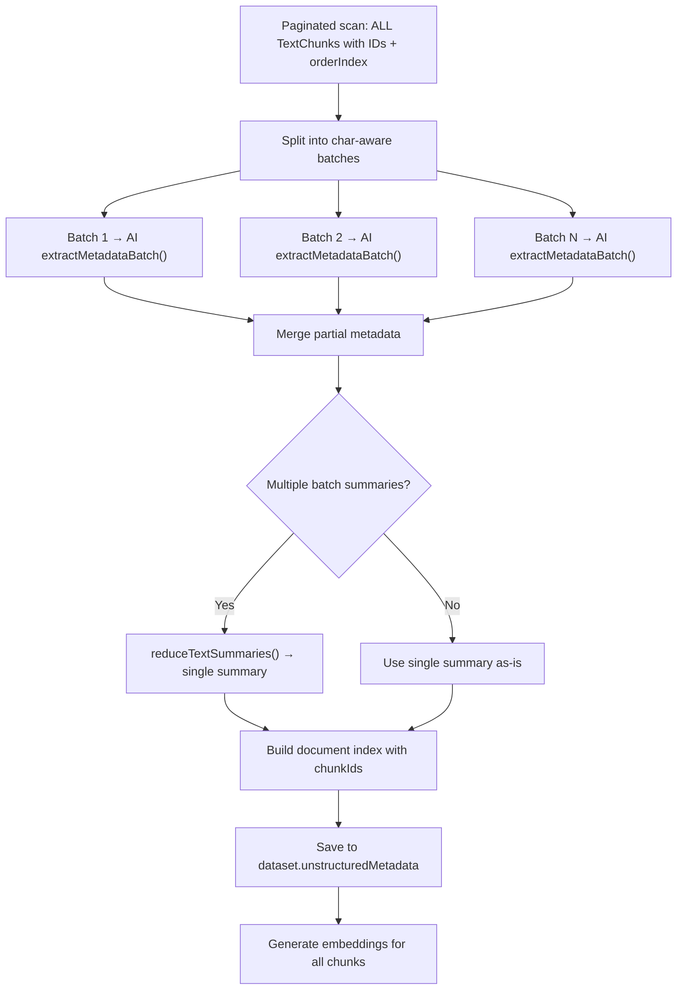

# Metadata Generation

## Overview

When a user uploads a file (CSV, PDF, XLSM) or imports a URL, the system automatically generates AI-powered metadata for each resulting dataset. This metadata is used to enrich the system prompt so the AI assistant understands the data it is working with.

Metadata generation runs **asynchronously** — it does not block the upload response. The dataset is created with `metadataStatus: pending` and the status progresses through `in-progress` → `ready` (or `failed`).

## End-to-End Flow



## Status Lifecycle



| Status        | Meaning                                                    |
|---------------|------------------------------------------------------------|
| `pending`     | Dataset created, metadata generation not yet started       |
| `in-progress` | AI is actively generating metadata                         |
| `ready`       | Metadata complete and available for use in system prompt   |
| `failed`      | Generation failed (can be retried via `retryGeneration`)   |

## Data Model



## Structured Metadata

For `structured-table` datasets (CSV, XLSM), the AI analyses sample rows and column mappings to produce:

### Generation Process

1. Load the first 10 `DataRecord` rows as samples
2. Build a prompt with column names, types, and sample data
3. Call `ai.generateJSON()` to extract metadata
4. Store the result in `Dataset.structuredMetadata`

### Schema (`StructuredMetadata`)

```typescript
interface StructuredMetadata {
  columnDescriptions: Array<{
    columnKey: string;       // camelCase column key
    columnOriginal: string;  // original column header
    description: string;     // AI-generated description
    exampleValues: string[]; // representative values
  }>;
  datasetDescription: string; // overall dataset summary
  statistics: Array<{
    columnKey: string;
    average?: number;
    max?: number;
    min?: number;
    nullCount: number;
    topFrequentValues?: Array<{ count: number; value: string }>;
    uniqueCount?: number;
  }>;
}
```

### Example

For a sales CSV with columns `product`, `revenue`, `region`:

```json
{
  "datasetDescription": "Sales transactions with product details, revenue figures, and regional breakdown.",
  "columnDescriptions": [
    { "columnKey": "product", "columnOriginal": "Product", "description": "Name of the product sold", "exampleValues": ["Widget A", "Gadget B"] },
    { "columnKey": "revenue", "columnOriginal": "Revenue", "description": "Revenue in USD", "exampleValues": ["1500.00", "2300.50"] },
    { "columnKey": "region", "columnOriginal": "Region", "description": "Sales region", "exampleValues": ["North America", "Europe"] }
  ],
  "statistics": [
    { "columnKey": "revenue", "nullCount": 0, "uniqueCount": 150, "min": 100, "max": 50000, "average": 3200 }
  ]
}
```

## Unstructured Metadata

For `unstructured-text` datasets (PDF), the system uses a **map-reduce** strategy to handle documents of any size.

### Generation Process



1. **Paginated scan** — Load all text chunks (pages of 100) with IDs and order indices, counting words
2. **Map phase** — Split chunks into batches by character limit (max 12,000 chars/batch), extract partial metadata from each batch via `ai.generateJSON()`
3. **Reduce phase** — Merge partial results: deduplicate topics, sum entity counts, pick most common content domain, concatenate sections
4. **Summary reduction** — If multiple batch summaries exist, recursively reduce them into a single cohesive summary via `ai.generateText()`
5. **Document index** — Build hierarchical index entries with chunk ID references
6. **Embedding generation** — Generate 768-dimensional vector embeddings for all text chunks in batches of 20

### Schema (`UnstructuredMetadata`)

```typescript
interface UnstructuredMetadata {
  chunkCount: number;           // total text chunks
  contentDomain: string;        // e.g. "financial", "legal", "scientific"
  documentIndex: Array<{
    chunkEnd: number;           // ending chunk orderIndex
    chunkIds: string[];         // TextChunk UUIDs in this section
    chunkStart: number;         // starting chunk orderIndex
    indexLabel: string;         // hierarchical label: "1", "1a", "1a-i"
    level: number;              // nesting depth (0 = main section)
    summary: string;            // brief section description
    title: string;              // section title
  }>;
  documentSummary: string;      // cohesive summary of entire document
  entities: Array<{
    count: number;
    name: string;
    type: string;               // unrestricted: person, organisation, date, etc.
  }>;
  keyTopics: string[];          // deduplicated, sorted alphabetically
  wordCount: number;            // total words across all chunks
}
```

### Document Index Labels

Index labels follow a hierarchical book-style scheme:

| Level | Format            | Example                      |
|-------|-------------------|------------------------------|
| 0     | Numeric           | `1`, `2`, `3`                |
| 1     | Parent + letter   | `1a`, `1b`, `2a`            |
| 2     | Parent + roman    | `1a-i`, `1a-ii`             |
| 3+    | Parent + number   | `1a-i-1`, `1a-i-2`          |

### Merge Strategy

| Field             | Strategy                                                          |
|-------------------|-------------------------------------------------------------------|
| `documentSummary` | Batch summaries joined, then reduced via `reduceTextSummaries()`  |
| `keyTopics`       | Deduplicated (case-insensitive), sorted alphabetically            |
| `entities`        | Merged by name+type key, counts summed                            |
| `contentDomain`   | Most frequently reported domain wins                              |
| `sections`        | Concatenated in order, carrying chunk index ranges from batches   |

## Embedding Generation

After unstructured metadata is computed, vector embeddings are generated for all text chunks to enable semantic search.

| Parameter         | Value       |
|-------------------|-------------|
| Model             | nomic-embed-text (Ollama) or text-embedding-004 (Gemini) |
| Dimensions        | 768         |
| Batch size        | 20 chunks per AI call |
| DB page size      | 100 chunks per DB query |
| Storage           | `TextChunk.embedding` (JSON string, indexed via pgvector HNSW) |

The pipeline paginates through chunks (100 per page), processes each page in embedding batches of 20, and updates each chunk's `embedding` column. Each batch is logged to `AILog` with purpose `EMBEDDING_GENERATION`.

## Cross-Dataset Relationship Detection

After metadata is generated for a dataset, the system scans other datasets in the same session for relationships:

| Relationship Type  | Detection Method                         | Applies To                            |
|--------------------|------------------------------------------|---------------------------------------|
| `shared-column`    | Matching camelCase column names          | Structured ↔ Structured               |
| `shared-topic`     | Matching topics (case-insensitive)       | Unstructured ↔ Unstructured           |

Detected relationships are stored in `Dataset.relationships` as a JSONB array.

## Events

| Event                           | Direction                      | Purpose                                              |
|---------------------------------|--------------------------------|------------------------------------------------------|
| `metadata.generateMetadata`     | Internal (data microservice)   | Trigger metadata generation after upload             |
| `datasetEvent.metadataReady`    | Cross-service (data → analysis)| Notify analysis service that metadata is complete    |

## Retry

Failed metadata generation can be retried via the `metadata.retryGeneration` action:

- **REST:** `POST /metadata/:datasetId/retry`
- Resets `metadataStatus` to `pending` and re-emits `metadata.generateMetadata`

## AI Logging

All AI interactions during metadata generation are recorded in the `AILog` table:

| Purpose                    | When                                              |
|----------------------------|---------------------------------------------------|
| `STRUCTURED_METADATA`      | Structured dataset column/stats generation         |
| `UNSTRUCTURED_METADATA`    | Each map-reduce batch + final reduce result        |
| `EMBEDDING_GENERATION`     | Each embedding batch (20 chunks)                   |

## Key Files

| File | Purpose |
|------|---------|
| `microservice.data/services/metadata/generateMetadata.event.ts` | Main metadata generation event handler |
| `microservice.data/services/metadata/retryGeneration.action.ts` | Retry failed metadata generation |
| `microservice.data/lib/map-reduce.ts` | Map-reduce utilities (batching, extraction, merging) |
| `microservice.data/db/dataset.entity.ts` | Dataset entity with metadata JSONB columns |
| `microservice.data/db/text-chunk.entity.ts` | TextChunk entity with embedding column |

## Constants

| Constant             | Value   | Purpose                                    |
|----------------------|---------|--------------------------------------------|
| `MAX_CHARS_PER_BATCH`| 12,000  | Character limit per map-reduce batch       |
| `PAGE_SIZE`          | 100     | DB pagination size for chunk loading       |
| `EMBEDDING_BATCH_SIZE`| 20     | Chunks per embedding API call              |
| Concurrency          | 1       | Sequential processing to limit AI load     |
