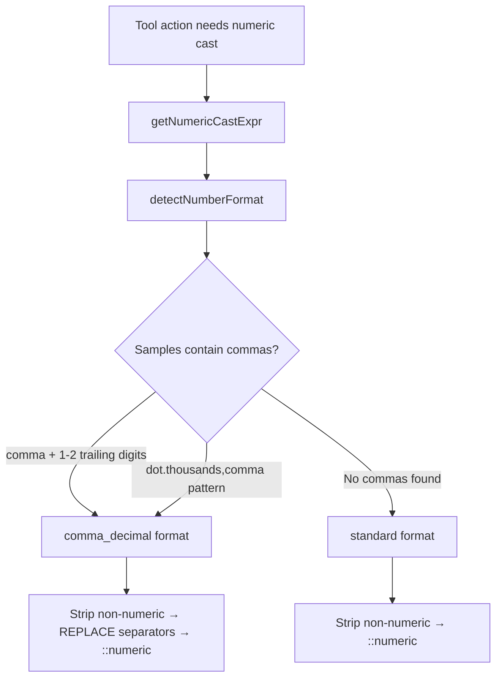

# Numeric Field Handling

## Problem

Uploaded datasets may store numeric values with:
- **Commas as decimal separators** (European/Vietnamese): `"60,00"`, `"1.234,56"`
- **Currency symbols or unit prefixes/suffixes**: `"$188.54"`, `"€1.234,56"`, `"50%"`
- **Empty or placeholder cells**: `""`, `"N/A"`, `"-"`

PostgreSQL's `::numeric` cast rejects all of these:

```
invalid input syntax for type numeric: "$188.54"
invalid input syntax for type numeric: "60,00"
```

This affects all structured data tools that perform numeric operations: `aggregate`, `correlateFields`, `detectOutliers`, `getPercentile`, `sortByField`, `pivotTable`, `filterByCondition`.

## Solution

### Format Detection & Safe Casting

All numeric SQL casting goes through a centralized utility in `numericFieldUtils.ts`:



### Key Functions

| Function | Purpose |
|---|---|
| `getNumericCastExpr()` | Detects format and returns safe SQL expression for numeric casting |
| `detectNumberFormat()` | Samples field values to determine if comma-decimal format is used |
| `buildNumericCast()` | Generates the SQL expression: strips non-numeric chars, handles format, casts |
| `sqlStripNonNumeric()` | SQL `REGEXP_REPLACE` to remove currency symbols, letters, spaces |
| `stripNonNumeric()` | JS-side stripping for regex testing during detection |
| `isFieldNumeric()` | Samples multiple non-empty values, strips symbols, checks if majority are numeric |
| `assertFieldIsNumeric()` | Throws `MoleculerClientError` if field is not numeric |
| `numericWhereClause()` | Returns a SQL WHERE fragment filtering out NULL and empty/blank values |

### Usage in Tools

```typescript
// Query builder (with table alias "r"):
const numExpr = await getNumericCastExpr({ datasetId, field, repo, tableAlias: "r" });
// → "(r.data->>'price')::numeric"  (standard)
// → "REPLACE(REPLACE(r.data->>'price', '.', ''), ',', '.')::numeric"  (comma-decimal)

// Filter out NULL and empty values before numeric casting:
qb.andWhere(numericWhereClause({ field, tableAlias: "r" }));
// → "r.data->>'price' IS NOT NULL AND TRIM(r.data->>'price') != ''"

qb.select(`SUM(${numExpr}) AS "total"`);

// Raw SQL (no alias):
const numExpr = await getNumericCastExpr({ datasetId, field, repo });
const filter = numericWhereClause({ field });
// → "data->>'price' IS NOT NULL AND TRIM(data->>'price') != ''"
```

### Supported Number Formats

| Format | Example | Detected As |
|---|---|---|
| Standard integer | `"1234"` | standard |
| Standard decimal | `"1234.56"` | standard |
| High-precision decimal | `"1234.5678"` | standard |
| Comma decimal | `"1234,56"` | comma_decimal |
| European (dot thousands + comma decimal) | `"1.234,56"` | comma_decimal |
| US with high precision | `"1,234.5678"` | standard |
| Currency prefixed (USD) | `"$188.54"` | standard |
| Currency prefixed (EUR) | `"€1.234,56"` | comma_decimal |
| Percentage suffix | `"50%"` | standard |

### SQL Transformation

All numeric casting first strips non-numeric characters using `REGEXP_REPLACE(val, '[^0-9.,-]', '', 'g')`, then applies format-specific transforms:

For **standard** format:
1. Strip non-numeric: `"$188.54"` → `"188.54"`
2. Cast: `::numeric` → `188.54`

For **comma_decimal** format:
1. Strip non-numeric: `"€1.234,56"` → `"1.234,56"`
2. Remove dots (thousands): `"1234,56"`
3. Replace comma with dot (decimal): `"1234.56"`
4. Cast: `::numeric` → `1234.56`

## Robust Numeric Detection

`isFieldNumeric()` uses multi-sample detection with symbol stripping for reliability:

1. **Strips currency/unit symbols** — `stripNonNumeric()` removes `$`, `€`, `£`, `%`, etc. before regex testing
2. **Filters out empty/blank strings** — `TRIM(val) != ''` prevents stray empty cells from causing false negatives
3. **Samples 10 values** instead of 1 — reduces sensitivity to individual outlier values
4. **Majority threshold (50%)** — field is considered numeric if at least half the samples match the numeric regex

This prevents false "non-numeric" errors when a dataset has mostly numeric values but a few empty or placeholder cells (e.g., `""`, `"N/A"`, `"-"`).

### Empty Value Filtering in SQL

All tool actions that perform numeric casting also filter out empty/blank values using `numericWhereClause()` to prevent `::numeric` cast errors at query time. This is a defense-in-depth measure — even if detection passes, stray non-numeric rows won't crash the query.

## Files Modified

- `services/tools/numericFieldUtils.ts` — Core detection and casting utilities
- All structured tool actions that perform numeric operations
