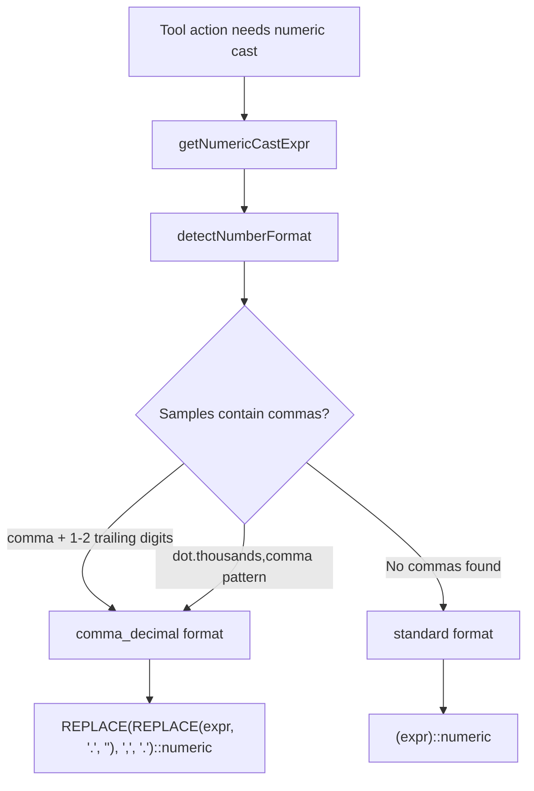

# Numeric Comma-Decimal Handling

## Problem

Uploaded datasets (especially Vietnamese/European data) may store numeric values with **commas as decimal separators** (e.g., `"60,00"` instead of `"60.00"`, or `"1.234,56"` instead of `"1234.56"`). PostgreSQL's `::numeric` cast rejects these values:

```
invalid input syntax for type numeric: "60,00"
```

This affects all structured data tools that perform numeric operations: `aggregate`, `correlateFields`, `detectOutliers`, `getPercentile`, `sortByField`, `pivotTable`, `filterByCondition`.

## Solution

### Format Detection & Safe Casting

All numeric SQL casting goes through a centralized utility in `numericFieldUtils.ts`:



### Key Functions

| Function | Purpose |
|---|---|
| `getNumericCastExpr()` | Detects format and returns safe SQL expression for numeric casting |
| `detectNumberFormat()` | Samples field values to determine if comma-decimal format is used |
| `buildNumericCast()` | Generates the SQL expression for a given format |
| `isFieldNumeric()` | Checks if a field contains numeric values (handles both formats) |
| `assertFieldIsNumeric()` | Throws `MoleculerClientError` if field is not numeric |

### Usage in Tools

```typescript
// Query builder (with table alias "r"):
const numExpr = await getNumericCastExpr({ datasetId, field, repo, tableAlias: "r" });
// → "(r.data->>'price')::numeric"  (standard)
// → "REPLACE(REPLACE(r.data->>'price', '.', ''), ',', '.')::numeric"  (comma-decimal)

qb.select(`SUM(${numExpr}) AS "total"`);

// Raw SQL (no alias):
const numExpr = await getNumericCastExpr({ datasetId, field, repo });
// → "(data->>'price')::numeric"  (standard)
```

### Supported Number Formats

| Format | Example | Detected As |
|---|---|---|
| Standard integer | `"1234"` | standard |
| Standard decimal | `"1234.56"` | standard |
| Comma decimal | `"1234,56"` | comma_decimal |
| European (dot thousands + comma decimal) | `"1.234,56"` | comma_decimal |

### SQL Transformation

For **comma_decimal** format, the SQL expression:
1. Removes dots (thousands separators): `REPLACE(val, '.', '')`
2. Replaces comma with dot (decimal): `REPLACE(val, ',', '.')`
3. Casts to numeric: `::numeric`

Example: `"1.234,56"` → `"1234,56"` → `"1234.56"` → `1234.56`

## Files Modified

- `services/tools/numericFieldUtils.ts` — Core detection and casting utilities
- All structured tool actions that perform numeric operations
