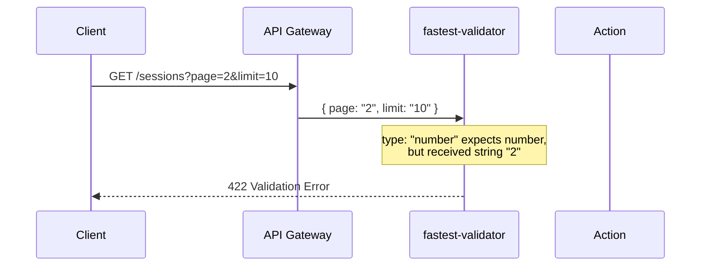
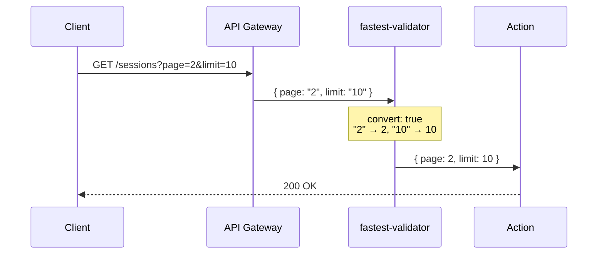

# Query Parameter Validation: Type Coercion

## Problem

HTTP query parameters are always transmitted as strings. When a REST endpoint (especially `GET`) defines numeric or boolean params in the `fastest-validator` schema, the validator rejects them with a **422 Unprocessable Entity** error because it receives `"10"` (string) instead of `10` (number).



## Solution

Add `convert: true` to any `number` or `boolean` param in actions that have a REST endpoint (particularly `GET` endpoints). This tells `fastest-validator` to coerce the string value to the expected type before validation.



## Rule

When defining action params for REST endpoints:

- **`type: "number"`** → always add `convert: true`
- **`type: "boolean"`** → always add `convert: true`

This applies to all REST methods but is especially critical for `GET` endpoints where parameters come from the query string.

### Example

```typescript
params: {
  page: { type: "number", convert: true, optional: true, integer: true, min: 1, default: 1 },
  limit: {
    type: "number",
    convert: true,
    optional: true,
    integer: true,
    min: 1,
    max: 100,
    default: 20,
  },
  includeArchived: { type: "boolean", convert: true, optional: true, default: false },
},
```

## Affected Endpoints

| Endpoint | Service | Params Fixed |
|----------|---------|-------------|
| `GET /sessions` | session.list | `page`, `limit` |
| `GET /chat/messages` | chat.getHistory | `page`, `limit`, `excludeSystem` |
| `GET /datasets/:id/preview` | dataset.previewDataset | `limit` |
