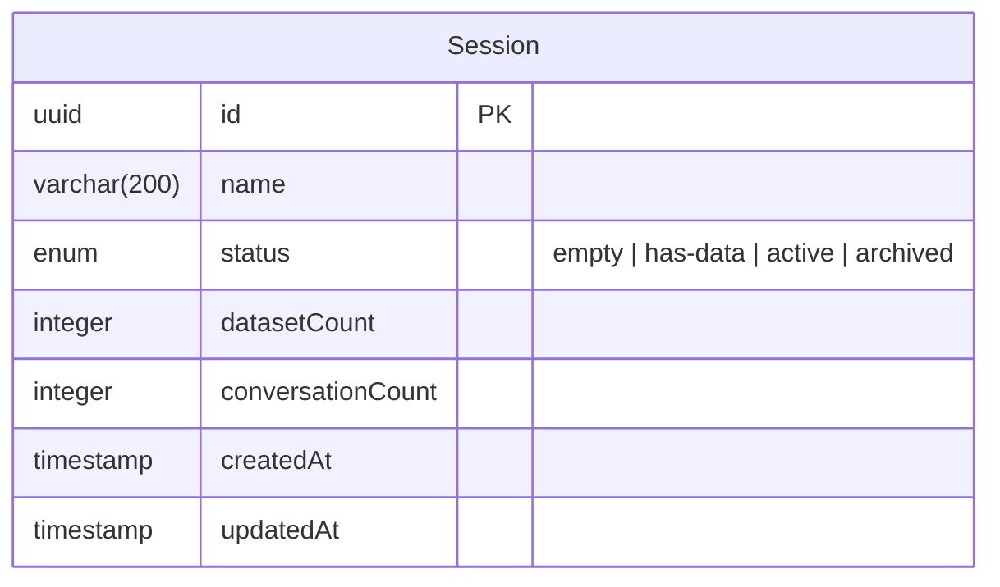
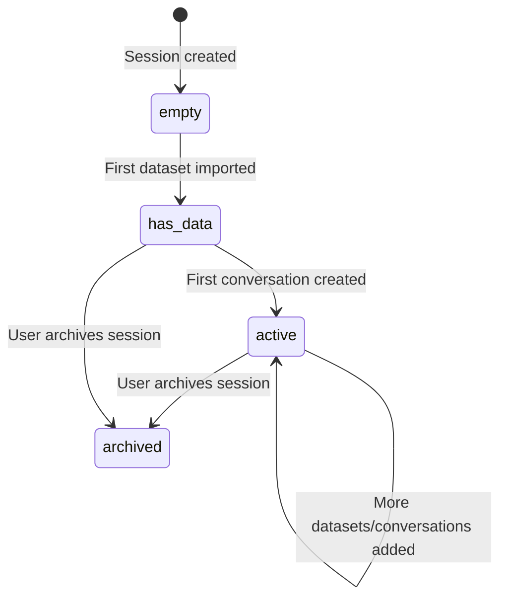

# Session Management

## Overview

A **Session** is an isolated analysis workspace that contains datasets and conversations. Sessions track lifecycle status and maintain denormalized counts for efficient listing.

## Data Model

## Session Lifecycle

Sessions transition through status states as the user works with data:

| Status     | Meaning                                   |
|------------|-------------------------------------------|
| `empty`    | Freshly created, no datasets yet          |
| `has-data` | At least one dataset imported, no conversations |
| `active`   | Has both datasets and conversations       |
| `archived` | Manually archived by user                 |

Status transitions are handled internally by the `session.updateSessionStatus` action, triggered by:
- `dataset-imported` — moves `empty` → `has-data`, increments `datasetCount`
- `conversation-created` — moves `has-data` → `active`, increments `conversationCount`

## REST Endpoints

All session endpoints are under the `/api/sessions` base path.

| Operation      | Method   | URL                         | Action                        |
|----------------|----------|-----------------------------|-------------------------------|
| Create session | `POST`   | `/api/sessions`             | `session.create`              |
| List sessions  | `GET`    | `/api/sessions`             | `session.list`                |
| Get session    | `GET`    | `/api/sessions/:id`         | `session.getSession`          |
| Delete session | `DELETE` | `/api/sessions/:id`         | `session.deleteSession`       |
| Rename session | `PATCH`  | `/api/sessions/:id/rename`  | `session.renameSession`       |

### Create Session

Auto-generates a name like `Session — Feb 28, 2026 14:30` when no name is provided.

**Params:**
- `name` (string, optional, 1–200 chars)

**Returns:** Full session object with `id`, `name`, `status`, `datasetCount`, `conversationCount`, `createdAt`, `updatedAt`.

### List Sessions

Paginated list sorted by `createdAt DESC`.

**Query params:**
- `page` (number, optional, default: 1, min: 1) — uses `convert: true`
- `limit` (number, optional, default: 20, min: 1, max: 100) — uses `convert: true`

**Returns:** `{ data, total, page, limit, totalPages }`

### Get Session

**Params:**
- `id` (uuid, required)

**Returns:** Full session object. Throws `404 SESSION_NOT_FOUND` if not found.

### Delete Session

Deletes the session (cascades to conversations and chat messages via FK). Emits `sessionData.sessionDeleted` event for cross-service cleanup (e.g., data microservice deletes datasets, files, chunks).

**Params:**
- `id` (uuid, required)

**Returns:** `{ success: true, id }`

### Rename Session

**Params:**
- `id` (uuid, required)
- `name` (string, required, 1–200 chars)

**Returns:** Updated session object.

## Internal Actions

| Action                          | Visibility  | Description                              |
|---------------------------------|-------------|------------------------------------------|
| `session.updateSessionStatus`   | `protected` | Updates session status based on triggers  |

## Events Emitted

| Event              | Payload             | When                     |
|--------------------|---------------------|--------------------------|
| `sessionData.sessionDeleted` | `{ sessionId }` | After session is deleted |
