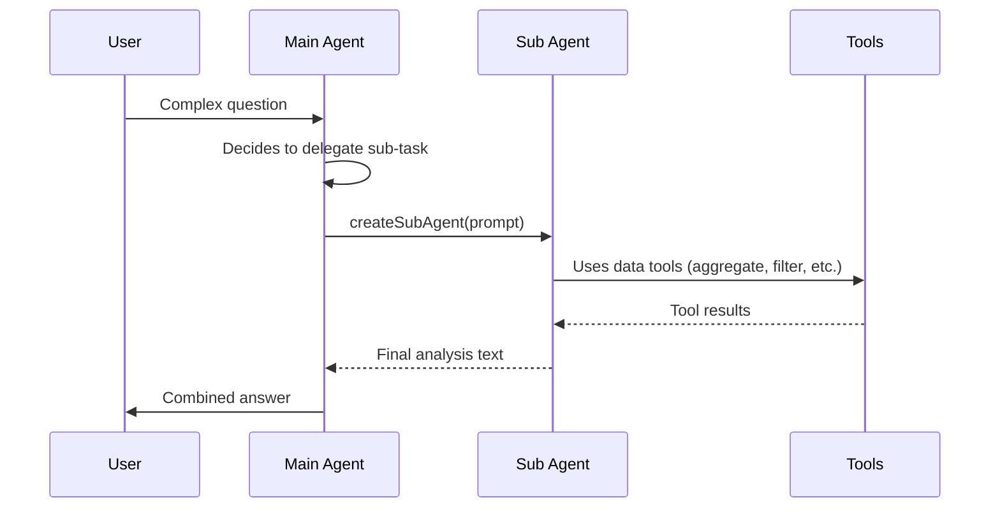

# Sub-Agent Delegation

## Overview

The chat system supports **sub-agent delegation** — the main AI agent can spawn a sub-agent to independently handle a self-contained analysis task. This is useful for breaking complex questions into parallel sub-tasks.

## How It Works



## Key Rules

1. **The main agent** can call `createSubAgent` with a detailed prompt.
2. **The sub-agent** has access to all existing tools (structured, unstructured, web).
3. **The sub-agent CANNOT create further sub-agents** — no recursive delegation. The `createSubAgent` tool is excluded from the sub-agent's tool set.
4. The sub-agent receives the same system prompt as the main agent (including dataset metadata), so it has full context about available datasets.

## Tool Definition

| Parameter | Type     | Required | Description                                      |
|-----------|----------|----------|--------------------------------------------------|
| `prompt`  | `string` | Yes      | Detailed instruction for the sub-agent to execute |

## Configuration

- **Max iterations (sub-agent):** 10 (vs 20 for the main agent)
- **Tool category:** `meta` — a separate category that is not tied to any dataset type
- **Action sentinel:** `__subagent__` — handled inline in the orchestration loop, not routed to a microservice action

## SSE Events

Sub-agent progress is streamed to the client via SSE with `[Sub-agent]` prefixed reasoning steps, so the user can see what the sub-agent is doing in real time.

## Example

The main agent might call:

```json
{
  "name": "createSubAgent",
  "arguments": {
    "prompt": "Analyze dataset abc-123. Use the aggregate tool to calculate the sum of revenue grouped by country, then find the top 5 countries by total revenue. Return a summary of findings."
  }
}
```

The sub-agent then independently calls tools, gathers data, and returns its textual analysis back to the main agent.
