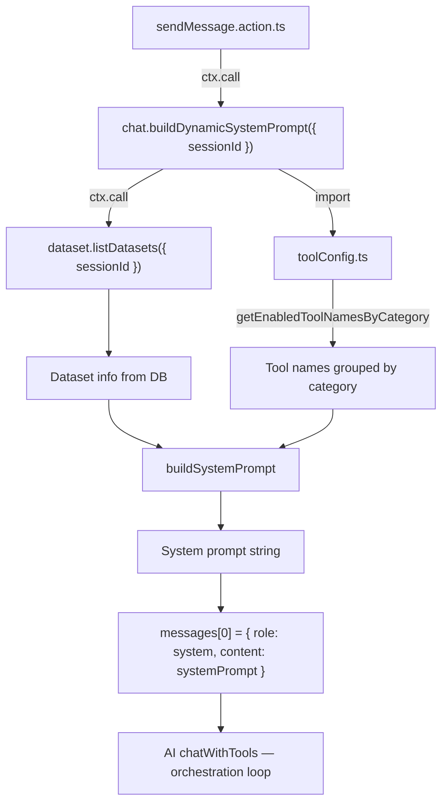
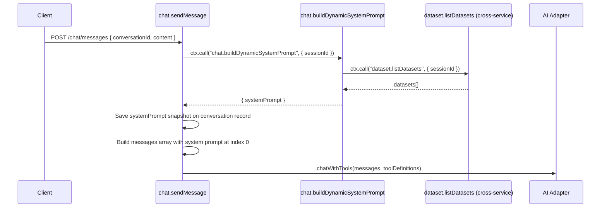
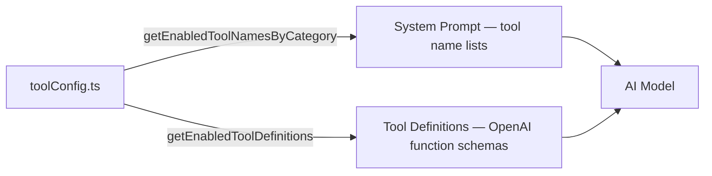
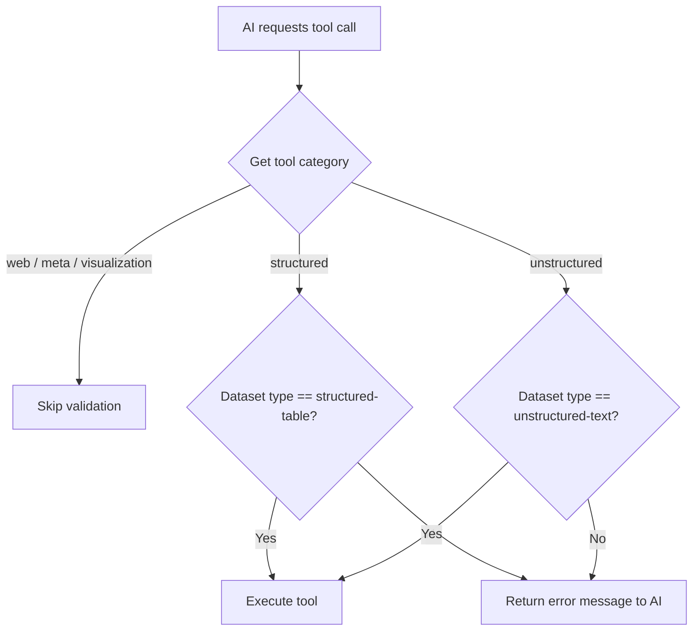

# System Prompt Construction

## Overview

The system prompt is the foundational instruction set sent to the AI model at the start of every chat message. It tells the AI what it is, what tools are available, what datasets exist in the session, and how to behave. The prompt is **generated dynamically** before each AI call so it always reflects the latest session state.

## Architecture



The `chat.buildDynamicSystemPrompt` action is **internal** (no REST endpoint). It is called from `sendMessage.action.ts` during conversation preparation, before the orchestration loop begins.

## When the System Prompt Is Built



The system prompt is rebuilt **every time** a message is sent, not at conversation creation time. This means:
- New datasets uploaded mid-conversation are automatically included
- Tool configuration changes take effect on the next message
- The conversation record stores a snapshot of the latest prompt for debugging

## Prompt Sections

The system prompt is assembled from multiple sections in order. Each section serves a distinct purpose.

### Section 1: Role & Behavior

Sets the AI's identity and core behavioral rules:

- **Identity:** "You are an AI data analysis assistant"
- **Mission:** Help the user analyse imported data by answering questions, running calculations, and providing insights
- **Language:** Always respond in the same language the user is asking in
- **Emoji:** Use strategically to highlight insights, do not overuse
- **Statefulness:** Tool execution states are cleared after each response — results do not persist

### Section 2: Tool Selection Rules by Dataset Type

Critical rules that prevent the AI from using the wrong tools on the wrong dataset types:

```
Each dataset has a `type` field: `structured-table` or `unstructured-text`.
You MUST choose tools based on the dataset type.
```

Tools are grouped into category sections. Each section is only included if tools of that category are enabled.

### Section 3: Tool Categories

Each enabled tool category gets its own subsection listing the available tool names and usage guidance.

| Category        | Datasets               | Example Tools                                        |
|-----------------|------------------------|------------------------------------------------------|
| `structured`    | `structured-table`     | aggregate, filterByCondition, sortByField, ...       |
| `unstructured`  | `unstructured-text`    | semanticSearch, getChunks                            |
| `web`           | N/A (external)         | webSearch, webFetch                                  |
| `visualization` | Any                    | generateChartSpec                                    |
| `meta`          | Any                    | createSubAgent                                       |

The tool names are sourced from `toolConfig.ts` via `getEnabledToolNamesByCategory()`. This ensures the prompt always matches the actual tool definitions sent to the AI.

#### Visualization Guidance

The visualization section includes detailed instructions for:
- When to proactively generate charts (even if user didn't ask)
- How to use `[chart:N]` placeholders for inline chart placement
- Data source referencing with `datasetNames` parameter
- Chart type selection (bar, line, pie)

#### Sub-Agent Guidance

The sub-agent section explains:
- When to delegate to sub-agents (multi-part questions, comparative analysis, cross-dataset queries)
- How to write effective sub-agent prompts
- When NOT to use sub-agents (simple single-tool lookups)

### Section 4: Tool Selection Decision Tree

A step-by-step guide for the AI to decide which tools to use:

1. Look at the dataset `type` field
2. `structured-table` → use ONLY Structured Data Tools
3. `unstructured-text` → use ONLY Unstructured Text Tools
4. Never mix tool categories across dataset types
5. For questions spanning both types, use each category separately and combine insights

### Section 5: Data Matching Rules

Rules for working with data values:

- Never assume values exist without checking via `getDistinctValues`
- Never assume data formats
- Never use `getDistinctValues` on numeric fields — use `countDistinctValues`, `getPercentile`, or `aggregate` instead
- Always provide a reasonable `limit` when calling `getDistinctValues`
- Check cardinality with `countDistinctValues` before calling `getDistinctValues`

### Section 6: Result Size Management

Rules to prevent overwhelming the AI context window:

- `aggregate` has a hard cap of 200 grouped rows
- Use `limit` and `orderBy` for high-cardinality groupings
- Check cardinality before grouping
- Inform users when results are truncated (`truncated: true`)
- Use `sampleData` to preview rows before analysis

### Section 7: Self-Reflection & Data Verification

Guidelines for the AI to verify its own work before answering:

1. **Assess Data Sufficiency** — Is the retrieved data enough to answer the question?
2. **Verify Data Relevance** — Is the data actually relevant to what was asked?
3. **Cross-Reference** — Verify key facts using multiple sources or tools
4. **Acknowledge Limitations** — State what information is missing rather than guessing
5. **Confidence Assessment** — Rate confidence; for unstructured text, verify chunks support conclusions

### Section 8: Available Datasets

Dynamically populated based on the session's datasets. Datasets are split into two groups:

- **Structured Table Datasets** — with heading "use Structured Data Tools only"
- **Unstructured Text Datasets** — with heading "use Unstructured Text Tools only"

If no datasets exist, a simple message says "No datasets have been imported to this session yet."

#### Dataset Info Included in Prompt

For **each dataset**, the following information is appended:

| Field | Source | Example |
|-------|--------|---------|
| Name | `dataset.name` | `Sales Data 2024` |
| ID | `dataset.id` | UUID |
| Type | `dataset.datasetType` | `structured-table` |
| Format | `dataset.fileType` | `csv` |
| Rows | `dataset.rowCount` | `15000` |

**Structured datasets additionally include:**

| Field | Source | Description |
|-------|--------|-------------|
| Columns | `dataset.columnMappings` | Each column with camelCase key, original name, detected type, AI description |
| Description | `structuredMetadata.datasetDescription` | AI-generated summary of the dataset |

**Unstructured datasets additionally include:**

| Field | Source | Description |
|-------|--------|-------------|
| Summary | `unstructuredMetadata.documentSummary` | Cohesive document summary |
| Chunks | `unstructuredMetadata.chunkCount` | Total text chunks |
| Topics | `unstructuredMetadata.keyTopics` | Comma-separated key topics |
| Key Entities | `unstructuredMetadata.entities` | Top 15 entities by count (name + type) |
| Document Index | `unstructuredMetadata.documentIndex` | Hierarchical index with chunk ranges |

### Example: Structured Dataset in Prompt

```
#### Sales Data 2024
- ID: 550e8400-e29b-41d4-a716-446655440000
- Type: structured-table
- Format: csv
- Rows: 15000
- Columns:
  - `product` (original: "Product", type: string, description: Name of the product sold)
  - `revenue` (original: "Revenue", type: number, description: Revenue in USD)
  - `region` (original: "Region", type: string, description: Sales region)
- Description: Sales transactions with product details, revenue figures, and regional breakdown.
```

### Example: Unstructured Dataset in Prompt

```
#### Annual Report 2024
- ID: 660e8400-e29b-41d4-a716-446655440000
- Type: unstructured-text
- Format: pdf
- Rows: 45
- Summary: Comprehensive annual report covering financial performance, strategic initiatives...
- Chunks: 45
- Topics: corporate governance, financial performance, risk management, sustainability
- Key Entities: Acme Corp (organisation), John Smith (person), Q4 2024 (date)
- Document Index (use getChunks tool with chunk ranges to read sections):
  1. "Executive Summary" [chunks 0–5]: Overview of key achievements...
  2. "Financial Performance" [chunks 6–20]: Detailed financial analysis...
    2a. "Revenue Analysis" [chunks 6–12]: Revenue breakdown by segment...
    2b. "Cost Structure" [chunks 13–20]: Operating costs and efficiency...
  3. "Strategic Outlook" [chunks 21–44]: Future plans and risk factors...
```

## Connection to Tool Definitions

The system prompt and the tool definitions sent to the AI both derive from the same source: `toolConfig.ts`.



This ensures the tool names mentioned in the system prompt always match the function definitions the AI can actually call.

## Dataset Type Enforcement

Beyond the system prompt instructions, the code also **validates** tool-to-dataset type matching at runtime in `sendMessage.action.ts`:



This double enforcement (prompt instructions + runtime validation) prevents tool-dataset mismatches.

## Key Files

| File | Purpose |
|------|---------|
| `microservice.analysis/services/chat/buildDynamicSystemPrompt.action.ts` | Builds the system prompt from datasets and tool config |
| `microservice.analysis/toolConfig.ts` | Single source of truth for tool names, categories, and definitions |
| `microservice.analysis/services/chat/sendMessage.action.ts` | Calls buildDynamicSystemPrompt, injects into messages, runs orchestration loop |
