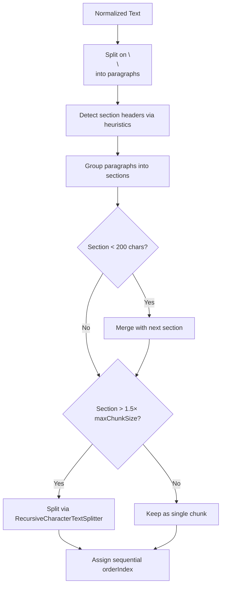

# Text Chunking for Vector Database

## Overview

Text extracted from documents (PDFs, etc.) must be split into chunks suitable for vector embeddings stored in PostgreSQL with pgvector. Proper chunking ensures that:

1. Chunks end at **natural boundaries** (sentences, paragraphs) — never mid-sentence
2. Overlapping context between chunks preserves continuity for semantic search
3. Soft line-wraps from PDF layout are normalized before splitting

Two chunking strategies are available:
- **Fixed-size chunking** (`chunkText`) — traditional RecursiveCharacterTextSplitter approach
- **Semantic chunking** (`semanticChunkText`) — section-aware chunking that preserves document structure

## Architecture

```mermaid
flowchart LR
    A[PDF Text\nwith soft wraps] --> B[normalizeExtractedText]
    B --> C[Cleaned text\njoined lines]
    C --> D{Chunking Strategy}
    D -->|Fixed-size| E[RecursiveCharacterTextSplitter\n@langchain/textsplitters]
    D -->|Semantic| F[Section Header Detection\n+ Paragraph Grouping]
    E --> G[TextChunk[]\nsentence-boundary splits]
    F --> H{Section too large?}
    H -->|Yes| E
    H -->|No| G
    G --> I[(pgvector\n768-dim embeddings)]
```

## Library: `@langchain/textsplitters`

We use LangChain's **`RecursiveCharacterTextSplitter`** — the industry-standard text splitter for RAG pipelines (1.2M+ weekly npm downloads).

**Key advantage over a naive splitter:** When a higher-priority separator (e.g., `\n\n`) produces a chunk that exceeds the target size, it **recursively** applies finer-grained separators (`". "`, `"? "`, `" "`) to that chunk. This guarantees chunks split at the best possible boundary.

### Separator Priority

```
\n\n  →  ". "  →  ".\n"  →  "? "  →  "! "  →  "; "  →  ", "  →  " "  →  ""
```

**Note:** Single `\n` is intentionally excluded from separators. PDF text has soft line-wraps at the column boundary that appear as `\n` mid-sentence. These are normalized to spaces before splitting (see below).

## Chunking Strategies

### Fixed-Size Chunking (`chunkText`)

Traditional approach using RecursiveCharacterTextSplitter.

| Parameter | Default | Description |
|-----------|---------|-------------|
| `chunkSize` | 800 | Target chunk size in characters |
| `overlap` | 200 | Characters of overlap between adjacent chunks |

### Semantic Chunking (`semanticChunkText`) — **Default for PDFs**

Semantic chunking preserves document structure by splitting at section boundaries rather than using a fixed character count. This produces variable-size chunks that keep headers together with their body text.

| Parameter | Default | Description |
|-----------|---------|-------------|
| `chunkSize` | 1500 | Maximum chunk size before fallback splitting |
| `overlap` | 100 | Overlap for fallback splits of oversized sections |

#### How It Works



#### Section Header Detection Heuristics

A line is considered a section header if it matches any of these patterns:

| Pattern | Example | Condition |
|---------|---------|-----------|
| ALL-CAPS | `"EDUCATION"`, `"KEY SKILLS"` | 3+ chars, all uppercase/digits/punctuation |
| Ends with colon | `"Summary:"`, `"Responsibilities:"` | ≤80 chars |
| Numbered heading | `"1. Introduction"`, `"Section 3"` | Starts with number/Section/Chapter/Part, ≤80 chars |
| Short title line | `"Background"`, `"Results"` | ≤60 chars, starts uppercase, no ending punctuation |

Lines longer than 120 chars are never considered headers.

#### Merging Rules

- **Tiny sections** (under 200 chars) are merged with the next section to avoid fragmenting context
- **Oversized sections** (over 1.5× `maxChunkSize`) fall back to `chunkText` for sub-splitting

## Text Normalization (`normalizeExtractedText`)

PDF text extractors insert `\n` at column boundaries, producing line breaks that don't correspond to actual paragraph/sentence breaks. The normalizer joins soft-wrapped continuation lines while preserving intentional breaks.

### Preserved as separate lines

| Pattern | Example | Reason |
|---------|---------|--------|
| Blank lines (`\n\n`) | Between paragraphs | Paragraph breaks |
| Lines ending with `.` `!` `?` | `"...or Docker."` | Complete sentences |
| Lines ending with `:` | `"Role:"`, `"Description:"` | Labels/headers |
| Short lines (≤50 chars) | `"EDUCATION"`, `"Team size: 10"` | Headings/metadata |
| Lines followed by bullets | `"- Agency Revolution"` | List items |
| Lines followed by ALL-CAPS words | `"SKILLS"`, `"GCP"` | Section headings |
| Lines followed by labels with `:` | `"Responsibilities:"` | Field labels |
| Lines followed by URLs | `"https://..."` | Links |
| Page markers | `"-- 1 of 3 --"` | Converted to paragraph breaks |

### Joined with space (continuation)

Any `\n` within a paragraph that doesn't match the above patterns is replaced with a space, joining the soft-wrapped line with the previous one.

## Data Model

Chunks are stored in the `textChunks` table:

| Column | Type | Description |
|--------|------|-------------|
| `content` | text | The chunk text |
| `embedding` | vector(768) | nomic-embed-text embedding |
| `orderIndex` | int | Position in the original document |
| `sourcePage` | int | Source page number (PDFs) |
| `sourceSection` | text | Optional section identifier |
| `datasetId` | uuid | FK to parent Dataset |

## Usage

```typescript
import { chunkText, semanticChunkText } from "core.lib/adapters/file-parser";

// Semantic chunking (preferred for PDFs)
const chunks = await semanticChunkText(pdfText, {
  chunkSize: 1500,
  overlap: 100,
});

// Fixed-size chunking (fallback / other use cases)
const chunks = await chunkText(text, {
  chunkSize: 800,
  overlap: 200,
});
// Returns: ParsedTextChunk[] with content, orderIndex, sourcePage
```

## Before vs After

**Before** (fixed-size chunking — 800 char chunks):
```
Chunk 0: "EDUCATION\nBachelor of Science in..."  ← header + partial content
Chunk 1: "...in Computer Science. WORK EXPERIENCE"  ← section boundary mid-chunk
```

**After** (semantic chunking — section-aware):
```
Chunk 0: "EDUCATION\n\nBachelor of Science in Computer Science from..."  ← complete section
Chunk 1: "WORK EXPERIENCE\n\nSoftware Engineer at Company X..."          ← starts at header
```
