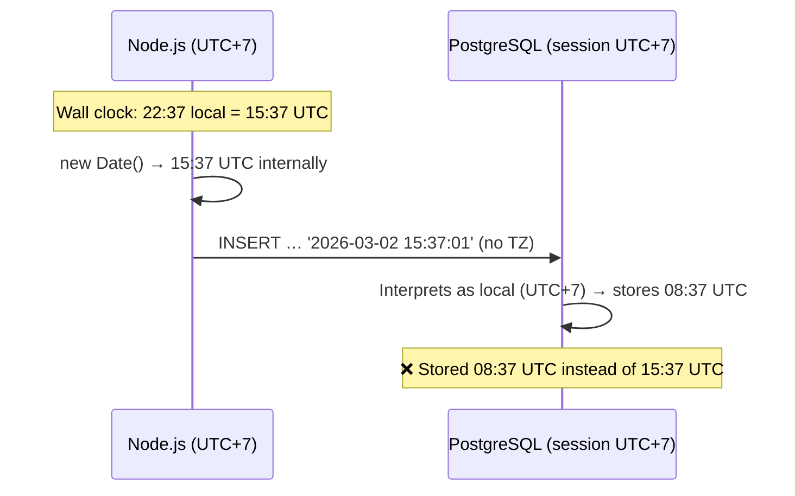
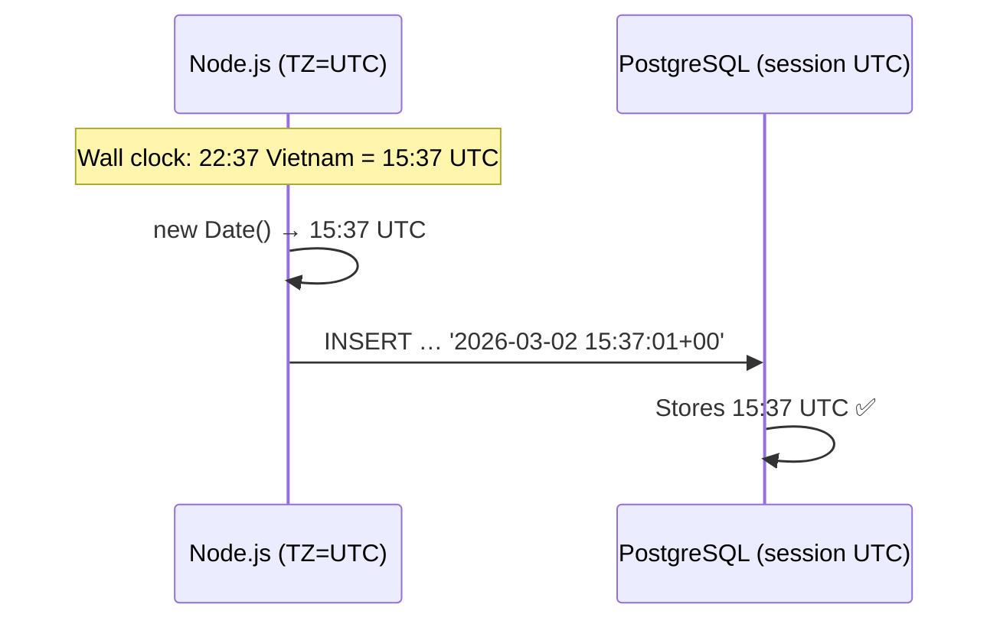

# Timezone Handling

## Overview

All backend timestamps are stored and processed in **UTC**. This prevents double-offset bugs when the server runs in a non-UTC timezone (e.g. Vietnam, UTC+7).

## Problem

When a Node.js process runs in a non-UTC timezone, the `pg` driver may serialize JavaScript `Date` objects without an explicit timezone indicator. PostgreSQL then interprets the value using its **session timezone**, applying the offset a second time:



The result is that timestamps are shifted by the local UTC offset (e.g. −7 hours for Vietnam).

## Solution

Two complementary safeguards are applied:

### 1. Process Timezone (`app.ts`)

Each microservice sets `process.env.TZ = "UTC"` **before any other imports** in its entry point:

```typescript
// app.ts — MUST be the first executable line
process.env.TZ = "UTC";

import "dotenv/config";
// …
```

This ensures:
- `new Date()` treats local time as UTC
- The `pg` driver serializes dates with `+00:00` offset
- `toLocaleString()` without an explicit `timeZone` option returns UTC

### 2. PostgreSQL Session Timezone (`createDataSource`)

The shared `createDataSource()` utility forces every database connection to use UTC:

```typescript
const dsOptions: DataSourceOptions = {
  // …
  extra: {
    options: "-c timezone=UTC",
  },
};
```

This guarantees PostgreSQL interprets any timestamp without an explicit offset as UTC, and returns timestamps in UTC format.

### Correct Flow



## Rules

| Rule | Detail |
|------|--------|
| Never remove `process.env.TZ = "UTC"` | It must stay as the first line in every `app.ts` that connects to a database |
| Always use `timestamptz` | All date columns should use `@CreateDateColumn({ type: "timestamptz" })` |
| Convert timezones on the frontend | Display local time by converting UTC → user timezone in the browser |
| Don't hardcode timezone offsets | Use `Intl.DateTimeFormat` or `date-fns-tz` on the client side |

## Affected Files

- [lib/database/index.ts](../../lib/database/index.ts) — `createDataSource()` sets `extra.options`
- [apps/domain.analysis/microservice.analysis/app.ts](../../apps/domain.analysis/microservice.analysis/app.ts) — `process.env.TZ = "UTC"`
- [apps/domain.data/microservice.data/app.ts](../../apps/domain.data/microservice.data/app.ts) — `process.env.TZ = "UTC"`
