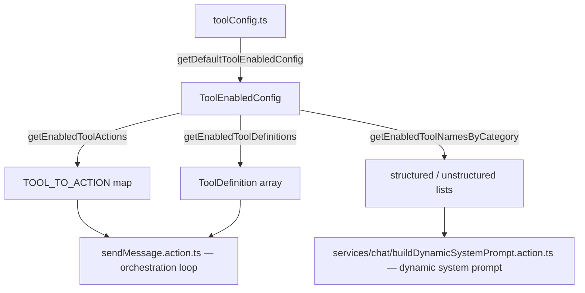
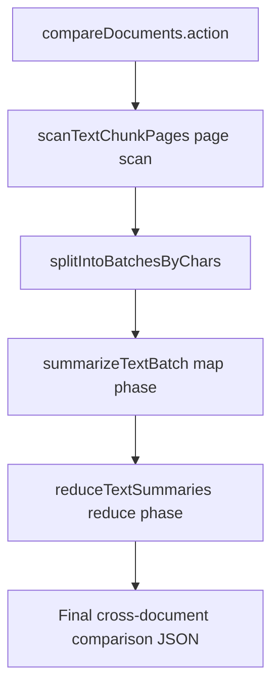
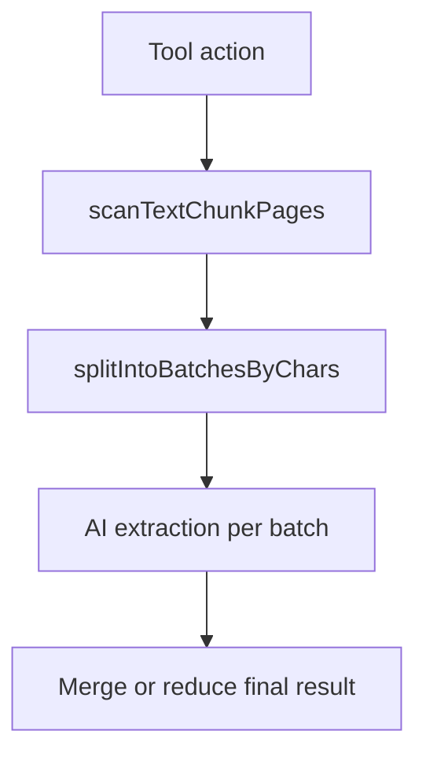

# Tool Configuration

The AI tool-calling system uses a centralised, configurable registry so that
individual tools can be enabled or disabled in one place. Both the **tool
definitions** (sent to the LLM during the orchestration loop) and the
**system prompt** (generated dynamically before each chat message) derive their
tool lists from the same configuration.

## Architecture



## Key File

**`microservice.analysis/toolConfig.ts`**

Single source of truth containing:

| Export | Description |
|--------|-------------|
| `ToolName` | Union type of all tool names (alphabetical) |
| `ToolCategory` | `"structured"` or `"unstructured"` |
| `ToolEnabledConfig` | `Record<ToolName, boolean>` |
| `ALL_TOOL_NAMES` | Sorted array of every tool name |
| `getDefaultToolEnabledConfig()` | Returns config with all tools **enabled** |
| `getEnabledToolActions(config)` | Filtered `{ toolName: "tools.action" }` map |
| `getEnabledToolDefinitions(config)` | Filtered `ToolDefinition[]` for the LLM |
| `getEnabledToolNamesByCategory(config)` | `{ structured: [...], unstructured: [...] }` |
| `getToolCategory(name)` | Returns category for a tool name |

## How to Disable a Tool

Edit the config construction in the consuming file (e.g. `sendMessage.action.ts`):

```typescript
const toolEnabledConfig = getDefaultToolEnabledConfig();
// Disable specific tools:
toolEnabledConfig.countAndGroup = false;
toolEnabledConfig.pivotTable = false;

const TOOL_TO_ACTION = getEnabledToolActions(toolEnabledConfig);
```

The same pattern applies in `services/chat/buildDynamicSystemPrompt.action.ts`
for the dynamic system prompt. Because both files call
`getDefaultToolEnabledConfig()` and apply overrides, they stay in sync
automatically when the overrides are shared or centralised.

## Tool Categories

### Structured Data Tools (`structured`)

Operate on `structured-table` datasets (CSV, Excel rows/columns):

aggregate, avgField, correlateFields, count, countAndGroup,
countDistinctValues, detectOutliers, filterByCondition, getDistinctValues,
getMinMax, getPercentile, getTopByField, joinDatasets, pivotTable,
sortByField, sumField

> **Note:** The `count` tool supports both simple key-value equality filters
> (`filters`) and rich condition-based filtering (`conditions`) with operators:
> `eq`, `neq`, `gt`, `gte`, `lt`, `lte`, `contains` (case-insensitive
> substring match), and `in` (value in list). This allows the AI to count
> records matching complex criteria (e.g. names containing a keyword) without
> needing to fall back to `filterByCondition` + manual counting.

### Unstructured Text Tools (`unstructured`)

Operate on `unstructured-text` datasets (PDF, TXT, DOCX via vector embeddings):

answerFromContext, compareDocuments, extractEntities, extractKeyTopics,
findSimilarChunks, semanticSearch, sentimentAnalysis, summarizeDocument,
timelineExtraction

## Adding a New Tool

1. Add the tool name to the `ToolName` union type in `toolConfig.ts`.
2. Add an entry to `TOOL_REGISTRY` with `action`, `category`, and
   `definition` (OpenAI function-calling schema).
3. Implement the corresponding action in `microservice.data/services/tools/`.
4. Run `npm run generate:types:all` then `npm run lint:fix`.

## Large Dataset Handling (compareDocuments)

`tools.compareDocuments` now processes full datasets instead of sampling only a
small fixed number of chunks.

### Flow



### Notes

- Chunk reading is paginated (`DEFAULT_TEXT_CHUNK_PAGE_SIZE = 100`) via
    `lib/text-chunk-pagination.ts`.
- Each page is summarized in batches, then all batch summaries are recursively
    reduced to one summary per dataset.
- Final comparison runs on the two reduced summaries, so the tool scales to
    much larger corpora while keeping prompt size bounded.
- Optional `summaryConcurrency` controls parallel summarization and defaults to
    `1` for safe, predictable load.

## Large Dataset Handling (other unstructured tools)

The following tools now use the same paginated full-dataset pattern instead of
fixed chunk sampling:

- `tools.extractEntities`
- `tools.extractKeyTopics`
- `tools.timelineExtraction`
- `tools.sentimentAnalysis`

### Shared processing pattern



### Tool-specific behavior

- `extractEntities`: merges entities across all batches using
    `type + normalized name`, aggregates counts, keeps strongest context.
- `extractKeyTopics`: merges topic candidates across all batches and performs a
    final consolidation pass to return top `maxTopics`.
- `timelineExtraction`: extracts events per batch, de-duplicates candidates,
    then performs a final chronological consolidation pass.
- `sentimentAnalysis`:
    - `granularity=document`: analyzes all text batches and aggregates score,
        themes, and tones.
    - `granularity=chunk`: analyzes every chunk (paginated) and returns per-chunk
        sentiment plus corpus-level aggregate score.

### Concurrency controls

Each of these actions now accepts optional `concurrency` (default `1`, min `1`,
max `10`) to tune throughput vs. AI provider load.
