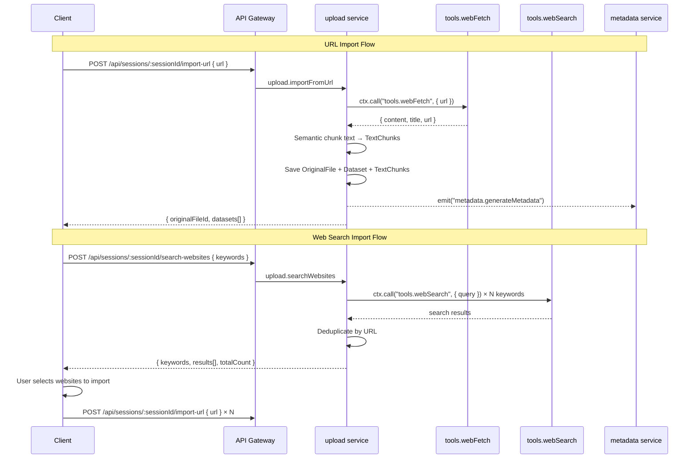

# URL Import & Web Search Import

## Overview

In addition to file uploads (CSV, PDF, XLSM), the upload service supports two web-based data import methods:

1. **URL Import** — Import content from a specific web page URL
2. **Web Search Import** — Search for websites by keywords, then selectively import results

Both methods create **unstructured-text** datasets with semantically chunked text content, identical in structure to text extracted from PDF uploads.

## Architecture



## URL Import (`upload.importFromUrl`)

### REST Endpoint

```
POST /api/sessions/:sessionId/import-url
Content-Type: application/json

{ "url": "https://example.com/data-page" }
```

### Processing Pipeline

1. **Validate** — UUID format for sessionId, valid HTTP/HTTPS URL
2. **Fetch** — Calls `tools.webFetch` (Puppeteer headless Chrome) with 200KB max content length
3. **Hash** — SHA-256 of `url + content` for duplicate detection
4. **Dedup** — Checks OriginalFile table for matching session + hash
5. **Store** — Creates OriginalFile record with `storagePath = url` (no physical file)
6. **Chunk** — Semantic text chunking (1500 char target, 100 char overlap)
7. **Insert** — Creates Dataset (FileType.URL) + TextChunks in 500-record batches
8. **Emit** — Fires `metadata.generateMetadata` event (non-blocking)
9. **Update** — Calls `session.updateSessionStatus` to refresh dataset count

### Dataset Properties

| Field | Value |
|-------|-------|
| `fileType` | `url` |
| `datasetType` | `unstructured-text` |
| `name` | `"{page title} — Web Import"` or `"{hostname} — Web Import"` |
| `metadataStatus` | `pending` (generates asynchronously) |

### Error Codes

| Code | Status | Description |
|------|--------|-------------|
| `INVALID_SESSION_ID` | 400 | Invalid or missing UUID |
| `INVALID_URL` | 400 | Malformed URL |
| `UNSUPPORTED_PROTOCOL` | 400 | Not HTTP/HTTPS |
| `URL_FETCH_FAILED` | 422 | Puppeteer could not load the page |
| `EMPTY_CONTENT` | 422 | Page returned no text |
| `DUPLICATE_URL` | 409 | Same URL + content already imported to session |

## Web Search Import (`upload.searchWebsites`)

### REST Endpoint

```
POST /api/sessions/:sessionId/search-websites
Content-Type: application/json

{
  "keywords": ["machine learning datasets", "public data sources"],
  "count": 5
}
```

### Processing

1. **Validate** — UUID for sessionId, 1–10 keywords (non-empty strings), count 1–20
2. **Search** — Calls `tools.webSearch` (Brave Search API) for each keyword
3. **Deduplicate** — Removes duplicate URLs across keywords (first occurrence wins)
4. **Return** — Array of `{ title, url, description, keyword }` results

### Parameters

| Parameter | Type | Default | Description |
|-----------|------|---------|-------------|
| `keywords` | `string[]` | (required) | 1–10 search keywords |
| `count` | `number` | 5 | Results per keyword (1–20) |

### Fault Tolerance

- If a search for one keyword fails, others continue
- Results from successful keywords are still returned
- Empty results are valid (no error thrown)

## Frontend Components

### DataImport (tabbed container)

Located at `frontend/src/components/upload/DataImport.tsx`. Provides a tabbed interface with three import methods:

- **File Upload** — Existing drag-and-drop file upload
- **Import URL** — URL input with import button
- **Web Search** — Keyword-based search with result selection

### UrlImport Component

- Text input for URL with Enter-to-submit
- Client-side URL validation before submission
- Loading, success, and error state displays
- Uses `useImportFromUrl` hook

### WebSearchImport Component

- Tag-style keyword input with add/remove
- Search button that queries all keywords
- Checkbox result list with bulk "Import N selected" button
- Per-URL import progress tracking (importing/imported states)
- Uses `useSearchWebsites` and `useImportFromUrl` hooks

## FileType Enum

The `FileType` enum was extended with a `URL` value:

```typescript
export enum FileType {
  CSV = "csv",
  PDF = "pdf",
  URL = "url",
  XLSM = "xlsm",
}
```

This value is used for datasets created via URL import. The URL type always produces `unstructured-text` datasets.
