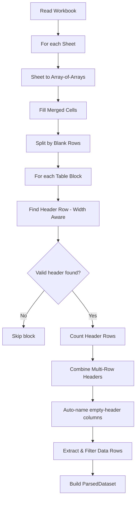

# XLSM/XLSX Parsing

## Overview

The `XlsmParser` handles `.xlsm`, `.xlsx`, and `.xls` files using SheetJS. It supports complex Excel layouts including merged cells, multi-row headers, and multiple tables per sheet.

## Parsing Pipeline

## Key Features

### Merged Cell Filling

Excel merged cells only store the value in the top-left cell. SheetJS returns `null` for other cells in the merge range. The parser fills all cells in each merge range with the top-left value before table detection.

This handles:
- **Horizontal merges**: Category headers like "TỔNG THÁNG" spanning multiple columns
- **Vertical merges**: Row labels like "SHOPEE" spanning multiple data rows

### Smart Header Detection

Instead of always using the first row as headers, the parser finds the actual header row using **width-aware** detection:

1. Calculates the max non-empty cell count across all rows in the table block
2. Requires header row width to be at least 40% of max width (minimum 3 cells)
3. Skips rows where all non-empty cells are identical (merged title rows)
4. Skips rows where >50% of cells are numeric (data rows, not headers)
5. Selects the first qualifying row with ≥2 unique values
6. Returns -1 if no valid header found → block is skipped entirely

This prevents narrow metadata rows (e.g., "THÁNG | 8 | NĂM | 2025") from being mistaken as headers when the real data table has 15+ columns.

### Multi-Row Header Combining

Many Excel reports use 2-3 header rows (e.g., category + date + qualifier). The parser:

1. Starting from the detected header row, counts consecutive "header-like" rows
2. A row is header-like if it has ≥3 non-empty cells and <50% are numeric
3. Stops when encountering a data row (majority numeric values)
4. Combines header rows by joining distinct values per column with spaces

**Example**: Three header rows for a date column:
- Row 1: `Thứ 2` (day name)
- Row 2: `01/12/2025` (date)
- Row 3: `AWO` (qualifier)
- Combined: `Thứ 2 01/12/2025 AWO`

### Table Detection

Tables within a sheet are separated by blank rows. Each contiguous block of non-blank rows becomes one candidate table. The width-aware header detection within each block handles mixed narrow/wide content (e.g., a narrow title row followed by wide data) by skipping narrow rows to find the real header.

Blocks are skipped when:
- Fewer than 2 rows
- No valid header found (all wide rows are numeric data or all identical)
- No data rows after the header

### Auto-Named Columns

Columns with no text in the header rows but containing data are automatically included with generated names (`column1`, `column2`, etc.). This preserves metric-name columns that don't have explicit headers.

### Empty Row Filtering

Data rows where all mapped columns are null/empty are automatically filtered out.

## Configuration

| Setting | Value | Description |
|---------|-------|-------------|
| `cellDates` | `true` | Dates returned as JS Date objects instead of serial numbers |
| `cellFormula` | `false` | Formulas not evaluated, raw values used |
| Max header rows | 4 | Maximum number of rows that can form a combined header |
| Min header cells | 3 | Minimum non-empty cells for a row to be considered a header |
| Min unique values | 2 | Minimum distinct values to distinguish headers from merged titles |
